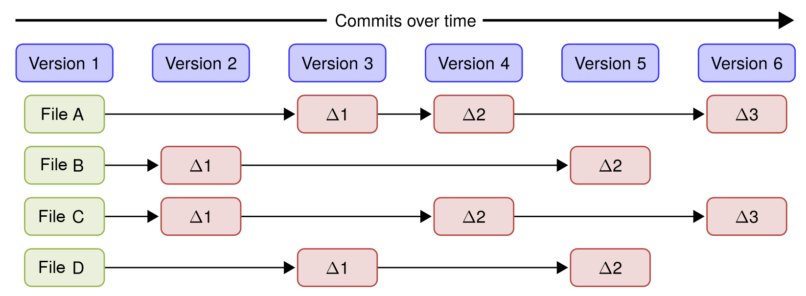
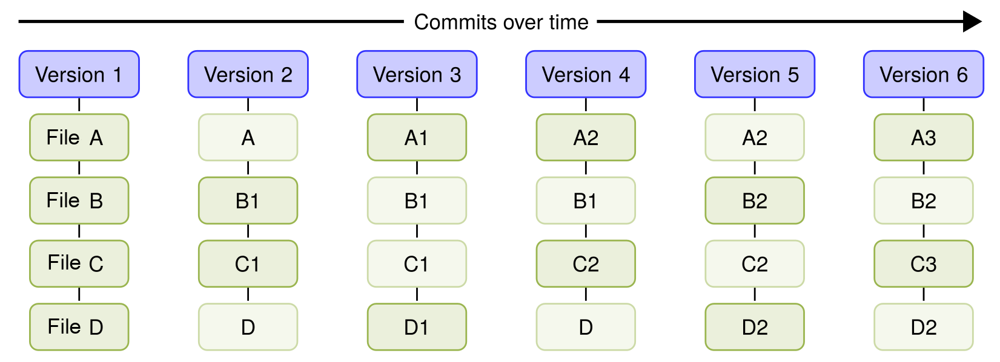
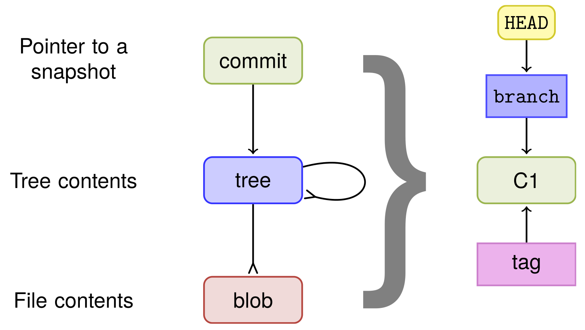
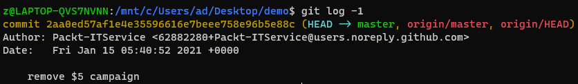
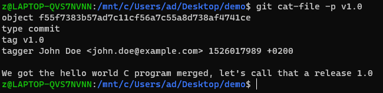
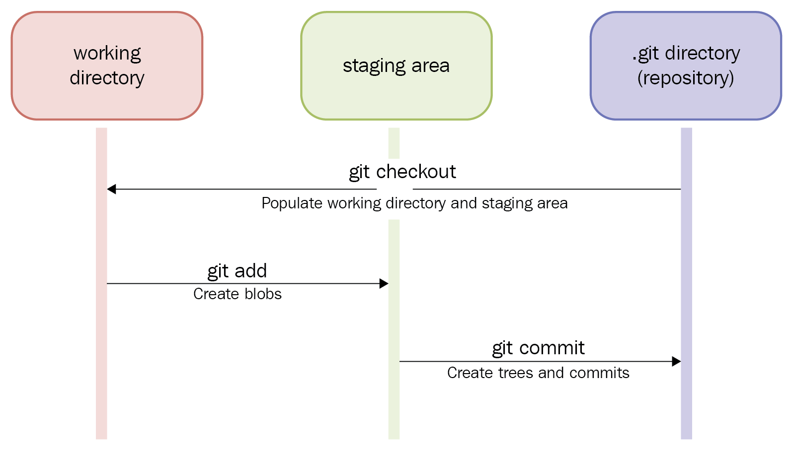
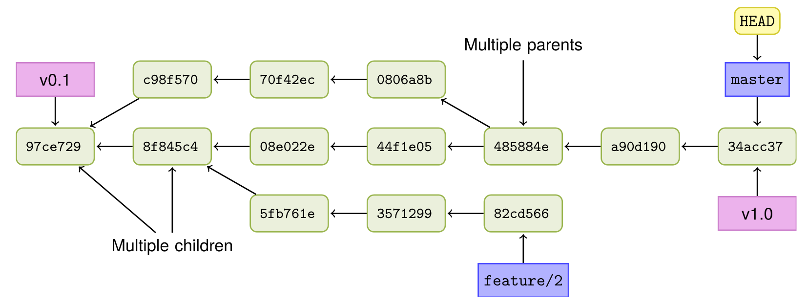
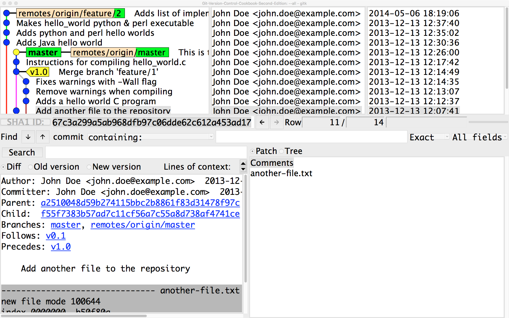
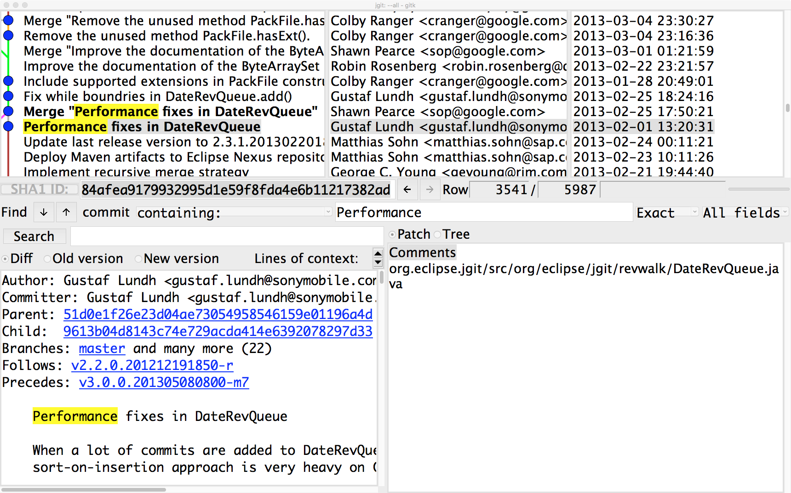

# 第一章 浏览 Git

相关主题：

- Git 对象模型
- Git 的三个阶段（stages）
- 查看有序无环图 (DAG)
- 提炼已修复事项
- 获取变动文件列表
- 使用 `gitk` 查看提交历史
- 在历史记录中查找提交版本
- 在历史代码中搜索信息


## 1.1 简介

传统版本管理系统：记录初始文件，以及后续变更。




Git：记录所有文件的快照。




Git 数据模型




`commit` 对象指向 **根节点树** `root tree`，根节点树又指向各子树（`subtrees`）与文件（`files`）

分支和标签指向 `commit` 对象，而 `HEAD` 对象指向当前签出的分支 `branch`。因此对于每一个版本，其指向的根节点树 **都是相同的**。


## 1.2 Git 对象

Git 对象是按键值对的形式存储。这个 **键**，用的是该对象的 SHA-1 哈希值，外加一些额外属性（如大小）。

Git 共有四种对象类型：

- 文件 `Files`（在 Git 语境下也称 **二进制大对象** blob）
- 目录 `Directories`（在 Git 语境下也称 **树**）
- 版本 `Commits`
- 标签 `Tags`

而 `HEAD` 是一个特殊的指针，指向当前签出的 `branch` 分支。

查看并打印 `HEAD` 标签指向的 `commit` 对象：

```bash
$ git cat-file -p HEAD
```

由于 `HEAD` 指向 `master`（现在叫 `main`）分支，`master` 分支又指向最近一次提交的版本 `commit`。


### 1.2.1. `tree` 对象

用同样的方式查看 `tree`：（`SHA-1`）

```bash
$ git cat-file -p 34fa038544bcd9aed660c08320214bafff94150b
```

或使用 `<rev>^<type>` 式引用：

```bash
# on Linux
$ git cat-file -p HEAD^{tree}
# on Windows
PS> git cat-file -p 'HEAD^{tree}'
```

注：`<rev>^<type>` 返回从 `rev` 递归查找到的第一个 `type` 型对象。


### 1.2.2. `blob` 对象

用该命令继续查看 `blob` 对象：（使用 `SHA-1`）

```bash
$ git cat-file -p 92f046f17079aa82c924a9acf28d623fcb6ca727
```

这里的 `-p` 即 `pretty print`，格式化输出。常用的选项还有：

- `-s`: 显示对象大小（size）
- `-t`: 显示对象类型（type）
- `-e`: 检查是否存在（exist），不存在则报错，否则返回状态0（无返回）


### 1.2.3. `branch` 对象

该命令也可以作用于 `master` 分支：（现在默认为 `main` 分支）

```bash
$ git cat-file -p master
```

此外，在 `.git` 文件夹内也能查看 `master` 分支指向的 `commit` 的 ID，使用 `cat` 命令：

```bash
$ cat .git/refs/heads/master
# 2aa0ed57af1e4e35596616e7beee758e96b5e88c
```

要验证该结果是否为最新的版本，使用 `git log -1`：



查看 `HEAD`：（现在默认叫 `main` 分支）

```bash
$ cat .git/HEAD
# ref: refs/heads/master
```

由此可见，`branch` 分支只是一个指向 `commit` 对象的指针。


### 1.2.4. `tag` 对象

标签有三类：

- 轻量标签
- 注解标签
- 签名标签

查看注解标签，使用 `git tag` ：

```bash
$ git tag
v0.1
v1.0
```

进一步查看标签 `v1.0`：

```bash
$ git cat-file -p v1.0
```



可见，标签由以下部分组成：

1. 对象（object）：此处即 `master` 分支的最新 `commit`
2. 类型（type）：为 `commit` 型（`commits`、`blobs` 与 `trees` 都可以添加标签）
3. 标签名（tag name）：`v1.0`
4. 贴标签人（tagger）及时间戳（timestamp）：`John Doe <john.doe@example.com> 1526017989 +0200`
5. 标签注释内容（tag message）：`We got the hello world C program merged, let's call that a release 1.0`


还可以通过使用命令 `git hash-object` 重散列（rehashing）来验证 `git cat-file` 的结果；例如，验证 `HEAD` 指向的 `commit`：

```bash
$ git cat-file -p HEAD | git hash-object -t commit --stdin
# 2aa0ed57af1e4e35596616e7beee758e96b5e88c
```

该结果可以用 `git log` 作对比：

```bash
$ git log -1 | grep commit
# commit 2aa0ed57af1e4e35596616e7beee758e96b5e88c
```


命令 `git cat-file -p` 虽然少见，但查看对象信息、了解各对象的构成情况却很方便。除了这个命令外，查看一个 tree 对象也可以使用 `git ls-tree` 或 `git show`，只是结果显示的方式不同罢了：

```bash
$ git cat-file -p HEAD^{tree}
100644 blob f21dc2804e888fee6014d7e5b1ceee533b222c15    README.md
040000 tree abc267d04fb803760b75be7e665d3d69eeed32f8    a_sub_directory
100644 blob b50f80ac4d0a36780f9c0636f43472962154a11a    another-file.txt
100644 blob 92f046f17079aa82c924a9acf28d623fcb6ca727    cat-me.txt
100644 blob bb2fe940924c65b4a1cefcbdbe88c74d39eb23cd    hello_world.c
$ git ls-tree HEAD^{tree}
100644 blob f21dc2804e888fee6014d7e5b1ceee533b222c15    README.md
040000 tree abc267d04fb803760b75be7e665d3d69eeed32f8    a_sub_directory
100644 blob b50f80ac4d0a36780f9c0636f43472962154a11a    another-file.txt
100644 blob 92f046f17079aa82c924a9acf28d623fcb6ca727    cat-me.txt
100644 blob bb2fe940924c65b4a1cefcbdbe88c74d39eb23cd    hello_world.c
$ git show HEAD^{tree}
tree HEAD^{tree}

README.md
a_sub_directory/
another-file.txt
cat-me.txt
hello_world.c
```


## 1.3 Git 的三个阶段



由于远程代码库后续存在新的提交，因此实操过程中的结果与书中并不完全一致。根据书中 `HEAD` 指向的 `SHA-1`：`34acc370b4d6ae53f051255680feaefaf7f7850d`，可通过以下命令切换到对应版本，并新建一个 `newdemo` 分支来避免后续版本的干扰：

```bash
# Stay the same with the book in a new branch
$ git checkout && git reset --hard 13dcada077e446d3a05ea9cdbc8ecc261a94e42d && git checkout -b newdemo
# Check commit info in advance for use
$ git cat-file -p HEAD | grep tree
tree 34fa038544bcd9aed660c08320214bafff94150b
$ git cat-file -p HEAD^{tree} | grep another-file
100644 blob b50f80ac4d0a36780f9c0636f43472962154a11a    another-file.txt
```

实战练习：

```bash
# Repo initialization
$ git clone https://github.com/PacktPublishing/Git-Version-Control-Cookbook-Second-Edition.git demo
$ cd demo
# Add new content to another-file.txt
$ echo "Another line" >> another-file.txt
# Check git status
$ git status
# Add modified file and check status again
$ git add another-file.txt 
$ git status
# When a file is moved to the staging area, the SHA-1 hash of the file is created and the blob object is written to Git's database. This happens every time a file is added, but if nothing changes for a file, it means that it is already stored in the database. At first, this might seem that the database will grow quickly, but this is not the case. Garbage collection kicks in at times, compressing, and cleaning up the database and keeping only the objects that are required.
# Some more modification
$ echo 'Whoops almost forgot this' >> another-file.txt
# check status
$ git status
# both 'Changes to be committed' and 'Changes not staged for commit' are observed due to the second update
# add again to merge the status
$ git add another-file.txt
$ git status
# Now, all the changes we have made to the file are ready to be committed, and we can record a commit
$ git commit -m 'Another change to another file'
# Error: fatal: empty ident name (for <z@LAPTOP-QVS7NVNN.localdomain>) not allowed
# Config user name and email
$ git config user.email 'john.doe@example.com'
$ git config user.name 'John Doe'
$ git commit -m 'Another change to another file'
[newdemo 9cfa61c] Another change to another file
 1 file changed, 2 insertions(+)
```

此时，再次查看 HEAD 信息，可以发现根节点树 `root tree` 与 `another-file.txt` 的 `SHA-1` 都因为 `commit` 操作更新了：

```bash
$ git cat-file -p HEAD | grep tree
tree 162201200b5223d48ea8267940c8090b23cbfb60
# before: 
# tree 34fa038544bcd9aed660c08320214bafff94150b
$ git cat-file -p HEAD^{tree} | grep another-file
100644 blob 35d31106c5d6fdb38c6b1a6fb43a90b183011a4b    another-file.txt
# before:
# 100644 blob b50f80ac4d0a36780f9c0636f43472962154a11a    another-file.txt
```

然而，文本文件 `another-file.txt` 在最后提交前添加到暂存区了两次，如果每次 `git add` 命令都会产生 `blob`、`tree` 以及 `commit` 对象，那么 Git 仓库中势必会有中间那次 `add` 操作的对象，被一同计入 Git 数据库。查看该对象可以使用命令 `git fsck`：

```bash
$ git fsck --dangling
Checking object directories: 100% (256/256), done.
Checking objects: 100% (49/49), done.
dangling blob ad46f2da274ed6c79a16577571a604d3281cd6d9
```

进一步验证查到的对象：

```bash
$ git cat-file -p ad46f2da274ed6c79a16577571a604d3281cd6d9
This is just another file
Another line
```

验证成功。


## 1.4 查看 `DAG` 图

`DAG` 图：全名为 `Directed Acyclic Graph`，即有向无环图。

示例仓库的 `DAG` 图如下：



注意：图中的箭头是对版本依赖的描述，即从每个版本指向其上一个版本，因此与版本的实际创建过程是相反的。

本节介绍 `git log` 命令的几个相关特性：

```bash
# ensure that the master branch is pointing to 34acc37:
$ git checkout master && git reset --hard 34acc37
# Show the last 3 commits
$ git log -3
# Turn on colors in the Git output
$ git config --global color.ui auto
# Some more pretty print
$ git log --decorate --graph --oneline --all
# Some DIY format using --pretty
$ git log --all --graph --pretty=format:'%Cred%h%Creset -
%C(yellow)%d%Creset %s %Cgreen(%ci) %C(bold blue)<%an>%Creset'
# Make a new alias
$ git config --global alias.graph "log --all --graph --pretty=format:'%Cred%h%Creset -%C(yellow)%d%Creset %s %Cgreen(%ci) %C(bold blue)<%an>%Creset'"
```

注意：自定义格式中的通用格式为：`%C<color-name>text-be-colored%Creset`


## 1.5 提取已修复事项

在软件项目的发布声明中列出已修复的 bug 清单是很常见的操作。一个不错的做法是每次将 bug 修复情况写入提交版本的注释里。而更好的做法，是将这类操作标准化，例如用 `"Fixes-bug"` 开头，然后是 bug 的标识符，再一并放到提交注释的末尾。这样做的好处在于，可以自动生成下一次发布所修复的 bug 清单。

以 `JGit` 项目为例，其 bug 标识符为字符串 `Bug:` + `bug ID`。

练习目标：将 `git log` 的输出限制在“仅列出自上次发布（贴标签）以来的提交、且这些提交中包含一个修复的 bug”。

```bash
# Init repo
$ git clone https://git.eclipse.org/r/jgit/jgit demo
$ cd demo
$ git checkout master
$ git reset --hard b14a939
# Find the last tag (release)
$ git describe 
v3.1.0.201310021548-r-96-gb14a939
```

> **关于 `v3.1.0.201310021548-r-96-gb14a939`：**
>
> - 最近一次的标签名：`v3.1.0.201310021548-r`
> - 自上一标签以来的 `commit` 数：`96`
> - 当前 `commit` 的简化 `SHA-1`：`b14a939`

```bash
# Our target format should be like this:
# Commit-id: Commit subject
# Fixes-bug: xxx
# ======================================
# Get the commits between HEAD and last release
$ git log --grep "Bug: " v3.1.0.201310021548-r..HEAD
# Rearrange the output with --pretty
# that is: 
# 1. %h: abbreviated commit ID
# 2. |:  a separator
# 3. %s: the commit subject (the first line of the commit message)
# 4. %n: a new line
# 5. %b: the body
$ git log --grep "Bug: " v3.1.0.201310021548-r..HEAD --pretty="%h|%s%n%b" 
# use grep to filter the lines that contain "|" or "Bug: " 
$ git log --grep "Bug: " v3.1.0.201310021548-r..HEAD --pretty="%h|%s%n%b" | grep -E "\||Bug: "
# replace "|" and "Bug " with sed
$ git log --grep "Bug: " v3.1.0.201310021548-r..HEAD --pretty="%h|%s%n%b" | grep -E "\||Bug: " | sed -e 's/|/: /' -e 's/Bug:/Fixes-bug:/'
```

相关语法：

`sed`: short for `stream editor`，`-e` is short for `--expression` 

`sed -e script` 等效于 `sed --expression=script`

`sed -e 's/regexp/replacement'`:  Attempt to match `regexp` against the pattern space.  If successful, replace that portion matched with `replacement`.  The replacement may contain the special character `&` to refer to that portion of the pattern space which matched, and the special escapes `\1` through `\9` to refer to the corresponding matching sub-expressions in the regexp.

`grep -E PATTERNS`: **PATTERNS** are extended regular expressions


如果只提取 Bug 的 ID：

```bash
$ git log v3.1.0.201310021548-r..HEAD | grep "Bug: "
```

如果只提取包含 Bug 的 `commit` ID，以及注释的主题（subjects，即首行注释）：

```bash
$ git log --grep "Bug: " --oneline v3.1.0.201310021548-r..HEAD
```


## 1.6 获取变更文件列表

获取指定版本范围内的文件变更列表：

```bash
$ git checkout master && git reset --hard b14a939
$ git diff --name-only v3.1.0.201310021548-r..HEAD
```

与 1.5 节中的 git log 命令一样，`git diff` 也对指定版本范围内的所有内容生效。参数 `--name-only` 会仅输出指定版本范围内、所有包含变更的文件路径列表。

若要细分出变更的具体类型，例如被删除的文件，则可以加过滤参数 `--diff-filter=D`：

```bash
$ git checkout master && git reset --hard b14a939
$ git diff --name-only --diff-filter=D v3.1.0.201310021548-r..HEAD
```

常见的变更类型：

- `--diff-filter=A`: added
- `--diff-filter=C`: copied
- `--diff-filter=D`: deleted
- `--diff-filter=M`: modified
- `--diff-filter=R`: renamed

更多参数设置，详见：`git help diff`


## 1.7 用 `gitk` 查看提交历史

```bash
# make sure you have gitk installed
$ which gitk
/usr/bin/gitk
# Sync the commit ID
$ git checkout master && git reset --hard 13dcad
# bring up the gitk interface, --all to see everything
$ gitk --all &
```




## 1.8 在历史版本中查找 `commit` 版本

```bash
# look at the entire history and search every commit that has "Performance" in its commit message:
$ git log --grep "Performance" --oneline --all
```

上述命令查找 Git 库内所有分支、所有提交注释中，包含 `Performance` 字样的 `commit` 版本，并单行显示。注意，这里的 `--grep` 参数是 **区分** 大小写的。

此外，也可以在 `gitk` 命令中查找指定关键字，`gitk` 会自动高亮匹配：




## 1.9 在历史版本的代码中搜索信息

有时候，仅仅在提交注释中进行检索并不能满足实际工作需要，比如要定位哪些提交版本改动了某个方法或变量时，就需要借助 `git log` 的其他参数实现了。

练习：以 JGit 项目为例，找出满足以下条件的所有提交版本信息：

1. SHA-1 指定为 `b14a939`
2. 变更的一行中包含 `"isOutdated"` 方法
3. 单行显示结果

执行命令如下：

```bash
$ git checkout master && git reset --hard b14a939
$ git log -G "isOutdated" --oneline
c9e4a7855 Add isOutdated method to DirCache
797ebba30 Add support for getting the system wide configuration
4c14b7623 Make lib.Repository abstract and lib.FileRepository its implementation
c9c57d34d Rename Repository 'config' as 'repoConfig'
5c780b387 Fix unit tests using MockSystemReader with user configuation
cc905e7d4 Make Repository.getConfig aware of changed config
```

参数 `-G` 实现的是在 **文件变更的增量补丁** 中查找。只要提交的版本中，某一行代码新增或删除过包含关键词 `isOutdated` 的情况，就会被检索到。

与之类似的另一个参数是 `-S`，其唯一区别在于，`-S` 检索的是指定关键词在某版本中的 **出现次数** 的变化情况。对比 `-S` 的执行结果：

```bash
$ git checkout master && git reset --hard b14a939
$ git log -S "isOutdated" --oneline
c9e4a7855 Add isOutdated method to DirCache
797ebba30 Add support for getting the system wide configuration
4c14b7623 Make lib.Repository abstract and lib.FileRepository its implementation
5c780b387 Fix unit tests using MockSystemReader with user configuation
cc905e7d4 Make Repository.getConfig aware of changed config
```

可以看到 `commit` ID 为 `c9c57d34d` 仅在 `-G` 时出现，在 `-S` 中未曾出现。借助命令 git show 查看该版本详情（ `grep -C4` 会展示目标代码行前后各 4 行的情况）：

```bash
$ git show c9c57d3 | grep -C4 "isOutdated"
@@ -417,14 +417,14 @@ public FileBasedConfig getConfig() {
                                throw new RuntimeException(e);
                        }
                }
-               if (config.isOutdated()) {
+               if (repoConfig.isOutdated()) {
                                try {
-                                       loadConfig();
+                                       loadRepoConfig();
                                } catch (IOException e) {
```

原来是对象的重命名导致的变更，导致这一行出现了关键词，但出现次数并不受影响。


