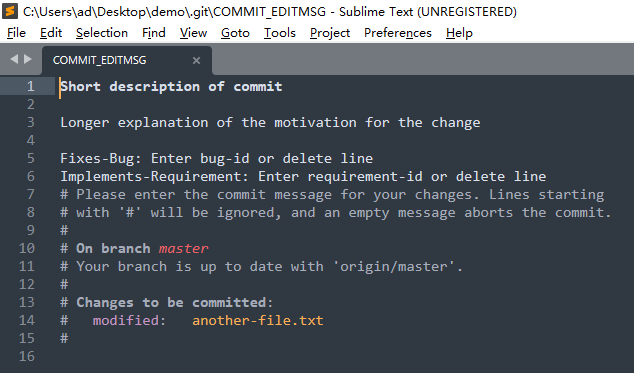
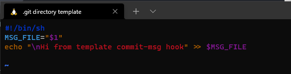
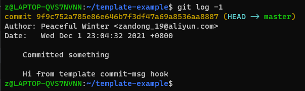
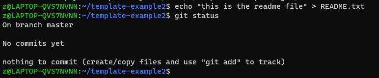
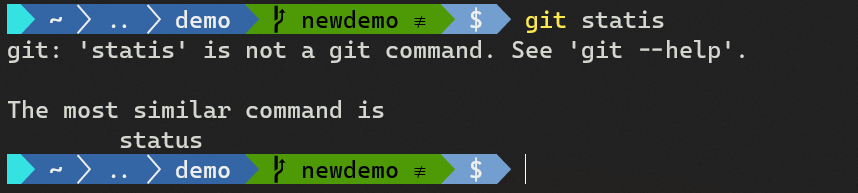
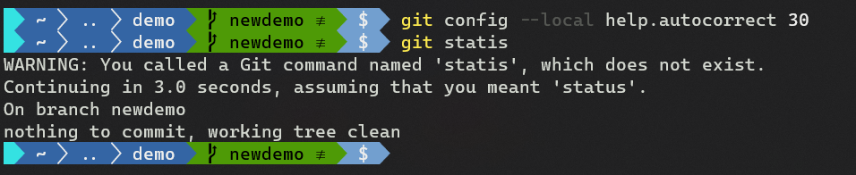
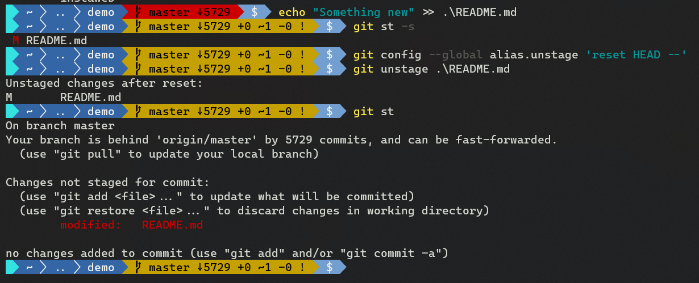
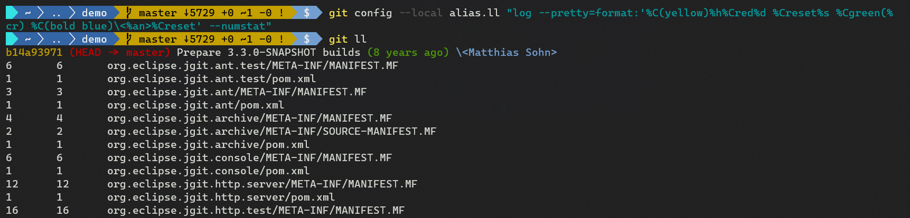
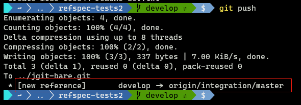

# 第二章 配置 Git

相关主题：

- 配置目标
- 检索已有配置
- 配置模板
- `.git` 目录模板
- 几个配置示例
- 设置 Git 别名
- `refspec` 举例


## 2.1 配置目标

Git 配置分三个层次：

| 配置层次 |    说明    |                         配置文件路径                         |
| :------: | :--------: | :----------------------------------------------------------: |
| `SYSTEM` | 系统级配置 | Linux: `/etc/gitconfig` <br/>Windows: `C:\Git\etc\gitconfig` |
| `GLOBAL` | 用户级配置 |                        `~/.gitconfig`                        |
| `LOCAL`  | 仓库级配置 |                        `.git/config`                         |

练习：

```bash
# Sync repo status
$ git clone https://git.eclipse.org/r/jgit/jgit demo
$ cd demo
# List the system config
$ git config --list --system
# List the global (user) config
$ git config --list --global
# List the repo config
$ git config --list --local

# Query single global key
$ git config --global user.email
# Set a key locally
$ git config --local user.email john@example.com
# Set default git editor
$ git config --global core.editor vim
```


## 2.2 检索已有配置

```bash
# View all the effective configurations for the current Git repository
$ git config --list
# Show single configuration item
$ git config user.name
# Set a new username
$ git config user.name "John Doe"
# Set your own configuration
$ git config my.own.config "Whatever I need"
$ git config my.his.config "Whatever He need"
$ git config my.own.config.item item
# Check the config file
$ cat .git/config
# ... sth irrelevant
[my "own"]
        config = Whatever I need
[my "his"]
        config = Whatever He need
[my "own.config"]
        item = item
# Show the value assigned
$ git config my.own.config
Whatever I need
$ git config my.own.config.item
item
```


## 2.3 配置模板

模板通常在用户级配置（`GLOBAL`），一般不在仓库级（`LOCAL`）配置。

```powershell
# Demonstrated in Windows
> git clone https://github.com/PacktPublishing/Git-Version-Control-Cookbook-Second-Edition.git demo
> git demo
# Create template file, save as ~/gitcommitmsg.txt
> notepad
# Demo content:
###########################################################
Short description of commit 

Longer explanation of the motivation for the change 

Fixes-Bug: Enter bug-id or delete line 
Implements-Requirement: Enter requirement-id or delete line 
###########################################################

# Config commit template
> git config --global commit.template ~/gitcommitmsg.txt
# Create a new commit
> echo "test new content" >> abc.txt
> git status -s
?? abc.txt
> git add abc.txt; git status
A  abc.txt
> git commit
# This would display a Sublime Text 3 interface:
```



```powershell
# Edit the template content, save and exit sublime text
> git commit
[master a5c36d0] Test git template file
 1 file changed, 0 insertions(+), 0 deletions(-)
 create mode 100644 abc.txt
> git log -1
commit a5c36d0bb6bcd5e3599de500e7628c296554aa93 (HEAD -> master)
Author: SafeWinter <zandong_19@aliyun.com>
Date:   Sat Nov 27 23:30:16 2021 +0800

    Test git template file

    Added a new file called abc.txt to test the functionality of git template

    Fixes-Bug: demo-bug-001
    Implements-Requirement: (skip)
```


### 相关注意事项

1. 配置 `Sublime Text 3` 为默认编辑器时，需加 `-w` 参数，表示 `wait`，即等待提交内容保存完毕后才可退出编辑，否则会默认提交失败。相关的 Git 配置如下（`Windows` 环境下，路径分隔符 **只能是** `\\`）：

```bash
# List git default editor (Sublime Text 3)
$ git config --system core.editor
'C:\\ProgramFiles\\SublimeText3\\subl.exe' -w
# Config Sublime Text 3 as default git editor
$ git config --system core.editor "'C:\\ProgramFiles\\SublimeText3\\subl.exe' -w"
```


2. `Window` 下的 Git 设置不可直接用于 `WSL2`，因为绝对路径在 `Linux` 环境下不存在 `C:\`，而是挂载在 `/mnt/` 路径下。


3. 虽然对 WSL2 可重新配置默认编辑器：

   ```bash
   $ git config --system core.editor
   '/mnt/c/ProgramFiles/SublimeText3/subl.exe' -w
   ```

   当在 `WSL2` 但运行 `git commit` 时，`Sublime Text 3` 会默认保存到 `Win10` 环境下的 `.git` 文件夹内，临时文件名为： `.git/COMMIT_EDITMSG`；然而此时使用的路径还是 WSL2 的 `/mnt/c/...`，因此首次默认保存提交注释会出错，需要手动指定到当前 `.git` 文件夹内，再次覆盖保存。


4. 由于 `Linux` 和 `Windows` 的根路径不同，要尽量避免同时在 `Windows` 和 `Linux` 环境内提交新版本，否则将报错：

   ```bash
   # Under WSL2 environment
   $ git commit
   hint: Waiting for your editor to close the file... 'C:\\ProgramFiles\\SublimeText3\\subl.exe' -w: 1: C:\\ProgramFiles\\SublimeText3\\subl.exe: not found
   error: There was a problem with the editor ''C:\\ProgramFiles\\SublimeText3\\subl.exe' -w'.
   Please supply the message using either -m or -F option.
   ```

   

5. 模板注释文件也可以是仓库级别的，只要将文件配置在 `--local` 级别即可，以满足更多样化的模板设置。


## 2.4 `.git` 目录模板

除了全局配置，有时进行版本控制时还需要触发一些预处理脚本的执行（这些 `script` 脚本即 `Git hooks`、Git 钩子），或者是模板化地剔除一些文件等。此时可以对 `git init` 命令设置统一的预处理操作。为配置项 `init.templatedir` 指定一个存放脚本的文件夹路径即可。

该文件夹路径的配置方式：

1. 作为 `git clone`、`git init` 命令的参数项运行；
2. 作为 `$GIT_TEMPLATE_DIR` 环境变量运行；
3. 作为 Git 的配置项运行（配置 `init.templatedir` 实现，默认路径为 `/usr/share/git-core/templates` ）。


> **模板化操作的工作原理**
>
> 将指定模板文件夹内的文件复制到 `.git` （即 `$GIT_DIR` ）文件夹。

本节演示两个模板操作：

1. `git hook` 示例
2. 以模板的方式设置忽略清单，忽略所有 `*.txt` 文件加入版本控制


### 示例1：Git 钩子

```bash
# Make customed template directory
$ mkdir ~/.git_template
$ mkdir ~/.git_template/{hooks,info}
# Copy git default hook files
$ cd ~/.git_template/hooks
$ cp /usr/share/git-core/templates/hooks/* .
# Rename commit-msg.sample file
$ cp commit-msg.sample commit-msg
# Edit with vim in commit-msg:
```



```bash
# Make the hook executable
$ chmod +x ~/.git_template/hooks/commit-msg
# Config git template directory
$ git config --global init.templatedir ~/.git_template
# Testing and validating
$ cd ~ && git init template-example && cd template-example
$ echo "something to commit" > somefile
$ git add somefile
$ git commit -m "Committed something"
$ git log -1
```



可以看到，提交的内容后面有一空行，以及一行由 `git hook` 中的 `commit-msg` 指定的文本。

---


### 示例2：剔除 `*.txt` 文件

本例将设置忽略所有 `*.txt` 文件，相当于将 `*.txt` 加入 `.gitignore` 文件。

```bash
# Make a new exclude file into template folder
$ echo "*.txt" > ~/.git_template/info/exclude
# testing
$ cd ~ && git init template-example2 && cd template-example2
$ echo "this is the readme file" > README.txt
$ git status
```




> **小结**
>
> 1. 每当进行 `init` 或 `clone` 操作，创建文件夹时 git 会自动将模板文件夹内的文件复制到新版本库 `.git` 中。此外，模板路径还可以在 **命令行** 或 **环境变量** 中进行指定；
>
> 2. 示例中使用了 `--global`，意味着对该用户的所有相关操作生效。但也有不足：对配置生效前同样需要应用相同模板规则的旧仓库，只能手动再执行一遍 `git init`；
>
> 3. 示例仅对 **Linux** 系统生效，**Windows** 系统的默认模板路径在 `{GIT_INSTALL_DIR}\mingw64\share\git-core\templates`，且 `\n` 在 **Windows** 系统不能输出一个回车，可以追加一个空串：（`$1` 指代的是版本提交时的注释内容）
>
>    ```bash
>    #!/bin/sh
>    MSG_FILE="$1"
>    echo "" >> $MSG_FILE
>    echo "Hi from template commit-msg hook on Win10" >> $MSG_FILE
>    ```


## 2.5 几个配置示例

### 2.5.1 变基（`rebase`）与合并（`merge`）设置

默认情况下，在执行 git pull 时，如果本地分支的历史记录与远程分支的历史不同，则会进行合并提交。修改默认方式可使用：

```bash
# use rebase instead of merge: true / false
$ git config pull.rebase true
```

切换分支时，取消默认按合并（`merge`）的方式进行分支切换：

```bash
# never(default) lacal remote always
$ git config branch.autosetuprebase always
```

设置具体某分支在执行 `git pull` 操作时按 `git rebase` 进行：

```bash
# pattern: branch.<name>.rebase approach
$ git config branch.feature/2.rebase true
```


### 2.5.2 有效期设置

默认情况下，Git 将对未引用对象执行垃圾回收，并对为超过 90 天的 `reflog` 条目进行清理。一个 `git` 对象必须被其他对象引用，这个其他对象可以是一个 tree 树，一个 tag 标签，一个 branch 分支，或者其他 Git 内部簿记，如 `stash` 或 `reflog`。有三个配置项可对有效期进行设置：

- `gc.reflogexpire`
- `gc.reflogexpireunreachable`
- `gc.pruneexpire`

```bash
# To set a non-default expiry date on remote branches only
$ git config gc./refs/remote/*.reflogexpire never
# How long the reflog entries that are not a part of the current branch history should be available in the repository, 30d by default:
$ git config gc./refs/remote/*.reflogexpireunreachable "2 months"
# Set a date so git gc will prune objects sooner
$ git config gc.pruneexpire 3.days.ago
```


### 2.5.3 设置自动更正

出现笔误时 `git` 会自动提示：



可以设置自动更正的时间间隔，单位 **厘秒**（0.1秒）：

```bash
$ git config help.autocorrect 5
$ git statis
WARNING: You called a Git command named 'statis', which does not exist.
Continuing under the assumption that you meant 'status'
in 0.5 seconds automatically...
# On branch master
# Changes to be committed:
#   (use "git reset HEAD <file>..." to unstage)
#
#       modified:   another-file.txt
#
```

实测效果：（设为 3 秒后自动更正）




## 2.6 设置 Git 别名

设置常见通用别名：

```bash
$ git config --global alias.co checkout 
$ git config --global alias.br branch
$ git config --global alias.ci commit
$ git config --global alias.st status
```

新增自定义别名：让某文件取消暂存

```bash
# pattern: git unstage <FILE>...
$ git config --global alias.unstage 'reset HEAD --'

# Test
$ echo "Something new" >> .\README.md
$ git unstage .\README.md
Unstaged changes after reset:
M       README.md
$ git unstage .\README.md
Unstaged changes after reset:
M       README.md
$ git st
On branch master
Your branch is behind 'origin/master' by 5729 commits, and can be fast-forwarded.
  (use "git pull" to update your local branch)

Changes not staged for commit:
  (use "git add <file>..." to update what will be committed)
  (use "git restore <file>..." to discard changes in working directory)
        modified:   README.md

no changes added to commit (use "git add" and/or "git commit -a")
```

实测截图：




更常见的是将自定义的 `git` 格式化后的日志形式存为一个别名：

```bash
$ git config --global alias.ll "log --pretty=format:'%C(yellow)%h%Cred%d %Creset%s %Cgreen(%cr) %C(bold blue)<%an>%Creset' --numstat"
```

实测效果：




git 也可以为自定义的外部脚本设置别名，此时别名内容前需要加感叹号 `!`。示例如下：

```bash
# add the line onto your ~/.gitconfig file
editconflicted = "!f() {git ls-files --unmerged | cut -f2 | sort -u ; }; $EDITOR 'f'"
```

这段脚本会打开预设的编辑器，其中包含由于合并或变基而处于冲突状态的所有文件。 该操作可以快速修复冲突并继续合并/变基。

测试如下：

```bash
$ git branch A 03f78fc
$ git branch B 9891497
$ git checkout A
Switched to branch 'A'
$ git merge B  
# conflicts found, and a list of conlicted files print out
# Resolve all these files and then run the script
$ git editconflicted
# Check the status
$ git st
# then commit to resolve merge
$ git ci
```


另一种创建 `Git` 别名的方法，是新建一个 `shell` 脚本，并使用名称 `git-<your-alias-name>` 保存。 设置文件权限为 **可执行**，并将其放在 `$PATH` 某一路径下，用命令行运行 `git <your-alias-name>` 看到相应结果。


查看当前定义的所有别名：

```bash
# Linux
$ git config --list | grep alias
# Powershell
> git config --list | where {$_ -match "alias"}
```


## 2.7 `refspec` 举例

设置 `git` 时，很难第一时间就想到 `refspec`，因为它通常是在执行 `git` 命令时被隐式调用。当执行仓库复制或添加远程分支时，`.git/config` 文件会有类似配置：

```ini
[remote "origin"]
  url = https://git.eclipse.org/r/jgit/jgit
  fetch = +refs/heads/*:refs/remotes/origin/*
```

其中 `fetch` 这行就包含了该仓库执行 `fetch` 时的 `refspec`。


本例将在本地创建一个 `bare` 仓库（工作目录为空的仓库），以便示例代码执行 `push` 操作（否则会覆盖目标仓库的工作区（`work area`）和索引（`index`）。

```bash
# Create bare repo from Eclipse remote repo
$ git clone --bare https://git.eclipse.org/r/jgit/jgit jgit-bare.git
# Init local repo for demo
$ git init refspec-tests
Initialized empty Git repository in /Users/john.doe/refspec-tests/.git/
# Add remote origin for the local repo
$ cd refspec-tests
$ git remote add origin ../jgit-bare.git
# Enter the bare repo and rename "stable-*" branches into "stable/*"
$ cd ../jgit-bare.git && for br in $(git branch  -a | grep "stable-"); do new=$(echo $br| sed 's/-/\//'); git branch $new $br; done
```

这里发现两处笔误：

1. `Linux` 环境下执行 `sed` 命令，替换为目标字符串的 `/` 需要转义，写作 `\/`，书中写为 `/`；
2. 远程分支的重命名，应该在 bare 仓库中进行，原书中少了一句 `cd ../jgit-bare.git`。反馈给作者核实后，两处笔误均已更正。
3. 实测时由于与作者成书时的间隔已有三年多之久，这其间 `jgit` 库一直在更新；加上国内网络环境查，无法按照书中的命令在线同步 `jgit` 代码库。变通办法为：先同步 `jgit` 远程库到本地，然后重命名 `stable` 分支，再以此为基础创建 `bare` 仓库。如果本地库不预先拉取 `jgit` 的所有远程分支，拷贝 `bare` 库时将丢失所有远程分支。切记！

关于离线版的准备工作，操作如下：

```bash
# ... get local copy of jgit repo, named demo ... (by fortune)
# Rename branches: e.g. stable-1.2 --> stable/1.2
$ cd ./demo && for br in $(git branch  -a | grep "stable-"); do new=$(echo $br | sed 's/-/\//'); git branch $new $br; done
# clone bare repo based on local 'demo' repo
$ cd .. && git clone --bare ./demo jgit-bare.git
# ... (same as mentioned above)
```


> **再次强调**
>
> **再次强调**
>
> **再次强调**
>
> 从本地仓库新建 `bare` 库时，数据源仓库的 **所有本地分支** 将作为 `bare` 库的远程跟踪分支（`remote-tracking branch`），被后续基于该 `bare` 库的其他衍生仓库查询出来。因此第 2 步中必须先将示例要用到的所有分支（即所有带 `stable-` 前缀的分支）签出。


---


### 示例一：只同步拉取 `master` 分支

```ini
# Edit .git/config file: heads/* --> heads/master; origin/* --> origin/master
[remote "origin"]
  url = ../jgit-bare.git
  fetch = +refs/heads/master:refs/remotes/origin/master
```

设置生效后，执行如下命令将只对 `master` 分支生效：

- `git fetch`
- `git pull`
- `git remote update origin`


### 示例二：只同步带 `stable` 字样的分支

```ini
[remote "origin"]
  url = ../jgit-bare.git
  fetch = +refs/heads/master:refs/remotes/origin/master
  fetch = +refs/heads/stable/*:refs/remotes/origin/stable/*
```


### 示例三：设置推送到远程仓库的默认远程分支名称

添加默认推送名称：

```ini
[remote "origin"]
  url = ../jgit-bare.git
  fetch = +refs/heads/master:refs/remotes/origin/master
  fetch = +refs/heads/stable/*:refs/remotes/origin/stable/*
  push = refs/heads/develop:refs/remotes/origin/integration/master
```

创建本地分支并提交一个新版本：

```bash
# Create local branch 'develop', then add one commit
$ git checkout -b develop
Switched to a new branch 'develop'
$ echo "This is the developer setup, read carefully" > readme-dev.txt
$ git add readme-dev.txt
$ git commit -m "adds readme file for developers"
```

推送到远程分支（确认是否默认推送至 `integration/master` 分支）：

```bash
$ git push
```

实测结果：




几点说明：

1.  `integration/master` 分支仅在本地存在，远程仓库（`bare` 库）不存在。

2. `refspec` 的格式为：`<source>:<destination>`：

   1. 对 `fetch` 操作：远程库为 `source`，本地库为 `destination`；

   2. 对 `push` 操作：远程库为 `destination`，本地库为 `source`；

   3. `refspec` 中的 `+` 号，是指具体的引用写法可以被修改，即便不是快进式修改（即按时间顺序进行的修改，原文为：... to indicate that the `ref` pattern can be updated even though it isn't a fast-forward update） 

   4. `refspec` 不支持模糊匹配，因此不能写作：

      ```ini
      fetch = +refs/heads/stable*:refs/remotes/origin/stable*
      ```

      但 `ref` 的写法可以按命名空间设置，如：

      ```ini
      fetch = +refs/heads/stable/*:refs/remotes/origin/stable/*
      ```

      这也是为什么示例一开始就要重命名分支名称的根本原因；同时也从另一个角度说明，分支的命名最好按命名空间的方式进行设计。


---

附作者反馈：

> Hi Anton,
>
> Hope you are doing well.
>
> This is what we have received from the author for the first query:
>
> "I have walked through the section, and the missing \ in the command is correct.
>
> Moreover, in order to archive what is described in the section, it is vital to mention that the renaming command (for br ...) must be executed in the directory jgit-bare.git. If you follow the commands in the section strictly, you will be in the directory refspec-tests.
>
> By changing the "for br ..." command to "(cd ../jgit-bare.git && for br ...)", it will work. The parenthesis at the beginning and at the end are important."
