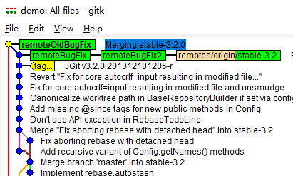
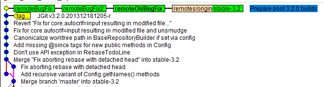
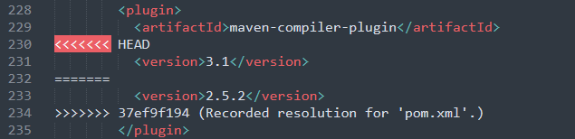
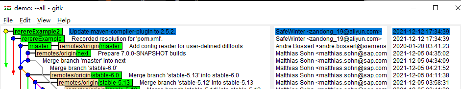

# 第三章 分支、合并及配置项

相关主题：

- 本地分支管理
- 远程分支
- 强制版本合并
- 使用 `git reuse recorded resolution` (`rerere`) 合并有冲突的 Git 版本
- 计算分支间的差异
- 孤立分支（`Orphan branches`）


## 3.1 本地分支管理

假如 `git` 库就在本地，即便无需远程共享代码，本地分支也可以像需要远程共享的仓库那样进行管理。正如本例所示，需要先复制一个仓库到本地，意味着存在一个远程库。

```bash
# clone the jgit repository to match
$ git clone https://git.eclipse.org/r/jgit/jgit 
$ cd jgit 
# Whenever you start working on a bug fix or a new 
# feature in your project, you should create a branch
$ git branch newBugFix 
$ git branch 
* master 
 newBugFix
# The newBugFix branch points to the current HEAD
# to verify this:
$ git log -1 newBugFix --format=format:%H
25fe20b2dbb20cac8aa43c5ad64494ef8ea64ffc
# edit branch description
$ git branch --edit-description newBugFix
# Add description in a newly opened editor
Refactoring the Hydro controller 

The hydro controller code is currently horrible needs to be refactored.  
# Show the description
$ git config --get branch.newBugFix.description 
Refactoring the Hydro controller 

The hydro controller code is currently horrible and needs to be refactored.  
# Show the commit hash the new branch based on
$ cat .git/refs/heads/newBugFix 
25fe20b2dbb20cac8aa43c5ad64494ef8ea64ffc 
```

由此可见，该 `ID` 与当前 `HEAD` 的 `ID` 一致。

注意：新建分支后，要切换到该分支才能使用：`git checkout -b <newBranch>`


拓展：若不从 `HEAD` 新建分支，而是某个提交 ID（`979e346`），此时基于该版本的提交可以写作：

```bash
# new branch from commit ID
$ git branch anotherBugFix 979e346 
$ git log -1 anotherBugFix --format=format:%h 
979e346 
$ git log -1 anotherBugFix --format=format:%H 
979e3467112618cc787e161097986212eaaa4533 
# checkout new branch
$ git checkout -b lastBugFix 979e346
```


查看分支信息：

1. `git branch`：仅分支名称
2. `git branch -v`：在 1 的基础上带注释及简化 `SHA-1`
3. `git branch -vv`：在 2 的基础上展示远程跟踪分支名称

```bash
$ git branch -v 

  anotherBugFix 979e346 Interactive Rebase: Do actions if  
* lastBugFix    979e346 Interactive Rebase: Do actions if  
  master        25fe20b Add missing package import for jg 
  newBugFix     25fe20b Add missing package import for jg
$ git branch -vv 

  anotherBugFix 979e346 Interactive Rebase: Do actions if e 
* lastBugFix    979e346 Interactive Rebase: Do actions if e 
  master        25fe20b [origin/master] Add missing package  
  newBugFix     25fe20b Add missing package import for g 
```


## 3.2 远程分支

有时，本地代码很可能从克隆别人的代码库产生。此时，本地代码就拥有一个远程仓库，通常又叫 `origin` 源。认识 Git 及其远程代码库，可以从 `git status` 命令开始：

```bash
$ git checkout -b remoteBugFix --track origin/stable-3.2
Switched to a new branch 'remoteBugFix'
Branch 'remoteBugFix' set up to track remote branch 'stable-3.2' from 'origin'.
```

可见，`remoteBugFix` 分支的远程跟踪分支为 `origin/stable-3.2`。这时 `git status` 的结果，展示的是本地 `HEAD` 与远程 `HEAD` 之间，本地是否可以快进到远程分支上。示例如下：

```bash
# Find a commit on remote branch
$ git log -10 origin/stable-3.2 --oneline
# Checkout specific SHA-1
$ git reset --hard 2e0d178
HEAD is now at 2e0d17885 Add recursive variant of Config.getNames() methods
# Use 'git status' to see the free benefit of Git
$ git status
On branch remoteBugFix
Your branch is behind 'origin/stable-3.2' by 9 commits, and can be fast-forwarded.
  (use "git pull" to update your local branch)

nothing to commit, working tree clean
```

注意：

1. 这里有个经常出现的概念：`fast-forward`，是指 Git 可以不用合并就能将 `HEAD` 移动到最新的版本上；
2. `git pull` 命令其实是两个命令的组合：
   1. `git fetch`
   2. `git merge`（合并远程跟踪分支到本地分支）

执行上述 `git status` 命令，是用来模拟本地执行 `git fetch` 后，远程分支上的新内容已经被拉取到本地跟踪分支 `origin/stable-3.2` 上的状态。继续合并将实际同步到本地分支上：

```bash
$ git merge origin/stable-3.2
Updating 2e0d17885..f839d383e
Fast-forward
 .../org/eclipse/jgit/api/RebaseCommandTest.java    | 213 +++++++++++++++++----
 .../src/org/eclipse/jgit/api/RebaseCommand.java    |  31 +--
 .../jgit/errors/IllegalTodoFileModification.java   |  59 ++++++
 .../eclipse/jgit/lib/BaseRepositoryBuilder.java    |   2 +-
 .../src/org/eclipse/jgit/lib/Config.java           |   2 +
 .../src/org/eclipse/jgit/lib/RebaseTodoLine.java   |  16 +-
 6 files changed, 266 insertions(+), 57 deletions(-)
 create mode 100644 org.eclipse.jgit/src/org/eclipse/jgit/errors/IllegalTodoFileModification.java
```

根据执行结果可知，正如 `git status` 的提示所言，此次合并是一个快进式合并（`fast-forward merge`）


除了在创建本地分支时用 `--track` 指定远程跟踪分支，`git` 还支持在现有分支上指定远程分支。如果提前创建了本地分支而忘记关联远程分支，`git` 的这一后期绑定功能就派上用场了：

```bash
# Checkout a new branch without relating to its remote tracking branch
$ git checkout -b remoteBugFix2 2e0d17 
Switched to a new branch 'remoteBugFix2' 
# Set the tracking branch manually by using -u or --set-upstream-to
$ git branch --set-upstream-to origin/stable-3.2 
Branch remoteBugFix2 set up to track remote branch stable-3.2 from origin. 
# Validate current status
$ git status 
On branch remoteBugFix2 
Your branch is behind 'origin/stable-3.2' by 9 commits, and can be fast-forwarded. 
  (use "git pull" to update your local branch) 
nothing to commit, working directory clean 
# Same as the previous demo as expected.
# Update the branch (also a fast-forward merge with origin/stable-3.2)
$ git pull 
Updating 2e0d17885..f839d383e
Fast-forward
 .../org/eclipse/jgit/api/RebaseCommandTest.java    | 213 +++++++++++++++++----
 .../src/org/eclipse/jgit/api/RebaseCommand.java    |  31 +--
 .../jgit/errors/IllegalTodoFileModification.java   |  59 ++++++
 .../eclipse/jgit/lib/BaseRepositoryBuilder.java    |   2 +-
 .../src/org/eclipse/jgit/lib/Config.java           |   2 +
 .../src/org/eclipse/jgit/lib/RebaseTodoLine.java   |  16 +-
 6 files changed, 266 insertions(+), 57 deletions(-)
 create mode 100644 org.eclipse.jgit/src/org/eclipse/jgit/errors/IllegalTodoFileModification.java
# The output is still the same as previous one as expected.
# Validate the current HEAD with origin/stable-3.2
$ git log -1 origin/stable-3.2  --format=format:%h
f839d383e
# Still the same.
```


## 3.3 强制生成合并提交

在阅读本书之前，您可能已经看过很多软件交付链和分支模型的案例了；您也很可能一直在尝试不同的策略，最后却发现一旦某工具支持特定的工作流后，就很难完全满足您要的其他应用场景了。而 Git 支持几乎所有工作流场景。 通常的需求是在合并某个特性时要能生成一次合并提交（即便可以通过快进模式来并入新特性）。 这样的需求常用来表示某个特性已被合并，并且希望将这次合并操作显式存到仓库中。

> **小贴士**
>
> 鉴于 `Git` 提供了一套方便快捷的方法来访问所有的提交信息，`Git` 库其实应该用作 **日志**，而不仅仅是对源代码的 **备份**。

以下示例将生成一次强制合并提交：

```bash
# Checkout branch stable-3.1 as remoteOldBugFix for use
$ git checkout -b remoteOldBugFix --track origin/stable-3.1
# force a merge commit
$ git merge origin/stable-3.2 --no-ff --edit --quiet
```

注意，使用 `--edit` 参数后，可以在打开的编辑器中修改默认的合并提交注释信息。示例中的 `--no-ff` 表示禁用快进模式；`--quiet` 用于简化屏幕输出内容。最终的效果如图所示：



为了与常规方式进行对比，执行合并时删除 `--no-ff` 参数项：

```bash
# Reset to initial status
$ git reset --hard  remotes/origin/stable-3.1
# Merge with fast forward by default
$ git merge origin/stable-3.2 --quiet
```

效果如下：




### 中途干预合并内容

除了执行完整合并，Git 还允许用户对合并内容进行干预，自主决定哪些内容参与合并。使用 `--no-commit` 参数，`git` 会在合并提交前中断进程，让用户在最终提交前修改或添加文件。例如，项目的特性分支中修改了项目版本号，但主分支并未修改。默认的合并操作会将版本号一并更新为特性分支上的版本号，而实际上你并不希望动版本号。这时使用 `--no-commit` 就可以避免。

以下示例将对用户干预下的合并操作进行演示。在合并时希望手动剔除更新许可文件那次提交：

```bash
# Clone repo into demo
$ git clone https://github.com/PacktPublishing/Git-Version-Control-Cookbook-Second-Edition_hello_world_flow_model.git demo
$ cd demo
# Checkout remote branch
$ git checkout -b remotePartlyMerge --track origin/release/1.0
Branch remotePartlyMerge set up to track remote branch release/1.0 from origin. 
Switched to a new branch 'remotePartlyMerge'
# Force a merge commit with --no-commit flag
$ git merge origin/master  --no-ff --no-commit
Automatic merge went well; stopped before committing as requested
# Exclude LICENSE file
$ git reset LICENSE
# Resume merging
$ git commit -m "Merging without LICENSE"
[remotePartlyMerge 1202b0e] Merging without LICENSE
# Check status (only LICENSE file remain untracked)
$ git status
On branch remotePartlyMerge
Your branch is ahead of 'origin/release/1.0' by 6 commits.
  (use "git push" to publish your local commits)

Untracked files:
  (use "git add <file>..." to include in what will be committed)
        LICENSE

nothing added to commit but untracked files present (use "git add" to track)
# check difference excluding LICENSE file (only on Linux)
$ git diff origin/master !(LICENSE)
```

考虑到网速问题，已将示例仓库 `Git-Version-Control-Cookbook-Second-Edition_hello_world_flow_model.git` 添加到本学习库中（ `repos/ex3.3-no-commit-repo.rar` ）


## 3.4 使用 `rerere` 合并有冲突的 Git 版本

如果每天都需要合并分支，或者在一个长期维护的特性分支上需要一直相同的代码冲突，那么可以试试 `git rerere`（ `reuse recorded resolution` ）。该命令默认不生效，需要手动配置生效：（可设为用户级配置，添加 `--global` 标记）

```bash
$ git config rerere.enabled true
```

下面以 `jgit` 为例，演示该命令的用法：

```bash
# Checkout a branch
$ git checkout -b rerereExample --track origin/stable-2.2
# Do some modification: 2.5.1 --> 2.5.2, then check by git diff
$ git diff 
diff --git a/pom.xml b/pom.xml
index 085e00fef..d5aec1777 100644
--- a/pom.xml
+++ b/pom.xml
@@ -208,7 +208,7 @@

         <plugin>
           <artifactId>maven-compiler-plugin</artifactId>
-          <version>2.5.1</version>
+          <version>2.5.2</version>
         </plugin>

         <plugin>
# Add a new commit for the modification
$ git add pom.xml
$ git commit
[rerereExample 37ef9f194] Recorded resolution for 'pom.xml'.
 1 file changed, 1 insertion(+), 1 deletion(-)
# Notice the first output from git
# Checkout another branch
$ git checkout -b rerereExample2
Switched to a new branch 'rerereExample2'
# rebase to stable-3.2 branch
$ git rebase origin/stable-3.2
# resolve conflicted file (pom.xml) as follows:
```



```bash
# Notice the code in L233 (from git rerere)
# Remain 2.5.2 line and continue rebase
$ git add pom.xml
$ git rebase --continue
# Add commit message 'Update maven-compiler-plugin to 2.5.2.' in editor
```

用 `gitk` 验证合并效果：




发散练习：当需要确定某个版本归属哪个分支时，可以轻松使用 `git branch` 命令的 `--contains` 参数实现，后跟 `commit` `ID` 即可：

```bash
# list some commit ID and select one
git log -5 --oneline --format='%h %s'
7384fac94 Update maven-compiler-plugin to 2.5.2.
f839d383e Prepare post 3.2.0 builds
699900c30 JGit v3.2.0.201312181205-r
0ff691cdb Revert "Fix for core.autocrlf=input resulting in modified file..."
1def0a125 Fix for core.autocrlf=input resulting in modified file and unsmudge
# select the 3rd one
$ git branch --contains 699900c30
  master
* rerereExample2
# If specific commit ID omitted, HEAD is used:
$ git branch -a --contains
* rerereExample2
```

`contains` 的值除了 `SHA-1` 外，还可以是标签（`tags`）、分支名（`branch names`）：

```bash
# Use tag
$ git branch -a --contains v2.3.0.201302130906
  master
* rerereExample2
  remotes/origin/HEAD -> origin/master
  remotes/origin/master
  remotes/origin/next
  remotes/origin/stable-2.3
  remotes/origin/stable-3.0
# ... (omitted)
```


## 3.5 计算分之间的差异


## 3.6 孤立分支（`Orphan branches`）

