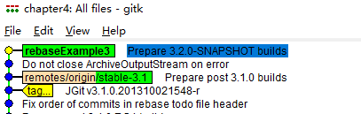

# 第四章 变基操作及相关案例

相关主题：

- 将 `commit` 版本变基到另一分支
- 在版本冲突的情况下执行变基
- 对指定版本执行交互式变基
- 利用交互式变基聚合版本
- 利用交互式变基变更提交者
- 自动聚合版本


## 4.0 变基简介

变基（`Rebasing`）是 Git 具备的一个异常强大的特性。变基是这样一类操作：假如一个 `commit`  **A** 最早是基于 `commit` **B** 的；那么将 **A** 变基到 **C**，就是将 **A** 变为基于 **C** 的操作。

在接下来的演示案例中，你会发现变基操作往往并不像看上去那么容易。


## 4.1 将 `commit` 版本变基到另一分支

先来看看最简单的一类变基操作。相关准备工作：引入一个新文件、提交、变更内容、再提交。这样本地就有了两次 `commit` 版本。

还是以 `jgit` 库为例：

```bash
# Clone jgit repo into chapter4
$ git clone https://git.eclipse.org/r/jgit/jgit chapter4
$ cd chapter4
# Checkout a new branch
$ git checkout -b rebaseExample --track origin/stable-3.1
# Create the 1st commit
$ echo "My Fishtank
    
Gravel, water, plants
Fish, pump, skeleton" > fishtank.txt
$ git add fishtank.txt
$ git commit -m "My brand new fishtank"
# Create the 2nd commit
$ echo "mosquitos" >> fishtank.txt
$ git add fishtank.txt
$ git commit -m "Feeding my fish"
# Rabase to stable-3.2
$ git rebase origin/stable-3.2
Successfully rebased and updated refs/heads/rebaseExample.
```

变基前：


###### 变基后：


`git rebase` 的执行过程：

1. 找到 `HEAD` 与变基指向的目标分支之间的公共版本（`merge-base`）；
2. 基于 `merge-base`，找出目标分支上所有缺少的版本；
3. 尝试将缺少的版本逐一应用到目标分支上。


## 4.2 在版本冲突的情况下执行变基

如果将一个 `commit` 版本或一个 `branch` 分支变基到不同的 `HEAD` 上，很可能会出现版本冲突。此时必须解决完冲突，并运行命令 `git rebase --continue`，方可完成变基。

本节示例将演示如何在有冲突的情况下完成变基。沿用 4.1 节中演示的最终结果，此时 `rebaseExample` 分支已经变基到 `stable-3.2` 分支。示例将从 stable-3.1 重新检出新分支，并添加一个和 `rebaseExample` 分支同名但内容不容的文本文件 `fishtank.txt`：

```bash
# Checkout rebaseExample2
$ git checkout -b rebaseExample2 --track origin/stable-3.1
# Add a new commit
$ echo "My Fishtank
Pirateship, Oister shell
Coconut shell
">fishtank.txt
$ git add fishtank.txt
$ git commit -m "My brand new fishtank"
# Rebase conflicting branches
$ git rebase rebaseExample
Auto-merging fishtank.txt
CONFLICT (add/add): Merge conflict in fishtank.txt
error: could not apply 24f9bf1ef... My brand new fishtank2
hint: Resolve all conflicts manually, mark them as resolved with
hint: "git add/rm <conflicted_files>", then run "git rebase --continue".
hint: You can instead skip this commit: run "git rebase --skip".
hint: To abort and get back to the state before "git rebase", run "git rebase --abort".
Could not apply 24f9bf1ef... My brand new fishtank2
$ subl fishtank.txt
```

冲突情况如下：


改为如下内容后保存、关闭：


添加合并好的文件，继续变基：

```bash
$ git add fishtank.txt
$ git rebase --continue
hint: Waiting for your editor to close the file...
```

打开的编辑器如图所示：


确认、保存并关闭，将看到提示变基成功：

```bash
$ git rebase --continue
[detached HEAD 9911772b3] My brand new fishtank2
 1 file changed, 2 insertions(+), 3 deletions(-)
Successfully rebased and updated refs/heads/rebaseExample2.
# Check new status via gitk
$ gitk
```

详情如下：


可见，本次变基，只将旧分支有、而新分支没有的版本变基过来（即新增 `commit`）。

在首次变基中断的 git 提示信息中，还能看到两个备选项：

1. `git rebase --abort`：如字面含义，中断变基

2. `git rebase --skip`：跳过冲突直接变基，这将导致 `rebaseExample2` 放弃新增的 `commit`，直接并入 `rebaseExample`，变基后指向的父级，和 `rebaseExample` 一致：

   


---


## 4.3 对指定版本执行交互式变基

本例以 4.1 中的 `rebaseExample` 分支为基础，演示如何利用 `--interactive` 标记，将 4.1 中变基的两个 `commit` 重新变基到远程跟踪分支 `stable-3.1` 上：

```bash
$ git checkout rebaseExample
Switched to branch 'rebaseExample'
Your branch is ahead of 'origin/stable-3.1' by 109 commits.
  (use "git push" to publish your local commits)
$ git rebase origin/stable-3.1
```

此时在新弹出的编辑器中会展示一个 commit 列表，范围是 `rebaseExample` 与 `stable-3.1` 之间的、所有可以变基到 `stable-3.1` 的 `commit` 记录。保留示例中新增的两个 `commit`，其余全部删除（即第 89 行及以前的内容）：


保存后退出编辑器可以看到如下输出：

```bash
$ git rebase --interactive origin/stable-3.1
Successfully rebased and updated refs/heads/rebaseExample.
# Check in gitk view:
```

结果如下：


> **示例拓展**

本例还可以通过一个命令快速实现既定效果：

```bash
$ git rebase --onto origin/stable-3.1 origin/stable-3.2 rebaseExample
Successfully rebased and updated refs/heads/rebaseExample.
```

变基前后示意图如下：


## 4.4 利用交互式变基聚合版本

在自己的新分支开发一个特性时，可能会产生多个细粒度的提交版本，而往往这些版本并不需要在并入正式分支时参与代码评审或功能测试。这时就需要在合并分支前，将本地分支通过交互式变基压缩成满足要求的精简版。

本节示例从 origin/stable-3.1 签出新分支 rebaseExample3，并在其中模拟出 6 个新增 `commit` 记录，然后演示怎样将这 6 个版本压缩为两个指定版本：

```bash
$ git checkout -b rebaseExample3 --track origin/stable-3.1
Switched to a new branch 'rebaseExample3'
Branch 'rebaseExample3' set up to track remote branch 'stable-3.1' from 'origin'.
$ git log origin/stable-3.1..origin/stable-3.2 --oneline --reverse
# Reset to the 7th commit listed
$ git reset --hard 5218f7b
# Rebase interactively
$ git rebase --interactive
hint: Waiting for your editor to close the file...
```

弹出编辑器界面如下：


将第二个、第四个版本改为 `squash` 后保存退出：


接着，`git` 会按指定的版本弹出两次编辑器窗口，用以确认被并入的两个 `commit` 的提交信息，可以不作任何修改，退出即可。`Git` 将自动完成其余工作：

```bash
$ git rebase --interactive
[detached HEAD f3ca970dd] Do not close ArchiveOutputStream on error
 Author: Jonathan Nieder <jrn@google.com>
 Date: Mon Sep 23 17:06:18 2013 -0700
 6 files changed, 537 insertions(+), 2 deletions(-)
 create mode 100644 org.eclipse.jgit.test/tst/org/eclipse/jgit/api/DescribeCommandTest.java
 create mode 100644 org.eclipse.jgit/src/org/eclipse/jgit/api/DescribeCommand.java
[detached HEAD b4e20341a] Prepare 3.2.0-SNAPSHOT builds
 Author: Matthias Sohn <matthias.sohn@sap.com>
 Date: Thu Oct 3 17:40:22 2013 +0200
 67 files changed, 422 insertions(+), 372 deletions(-)
 rewrite org.eclipse.jgit.http.server/META-INF/MANIFEST.MF (61%)
 rewrite org.eclipse.jgit.java7.test/META-INF/MANIFEST.MF (66%)
 rewrite org.eclipse.jgit.junit/META-INF/MANIFEST.MF (73%)
 rewrite org.eclipse.jgit.pgm.test/META-INF/MANIFEST.MF (61%)
 rewrite org.eclipse.jgit.pgm/META-INF/MANIFEST.MF (63%)
 rewrite org.eclipse.jgit.test/META-INF/MANIFEST.MF (77%)
 rewrite org.eclipse.jgit.ui/META-INF/MANIFEST.MF (67%)
 rewrite org.eclipse.jgit/META-INF/MANIFEST.MF (64%)
Successfully rebased and updated refs/heads/rebaseExample3.
# Check in gitk
$ gitk
```

结果如下：




> **示例拓展**

除了关键词 `squash`，交互式变基过程中还可以使用 `fixup` 功能，区别在于：`squash` 会保留被压缩 `commit` 的提交信息，而 `fixup` 不会。可以通过 `git log -1` 查看结果，或者与最终版本比较差异：`git diff 5218f7b`。使用 `fixup` 的情况下，应该没有差异内容输出：

```bash
$ git checkout -b rebaseExample4 --track origin/stable-3.1
$ git log origin/stable-3.1..origin/stable-3.2 --reverse --oneline
$ git reset --hard 5218f7b33
$ git rebase --interactive
# Using fixup or f for short:
```


保存后关闭编辑器：

```bash
$ git rebase --interactive
Successfully rebased and updated refs/heads/rebaseExample4.
# Check via gitk
```


```bash
# Check via git status
$ git status -1
commit 9bb94368060f0af6cbf0138c0d10d9b7df98780a (HEAD -> rebaseExample4)
Author: Matthias Sohn <matthias.sohn@sap.com>
Date:   Thu Oct 3 17:40:22 2013 +0200

    Prepare 3.2.0-SNAPSHOT builds

    Change-Id: Iac6cf7a5bb6146ee3fe38abe8020fc3fc4217584
    Signed-off-by: Matthias Sohn <matthias.sohn@sap.com>
# no commit message related to fixup commits
# 
# Check git diff
$ git diff 5218f7b33
# no output as expected
```


与前述期望结果一致。


> **小结**

1. 交互式变基的编辑器视图中，`commit` 列表是按照从近到远的顺序展示的，与 `git log` 的默认顺序 **相反**；
2. `squash` 与 `fixup` 的作用对象，是其 **上一个** 带 `pick` 标记的 `commit`，时间顺序上看则是 **下一个** 带 `pick` 的 `commit`；
3. 虽然选了 6 个版本来演示版本压缩，但实际进入操作列表的只有 4 个版本，另两个其实是合并产生的 `commit`，根据 `Git` 的相关文档，这样的 `commit` 不参与交互式变基，也不推荐使用 `--preserve-merges` 标记保留它们。


## 4.5 利用交互式变基变更提交者

开发一个新项目时，一开始可能设置的作者和邮箱并不是最终需要的，这时可能需要批量更正为正确的提交人信息。然而一般的 `git commit --amend` 只对 `HEAD` 处的 commit 有效，如果要应用到指定范围的 `commit` 对象上，可以借助交互式变基实现。

示例将从 `master` 分支签出一个新分支 `resetAuthorRebase`，

```bash
# Checkout new branch from master
$ git checkout -b resetAuthorRebase -t origin/master
# Update HEAD's committer info (exit without modifying anything)
$ git commit --amend --reset-author
# Check the updated status (already updated)
$ git log --format='format:%h %an <%ae>' origin/stable-3.2..HEAD -5

b76ed52f8 SafeWinter <zandong_19@aliyun.com>
caea5a26f Matthias Sohn <matthias.sohn@sap.com>
284d2b5b9 Matthias Sohn <matthias.sohn@sap.com>
35713588f Matthias Sohn <matthias.sohn@sap.com>
1cffba438 Matthias Sohn <matthias.sohn@sap.com>
$ git rebase --interactive --exec "git commit --amend --reset-author --reuse-message=HEAD" origin/stable-3.2
# When the editor view appeared, close it without modification
# Check via git log
$ git log --format='format:%h %an <%ae>' origin/stable-3.2..HEAD
c5365deec SafeWinter <zandong_19@aliyun.com>
13512ccd0 SafeWinter <zandong_19@aliyun.com>
d54c9e86b SafeWinter <zandong_19@aliyun.com>
6f090c0ea SafeWinter <zandong_19@aliyun.com>
96260fb33 SafeWinter <zandong_19@aliyun.com>
0d55fae34 SafeWinter <zandong_19@aliyun.com>
308bd65f7 SafeWinter <zandong_19@aliyun.com>
849ec32b1 SafeWinter <zandong_19@aliyun.com>
9f5b85b33 SafeWinter <zandong_19@aliyun.com>
5a74b14af SafeWinter <zandong_19@aliyun.com>
... more logs omitted
```

实测效果：


> **小结**

执行交互式变基时，一个非常重要的参数，是在 `--exec` 参数指定的命令中，加入 `--reuse-message=HEAD`，表示将 `HEAD` 的修改结果复用到变基命令指定的 `commit` 对象中。如果不加该参数，`Git` 就会逐一弹出编辑器窗口让用户确认提交消息。加了 `--reuse-message=HEAD` 后才能自动取消弹窗提示。

本节示例功能虽然应用场景不常见，但却非常实用。


## 4.6 自动聚合版本
