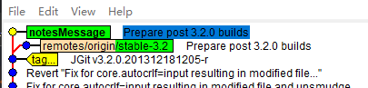

# 第五章 在 `Git` 仓库存入附加信息

相关主题：

- 添加第一条 `Git` 笔记
- 按类别区分 `Git` 笔记
- 从远程库读取 `Git` 笔记
- 推送 Git 笔记到远程库
- 为 `commit` 版本添加标签

---


`Git` 最强大的一个特性，在于它的提交历史永不可改变。这意味着任何试图篡改仓库历史的行为，对其他克隆该仓库的人来说都是可见的。这一特性也给开发者带来些许困扰，尤其是需要在已经发布的提交记录中修改版本注释信息的时候。正是由于 `git` 历史的不可变更性，`git` 笔记（`notes`）才应运而生。本质上，`git` 笔记是 `refs/notes/commits` 引用的附加版。笔记内容既可以在执行 `git log` 命令时，随提交信息一同展示出来，也可以发布到远程仓库供其他人获取笔记。


## 5.1. 添加第一条 `Git` 笔记

本节将在已发布的版本中添加附加信息。如果直接修改目标版本，则 `commit` 的哈希值也会变动。以 `jgit` 库为例，先演示直接修改历史版本的效果，再给出使用 `git` 笔记的演示方案。

```bash
# Clone repo
$ git clone https://git.eclipse.org/r/jgit/jgit chapter5
$ cd chapter5 
# Checkout a new branch based on stable-3.2
$ git checkout -b notesMessage  --track origin/stable-3.2
# Check HEAD hash: f839d383e6fbbda26729db7fd57fc917fa47db44
$ git log -1 
# Edit commit message, add 'Update MANIFEST files'
$ git commit --amend
# Check HEAD hash: f942f7b58238b5aaac566038a7d67e0cb6a02fe1
# commit hash diverged
$ git log -1 
# See the change via status
$ git status
# via gitk
$ gitk origin/stable-3.2 HEAD
```

结果如下：（版本结构已发生变化）



这是使用 `git note` 就可避免：

```bash
# Resume
$ git reset --hard origin/stable-3.2
# Add a git note
$ git notes add -m 'Update MANIFEST files'
# Check git log (f839d383e6fbbda26729db7fd57fc917fa47db44)
$ git log -1
commit f839d383e6fbbda26729db7fd57fc917fa47db44 (HEAD -> notesMessage, origin/stable-3.2)
Author: Matthias Sohn <matthias.sohn@sap.com>
Date:   Wed Dec 18 21:16:13 2013 +0100

    Prepare post 3.2.0 builds

    Change-Id: Ie2bfdee0c492e3d61d92acb04c5bef641f5f132f
    Signed-off-by: Matthias Sohn <matthias.sohn@sap.com>

Notes:
    Update MANIFEST files
# Check status (not diverged)
$ git status
# (No changes)
```

虽然 `git notes` 没有在原记录上直接修改（像 `--amend` 那样），但也实现了对历史提交信息进行增补，且不影响原有的树形版本结构。


> **拓展**

除了通过 `git notes add` 新增一个 `git` 笔记，还可以强制替换（`-f`）、追加（`append`）、编辑（`edit`）`git` 笔记：

```bash
# force to add notes (replace the old one)
$ git notes add -f -m "Update MANIFESTS files for next version"
# append content to a note
$ git notes append -m "Verified by John Doe"
# Show in the log via --notes
$ git log --oneline --notes
f839d383e (HEAD -> notesMessage, origin/stable-3.2) Prepare post 3.2.0 builds
Notes:
    Update MANIFESTS files for next version

    erified by John Doe

# Edit a note (this would replace the old note with 'John Doe')
$ git notes edit -m 'John Doe'
The -m/-F/-c/-C options have been deprecated for the 'edit' subcommand.
Please use 'git notes add -f -m/-F/-c/-C' instead.
# git notes edit without any arguments would be the same as git notes add
$ git log --oneline --notes -1
f839d383e (HEAD -> notesMessage, origin/stable-3.2) Prepare post 3.2.0 builds
Notes:
    John Doe

```

更多子命令，详见 `git help notes`。


> **小结**

1. `git notes edit -m` 的用法已被淘汰，Git 推荐使用 `git notes add` 来替换 `git notes edit`；
2. 决定 commit 哈希值的三个因素：
   1. 版本内容（the content in the commit）
   2. 父级版本（the parents of the commit）
   3. 提交信息（the commit message）

---


## 5.2 按类别区分 `Git` 笔记

正如上一节提到的，git 笔记本质上是一个命名空间为 `refs/notes/` 的引用，默认展示在 git log 中的是 `refs/notes/commits` 引用。此外还可以自定义笔记类别，如 `featureImplemented`、`defect`、`alsoCherryPick` 等等，以便对笔记统一归类管理。

本例的演示场景：假设在项目中修正了一个缺陷（`defect`），产生了一个 commit 版本，同时还对受该缺陷影响的其他版本做了同步修复。示例将新建一个 `git` 笔记类型 `refs/notes/alsoCherryPick`，用来说明当前版本如果要被 `cherry-pick` 到其他分支，那么应该同时将 `alsoCherryPick` 中提到的相关 `commit` 版本一并带上，因为它们都是对同一缺陷的修复。

```bash
# Checkout new branch
$ git checkout -b notesReferences --track origin/stable-3.1
# List commits for use
$ git log -10 --oneline
da6e87bc3 (HEAD -> notesReferences, origin/stable-3.1) Prepare post 3.1.0 builds
16ca725b3 (tag: v3.1.0.201310021548-r) JGit v3.1.0.201310021548-r
c6aba9966 Fix order of commits in rebase todo file header
5a2a2222e Prepare post 3.1.0 RC1 builds
6f0681eb9 (tag: v3.1.0.201309270735-rc1) JGit v3.1.0.201309270735-rc1
a065a06c2 Attempt to fix graph layout when new heads are introduced
b4f07df35 Prepare re-signing pgm's ueberjar to avoid SecurityException
aa4bbc67b Use full branch name when getting ref in BranchTrackingStatus
570bba5e7 Ignore bitmap indexes that do not match the pack checksum
801aac579 Merge branch 'stable-3.0'

# Add notes for current HEAD
$ git notes add -m "test note"
# Select a commit (570bba5) categoried as alsoCherrypick
$ git notes --ref alsoCherryPick add -m "570bba5" b4f07df
# Check in the log view with --notes
$ git log -1 b4f07df --notes=alsoCherryPick
# config the alsoCherryPick notes' reference by default
$ git config notes.displayRef "refs/notes/alsoCherryPick"
# config to show all notes with all categories
$ git config notes.displayRef 'refs/notes/*'
# Test to add a new note with category of 'defect'
$ git notes --ref defect add -m "Bug:24435" b4f07df
# Check to see whether or not defect content is displayed
$ git log -1 b4f07df --oneline --notes
b4f07df35 Prepare re-signing pgm's ueberjar to avoid SecurityException
Notes:
    test note1

Notes (alsoCherrypick):
    570bba5

Notes (defect):
    Bug:24435
```

> **小结**

1. 添加 `git notes` 默认归类到 `refs/notes/commits`，可随 `git log` 一并展示；
2. 如果使用 `git log --oneline`，则显示对应的 `git notes` 需要带 `--notes` 标记；
3. 让 `git log` 显示自定义类型的 `notes`，有两种方式：
   1. 在 `git log` 后加 `--notes=<categoryName>`；
   2. 修改 `git` 配置项：`git config notes.displayRef 'refs/notes/<catName>'` 或 `git config notes.displayRef 'refs/notes/*'`；


> **拓展**

检出分支时，联想到 `git` 笔记引用与其他远程跟踪分支引用的相似性，可以在本地直接签出 `refs/notes` 分支：

```bash
$ git checkout -b myNotes notes/alsoCherryPick
Switched to a new branch 'myNotes'
$ ls
b4f07df357fccdff891df2a4fa5c5bd9e83b4a4a
$ cat b4f07df357fccdff891df2a4fa5c5bd9e83b4a4a
570bba5
```

可见，将 `notes` 引用作远程跟踪分支时，该分支下的文件，其文件名为指定类别的 `notes` 所指向的目标 `commit` 的哈希值，文件内容为 `git` 笔记内容。

值得一提的是，经实测，签出某个 `notes` 引用后，对应的分支并不会自动更新该引用下的文件列表（当有多个同一类别的 `note` 时，该目录就有相同数量的文件），只能删除分支后重新签出。


## 5.3 从远程库读取 `Git` 笔记

由于 `git` 笔记并非 `git` 的默认项，因此同步远程库的笔记，或者推送本地笔记到远程库与之前的操作不太一样。

本节将以本地 `chapter5` 为远程库，演示 git 笔记从远程库读取的操作流程。

```bash
# Prepare locat remote repo
$ git checkout master
# Checkout stable-3.1 for use
$ git branch stable-3.1 origin/stable-3.1
$ git branch
* master
  myNotes
  notesMessage
  notesReferences
  stable-3.1
# clone repo from chapter5 locally
$ cd ..
$ git clone ./chapter5 shareNotes
$ cd shareNotes
# Check remote branches
$ git branch -a
* master
  remotes/origin/HEAD -> origin/master
  remotes/origin/master
  remotes/origin/myNotes
  remotes/origin/notesMessage
  remotes/origin/notesReferences
  remotes/origin/stable-3.1
```

**注意**：之所以要在 `chapter5` 签出 `master` 分支和 `stable-3.1` 分支，是因为本节示例要将 `chapter5` 仓库作为远程库，而 `git clone` 命令默认会将 `refs/heads/*` 下的所有分支克隆出去，作为目标仓库的远程分支。

先看看克隆出的仓库直接查看 `git` 笔记的情形：

```bash
# within shareNotes repo
$ git log -1 b4f07df --notes=alsoCherryPick
warning: notes ref refs/notes/alsoCherrypick is invalid
commit b4f07df357fccdff891df2a4fa5c5bd9e83b4a4a
Author: Matthias Sohn <matthias.sohn@sap.com>
... (more output omitted)
```

根据第一句的提示，`shareNotes` 库中的自定义笔记类型 `alsoCherrypick` 无效，然而它在 `chapter5` 库中确实存在。这时需要新增一条 `fetch` 规则，先来看看默认的设置：

```bash
$ git config --get remote.origin.fetch
+refs/heads/*:refs/remotes/origin/*
```

结果显示，`chapter5` 的 `refs/heads/*` 被 `fetch` 到了 `shareNotes` 库的 `refs/remotes/origin/*`。新增如下 `notes` 配置项：

```bash
$ git config --add remote.origin.fetch '+refs/notes/*:refs/notes/*'
# Check the config
$ git config --get-all  remote.origin.fetch
+refs/heads/*:refs/remotes/origin/*
+refs/notes/*:refs/notes/*
# then fetch
$ git fetch
From C:/Users/ad/Desktop/./chapter5
 * [new ref]             refs/notes/alsoCherrypick -> refs/notes/alsoCherrypick
 * [new ref]             refs/notes/commits        -> refs/notes/commits
 * [new ref]             refs/notes/defect         -> refs/notes/defect
# retry
$ git log -1 b4f07df --notes=alsoCherryPick --oneline
b4f07df35 Prepare re-signing pgm's ueberjar to avoid SecurityException
Notes (alsoCherrypick):
    570bba5
```

这样，通过新增 `fetch` 规则，就能从远程库拉取 `git` 笔记数据。


> **小结**

1. `fetch` 默认将 `refs/heads/*` 拉取到本地远程跟踪分支 `refs/remotes/origin/*`
2. 要想 `fetch` 远程 `notes`，需要创建 `fetch` 规则，将远程 `refs/notes/*` 拉取到本地的 `refs/notes/*`；
3. 配置具有多个值的 `git` 配置项时，需要加 `--add`，否则不会追加，而是覆盖；同样的，查看所有配置的值，需要加 `--get-all` 参数，否则只显示一个。


## 5.4 推送 Git 笔记到远程库

与获取远程笔记类似，推送笔记到远程库也需要手动指定：(`git push origin refs/notes/*`)

```bash
# Add a new local git note in category of verified
$ git notes --ref verified add -m 'Verified by john.doe@example.com' 871ee53b52a
# Check note locally
$ git log -1 871ee53b52a --notes=verified --oneline
871ee53b5 Reset internal state canonical length in WorkingTreeIterator when moving
Notes (verified):
    Verified by john.doe@example.com
# try default push
$ git push
# specify notes reference by hand
$ git push origin refs/notes/*
# Check in remote repo
$ cd ../chapter5
$ git log --notes=verified -1 871ee53b52a --oneline
871ee53b5 Reset internal state canonical length in WorkingTreeIterator when moving
Notes (verified):
    Verified by john.doe@example.com
```

小结：由于 `git notes` 不是 `git` 的常规分支，与远程库的数据交互要繁琐些。一个推荐做法是搭建一套工具来添加 `git` 笔记，这样只用新增一个处理笔记的服务器即可。

同时，作为一个有效补充，笔记内容也可以关联 `Jenkins` 构建工具或测试套件，尤其是后期需要追加笔记内容时用处很大，可以直观查看哪些版本执行了哪些测试。


## 5.5 为 `commit` 版本添加标签

项目发布时，就会用到标签（`git tags`）。标签是对仓库中的软件发布版本的描述，分为 **轻量级标签** 和 **带注解标签** 两种。轻量级标签就是一个具名引用，如 `refs/tags/version123`。该标签指向一个目标 `commit`；而一个本地签出的分支的引用，是 `refs/heads/version123`。

标签和分支的区别在于，分支的引用会随工作的推进不断前进，而标签永远指向创建时指向的目标 `commit` 版本。

本节示例，将基于 `chapter5` 的 `stable-2.3` 分支，同时要在落后 `stable-2.3` 10 个版本的位置添加标签：

```bash
# repo init
$ git checkout stable-2.3 
# list the latest 11 commits without merged commits
$ git log -11 --no-merges --oneline
# find the target commit (ea060dd)
$ git tag 'v2.3.0.201302061315rc1' ea060dd
# query a tag by wildcards
$ git tag -l "v2.3.0.2*"
# show the detail
$ git show v2.3.0.201302061315rc1
# It should behave the same as using SHA-1
$ git show ea060dd
# Create an annotated tag with --annotate
# Here -m means --message, which would bring up an default editor view when left out
$ git tag --annotate -m "Release Maturity rate 97%" 'v2.3.0.201409022257rc2' 1c4ee41
# Check the new tag
$ git show 'v2.3.0.201409022257rc2'
```

Git 标签可以提供很多关键信息，可以作为代码库的正式发布版本使用，因此其标签内容及发布需要引起高度重视。

这里有个细节需要特别注意：如果将发布到线上的某个 `tag` 版本，重新指向另一个 `commit` 位置，那么对于已经拉取该版本到本地的开发人员而言，`fetch` 操作不会同步 `tag` 到最新的指向上，除非在本地删除该标签后重新拉取。

验证如下：

```bash
# remove the tag
$ git tag -d v1.3.0.201202121842-rc4
# then update it to point to HEAD
$ git tag -a -m "Local created tag" v1.3.0.201202121842-rc4
# fetch from remote
$ git fetch
# verify tag (still the local one)
$ git show v1.3.0.201202121842-rc4
# then delete a tag
$ git tag -d v1.3.0.201202121842-rc4
# fetch again
$ git fetch
# Check again
$ git show v1.3.0.201202121842-rc4
```

这样才能同步到新标签。这也给我们提了个醒：不要擅自改动发布到线上的标签版本。否则提前同步过这一版本的开发者无法及时获知版本更新，除非手动删除重新同步或重新克隆远程库。


>  **章节综述**

本章学习了添加 `tag` 标签和 `note` 笔记的各种方法。提交一个版本前，应提供该版本的关键信息，写明这个版本做了什么，以及为什么要这样做：

- 如果正在解决一个 bug，应该列出 bug ID；
- 如果运用了特殊的方法来解决问题，应该描述清楚这么做的缘由

这样在回顾 `commit` 版本时，就能了解到当时为何采取不同方案的基本情况。


