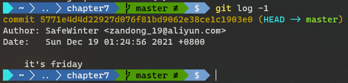
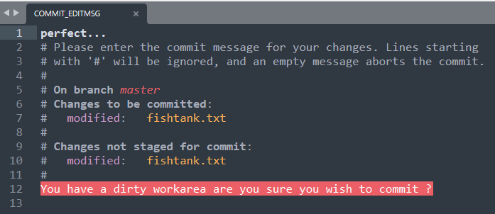

# 第七章 用 Git 钩子、别名、脚本提升日常工作效率

相关主题：

- 在提交消息中应用分支描述信息
- 创建提交消息的动态模板
- 在提交消息中应用外部信息
- 阻止特定版本推送到远程库
- 配置并使用 Git 别名
- 配置并使用 Git 脚本
- 设置并使用提交消息模板

---


为了在公司高效工作，产出的任何代码都该遵循一些原则或规范，让其顺利通过编译或单元测试；也应该在提交注释中加上一定的文字说明，比如已修复的 `bug` 的 ID 标识，或者相关实例的引用等等。绝大部分这类规则都可以通过脚本自动完成。既然如此，何不让它们在版本提交时自动进行呢？本章给出的示例，将向您展示如何在输出最终的提交注释前，将某处的数据转移到提交注释中，并可以学到一些实用方法，验证代码是否推送到想要的地方。最后介绍如何在 Git 中添加执行脚本。

Git 中的钩子（`hook`）是一段处理脚本，可以在特定事件发生时触发执行（如推送、提交、变基等）。如果脚本在退出时返回一个非零的值，则取消当前的 `git` 操作。这些 `hook` 脚本可以在克隆到本地的仓库文件夹 `.git/hooks` 下找到。如果文件扩展名是 `.sample`，表示当前不生效。


## 7.1 在提交消息中应用分支描述信息

在第三章介绍分支时，提到过为分支设置描述信息的命令，查看描述内容可通过如下命令完成：

```bash
$ git config --get branch.<branchname> description
```

本节示例演示怎样将分支描述信息应用到提交注释中。需要用到的 `hook` 钩子，叫作 `prepare-commit-msg`，在提交时触发。在实际弹出提交注释的编辑器之前，可以将钩子设置为您想要检查的任何内容。

示例中的脚本编写需要一定的 `shell` 基础。

以 `jgit` 库的 `stable-3.2` 分支为例，演示怎样在本地分支设置描述信息、进而创建 git 钩子了提取该信息到提交注释中：

```bash
# prepare repo and branch
$ git clone https://git.eclipse.org/r/jgit/jgit chapter7.5
$ cd chapter7.5
$ git checkout -b descriptioInCommit  --track origin/stable-3.2
# Edit description
$ git branch --edit-description descriptioInCommit
########### branch description start ###########
Remote agent not connection to server
    
When the remote agent is trying to connect
it will fail as network services are not up
and running when remote agent tries the first time
########### branch description stop  ###########
# Check the config
$ git config --get branch.descriptioInCommit.description
# edit hook file and make it executable (chmod +x)
$ vim .git/hook/prepare-commit-msg
# hook content:
#!/bin/bash
BRANCH=$(git branch | grep '*'| sed 's/*//g'|  sed 's/ //g')
DESCRIPTION=$(git config --get branch.${BRANCH}.description)
if [ -z "$DESCRIPTION" ]; then
  echo "No desc for branch using default template"
else
  # replacing # with n
  DESCRIPTION=$(echo "$DESCRIPTION" | sed 's/#/\n/g')
  # replacing the first \n with \n\n
  DESCRIPTION=$(echo "$DESCRIPTION" | sed 's/\n/\n\n/')
# append default commit message
DESCRIPTION=$(echo "$DESCRIPTION" && cat $1)
# and write it all to the commit message
echo "$DESCRIPTION" > $1
fi
# Test with an empty commit
$ git commit --allow-empty
```

弹出的编辑器窗口情况如下：


```bash
# save and check it in git log:
$ git log -1
commit a2aad6607b1d251a480bbf98b3e8ab4063266165 (HEAD -> descriptionInCommit)
Author: SafeWinter <zandong_19@aliyun.com>
Date:   Sat Dec 18 19:35:08 2021 +0800

    Remote agent not connection to server

    When the remote agent is trying to connect
    it will fail as network services are not up
    and running when remote agent tries the first time
# Checkout another new branch and test
$ git checkout -b noDescriptionBranch
$ git commit --allow-empty
```

结果如下：


## 7.2 创建提交消息的动态模板

要让开发者做对的事，要么出于鼓励，要么出于强制。无论是哪一种，最终都需要开发者花时间来写出代码。这时如果需要一个不错的提交注释，可以试试 `prepare-commit-msg` 钩子来辅助开发人员。

本节示例将在提交注释中动态包含工作区状态的相关信息；此外，也能动态插入外部网页中的信息，比如 `Bugzilla` 中的缺陷相关的信息。

示例将从一个新仓库开始，`git` 库初始化的两种方式：

1. 创建新仓库：`git init <directory>`
2. 在指定目录中：`git init`

> **例一：设置为拒绝提交**

```bash
$ git init chapter7
$ cd chapter7
$ ls .git/hooks/
$ cd .git/hooks/
$ mv prepare-commit-msg.sample prepare-commit-msg
$ vim prepare-commit-msg
#!/bin/bash 
echo "I refuse to commit"
exit 1
$ cd -
$ git commit --allow-empty
I refuse to commit
$ git log -1
fatal: your current branch 'master' does not have any commits yet
```


> **例二：拒绝 `git commit --amend`**

 `prepare-commit-msg` 钩子还可以接收参数，第一个参数为 `.git/COMMIT_EDITMSG`，第二个参数可以是 `merge`、`commit`、`squash`，或 `template`，具体取值取决于当时的场景。例如提交时拒绝使用 `--amend` 方式修订记录：

`prepare-commit-msg`：

```bash
#!/bin/bash
if [ "$2" == "commit" ]; then
  echo "Not allowed to amend"
  exit 1
fi
```

测试一下效果：

```bash
$ echo "a lot of fish" > fishtank.txt
$ git add fishtank.txt
$ git commit -m "All my fishes are belong to us"
$ git commit --amend
Not allowed to amend
```


> **例三：在提交注释中插入外部网页的请求内容**

修改 `prepare-commit-msg` 钩子如下：

```bash
#!/bin/bash
if [ "$2" == "commit" ]; then 
  echo "Not allowed to amend"
  exit 1
fi
MESSAGE=$(curl -s http://whatthecommit.com/index.txt)
echo "$MESSAGE" > $1
```

第六行是从网站 http://whatthecommit.com 上请求一则提交消息放入 MESSAGE 变量。测试是否生效：

```bash
$ echo "gravel, plants, and food" >> fishtank.txt
$ git add fishtank.txt
$ git commit
```

弹出的编辑器如下：


确认提交后，查看 `git log -1` 的输出结果：



符合预期。实际工作中更常见的情形，是从一个外部系统，例如 `TeamForge` 拉取 `bug` 信息，再按一定的格式列举到提交注释中：

```bash
# You have the following artifacts assigned
# Remove the # to add the artifact ID to the commit message
    
#[artf23456] Error 02 when using update handler on wlan
#[artf43567] Enable Unicode characters for usernames
#[artf23451] Use stars instead of & when keying pword
```

这样方便开发人员快速根据 `bug` 情况提交版本注释，同时也方便后续系统根据格式化后的提交注释检索需要的信息。


> **拓展**

`prepare-commit-msg` 钩子的功能扩展起来很轻松，关键是记住一点：获取某些信息的等待时间应该是值得的。通常容易检查的一件事是脏工作区（`dirty work area`）。我们可以在 `prepare-commit-msg` 钩子中使用 `git status` 的结果，来预测工作区的内容在提交后是否仍有被改动的文件：

```bash
$ git status
$ echo "saltwater" >> fishtank.txt
$ git status --porcelain
 M fishtank.txt
$ git add fishtank.txt
$ git status --porcelain
M  fishtank.txt
$ echo "sharks and oysters" >> fishtank.txt
$ git status --porcelain
MM fishtank.txt
```

注意第 4 行与第 7 行的细微差别，`porcelain` 参数是以对机器友好的形式呈现 git 库的当前状态：

1. 第一个字符位：表示暂存区（`staging area`）的状态
2. 第二个字符位：表示工作区（`work area`）的状态

因此可以利用这一特性，对 `prepare-commit-msg` 钩子做如下改造，判定仓库在提交后是否仍存在尚未提交的改动：

```bash
#!/bin/bash
if [ "$2" == "commit" ]; then 
  echo "Not allowed to amend"
  exit 1
fi
MESSAGE=$(curl -s http://whatthecommit.com/index.txt)
echo "$MESSAGE $(cat $1)" > $1

for file in $(git status --porcelain)
do
  if [ ${file:1:1} ]; then 
    DIRTY=1
  fi
done
if [ "${DIRTY}" ]; then
  # -i '' is not needed on Linux 
  sed "s/# Please/You have a dirty workarea are you sure you wish to commit ?\n&/" $1
  echo "You have a dirty workarea are you sure you wish to commit ?" >> $1
fi
```

第 3 行是检测第二个字符位是否为空。如果非空，提交后就会出现脏工作区。最后把相关提示插入提交注释中。来看看效果：

```bash
$ git commit
```

弹出的编辑器内容如下：



保存并直接提交后，原命令行的输出情况：


根据提示，工作区在提交后仍有变更。再到 `git log` 中查看：

```bash
$ git log -1
```


这样就能在提交的时候，检测工作区是否有遗漏的变更。

（此处与书中的结果略有不同，但殊途同归。原脚本的问题在于 `echo "$MESSAGE" > $1` 将原来的提示信息覆盖了，具体更正方案待定。）

为了方便下一节的演示，恢复到拓展之前的状态：

```bash
$ git reset --hard HEAD^
```

（此处有笔误，原书命令为 `git reset --hard HEAD`，末尾少了一个 `^`）


## 7.3 在提交消息中应用外部信息

关闭提交注释编辑器时，会触发 `commit-msg` 钩子，可用于处理提交注释或完成一个自动检测工作。

本节示例需要先禁用 `prepare-commit-msg` 钩子，同时启用 `commit-msg` 钩子：

```bash
# init hooks
$ git checkout -b commit-msg-example
Switched to a new branch 'commit-msg-example'
$ mv .git/hooks/prepare-commit-msg .git/hooks/prepare-commit-msg.example
$ cp .git/hooks/commit-msg.sample .git/hooks/commit-msg
```

> **示例一：禁止提交**

`commit-msg` 脚本修改如下：

```bash
#!/bin/bash
echo "you are not allowed to commit"
exit 1
```

验证：

```bash
$ echo "Frogs, scallops, and coco shell" >> fishtank.txt
$ git add fishtank.txt
# no matter what you input into the editor, you got result like this:
$ git commit
you are not allowed to commit
$ git log -1
commit 64b780b3d4918e5a56ddca5662431be4fd0e3789 (HEAD -> commit-msg-example, master)
Author: SafeWinter <zandong_19@aliyun.com>
Date:   Sun Dec 19 02:41:48 2021 +0800

    did everything
```

可见，`commit-msg` 钩子是在关闭编辑器时触发，而 `prepare-commit-msg` 钩子是在弹出编辑器之前。


> **示例二：与 Jenkins-CI 组合使用**

修改 `commit-msg` 钩子：

```bash
#!/bin/bash
JIRA_ID=$(cat $1 | grep jenkins | sed 's/jenkins //g')
ISSUE_INFO=$(curl -g "https://issues.jenkins.io/browse/JENKINS-${JIRA_ID}")
if [ -z "${ISSUE_INFO}" ]; then 
  echo "Jenkins issue ${JIRA_ID} does not exist"
  echo "Please try again"
  exit 1
else
  TITLE=$(curl -g "https://issues.jenkins.io/browse/JENKINS-${JIRA_ID}" | grep -E "<title>.*</title>")
  echo "Jenkins issue ${JIRA_ID}"
  echo "${TITLE}"
  exit 0
fi
```

注意：由于时间间隔过久，原请求地址已经改为 `https://issues.jenkins.io/browse/JENKINS-${JIRA_ID}`。

这里用到了 `CURL` 来获取网页内容，分别用一个无效 ID（`jenkins 384895`）与有效 ID （`jenkins 3157`）进行测试：

```bash
$ echo "more water" >> fishtank.txt
$ git add fishtank.txt
$ git commit
```

此时，在弹出编辑器的首行，即 `subject` 位置，输入 `Feature cascading ...`，然后在第三行，即 `body` 位置，输入 `jenkins 384895`，保存，关闭编辑器，返回命令行将看到如下结果：


很明显，无效 ID 无法顺利提交，可以用 `git status` 验证：


再来看看有效 ID 的情况。在提交注释编辑器中输入如下内容：

```bash
Feature: Cascading...

jenkins 51444
```

得到结果：


有效 ID 顺利提交，查看提交日志：

```bash
$ git log -1
commit 2fc2c1711cb86c731f9a2e94b7dee95b873acfa9 (HEAD -> commit-msg-example)
Author: SafeWinter <zandong_19@aliyun.com>
Date:   Sun Dec 19 17:47:19 2021 +0800

    Feature: Cascading...

    jenkins 51444
```

这里与原书不一致，按书中的原意，title标签的内容应该加到提交注释中，因此 `commit-msg` 钩子漏了一个写入的操作：（第 11 行）

```bash
#!/bin/bash
JIRA_ID=$(cat $1 | grep jenkins | sed 's/jenkins //g')
ISSUE_INFO=$(curl -g "https://issues.jenkins.io/browse/JENKINS-${JIRA_ID}")
if [ -z "${ISSUE_INFO}" ]; then 
  echo "Jenkins issue ${JIRA_ID} does not exist"
  echo "Please try again"
  exit 1
else
  TITLE=$(curl -g "https://issues.jenkins.io/browse/JENKINS-${JIRA_ID}" | grep -E "<title>.*</title>")
  echo "Jenkins issue ${JIRA_ID}"
  echo "${TITLE}" >> $1
  exit 0
fi
```

再次验证（与书中一致）：


如果需要去掉查询结果中的 `<title></title>` 标签，可以对 `commit-msg` 脚本调整如下：

```bash
#!/bin/bash
JIRA_ID=$(cat $1 | grep jenkins | sed 's/jenkins //g')
ISSUE_INFO=$(curl -g "https://issues.jenkins.io/browse/JENKINS-${JIRA_ID}")
if [ -z "${ISSUE_INFO}" ]; then 
  echo "Jenkins issue ${JIRA_ID} does not exist"
  echo "Please try again"
  exit 1
else
  TITLE=$(curl https://issues.jenkins.io/browse/JENKINS-${JIRA_ID} | grep -E "<title>.*</title>")
  TITLE=$(echo ${TITLE} | sed 's/^<title>//' | sed 's/<\/title>$//')
  echo "Jenkins issue ${JIRA_ID}"
  echo "${TITLE}" >> $1
exit 0
fi
```

新增一次提交，验证结果如下：


本例中，提交注释如果填入无效的 ID，会直接丢弃已经写好的注释内容，实际工作中不应如此简单粗暴。一个更合理的方案是结合 `prepare-commit-msg` 钩子实现提交注释内容的“缓存”：如果提交中断，则将已经写好的注释内容临时保存到一个位置，以便下次提交时，用 `prepare-commit-msg` 钩子提前读取。


## 7.4 阻止特定版本推送到远程库


## 7.5 配置并使用 Git 别名

## 7.6 配置并使用 Git 脚本

## 7.7 设置并使用提交消息模板
