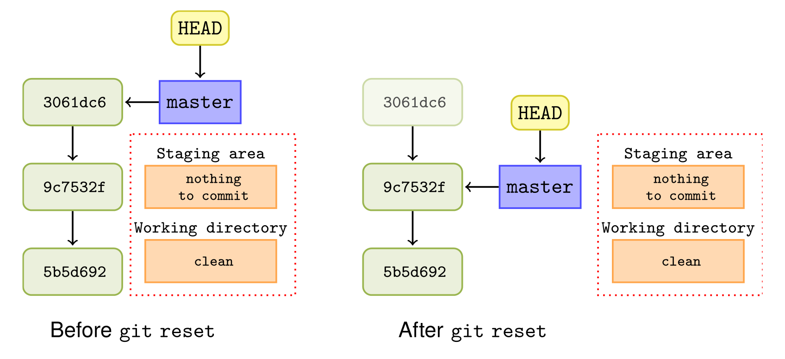
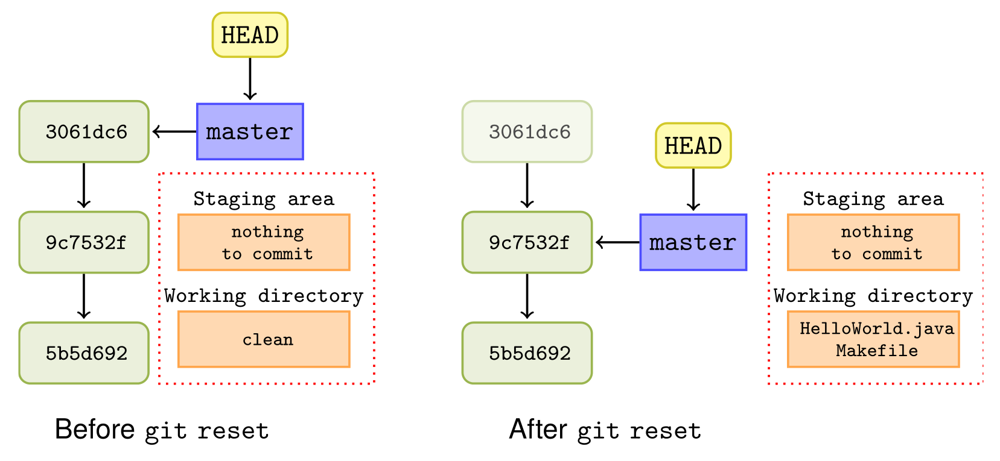
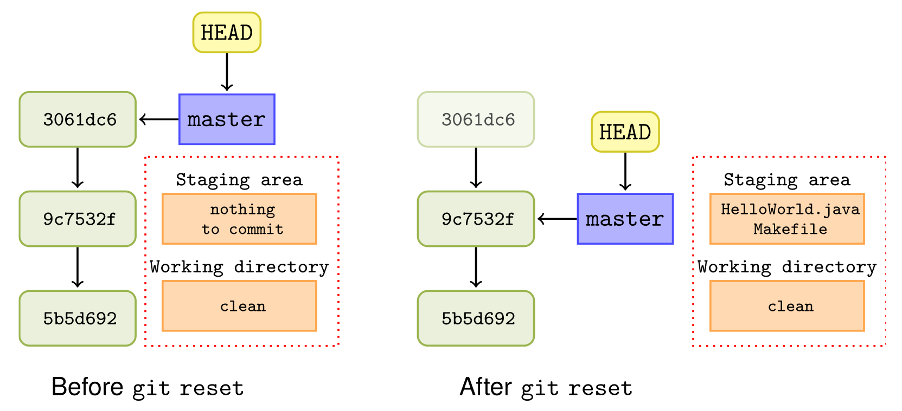
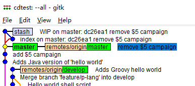
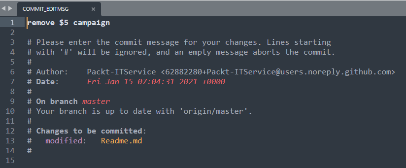

# 第八章 从错误版本中恢复

相关主题：

- 撤销 – 完全移除一次 `commit`
- 撤销 – 删除提交版本但保留文件变更
- 撤销 – 删除提交版本但保留暂存区内的文件变更
- 撤销 – 与脏工作区打交道
- 重做 – 将新变更重新创建到最后一个 commit 版本
- 恢复 – 撤销由于提交引入的变更
- 对合并版本的恢复
- 用 `git reflog` 查看 Git 的历史动作
- 用 `git fsck` 找出遗失的变更

---

## 引言

如果直到推送或发布一次更新的时候才发现一个错误，`git` 可以在推送环境进行更正；如果已经推送到远程库，`git` 也可以撤回到错误引入时的那个版本。

本章将考察 `git reflog` 命令的使用，以及运用 `git fsck` 还原丢失的信息。

其实 `Git` 的核心库并未提供现成的撤回（`undo`）命令，因为“撤回”是一个很模糊的概念：究竟是撤回到上一个版本，还是到新增的文件？如果是撤回上一个版本，对应的具体操作是什么？是把当次提交的变更删掉吗？是退回到上一次提交后的状态，还是说仅仅撤回上一个版本，略作修改以便再次提交？还或者，只是更新一下提交注释的内容？……有太多不确定的因素需要明确。

本章将根据演示需要，探讨撤回操作可能涉及的几种情况：

- 完全撤回：删除所有变更，还原回上一次提交后的状态；
- 撤销提交，并从暂存区退出：即撤回到加入暂存区前的状态；
- 仅撤回提交：暂存区（或索引区）不动，允许细小变更以便重新提交；
- 从脏工作区撤回提交。


注意：实际工作中，由于会变更历史版本，类似撤回已推送的版本，通常是严格禁止的，本章只做演示。

## 8.1 完全移除一次 `commit`

本节演示第一种最简单的情况——完全撤回：

```bash
$ git clone https://github.com/PacktPublishing/Git-Version-Control-Cookbook-Second-Edition_hello_world_cookbook.git 
$ cd Git-Version-Control-Cookbook-Second-Edition_hello_world_cookbook.git
$ git status 
$ ls 
$ git log --oneline 
$ git reset --hard HEAD^
$ git log --oneline 
$ git status
$ ls
```

`git reset --hard HEAD^` 原理示意图：




## 8.2 撤销 – 删除提交版本但保留文件变更

本节演示如何在撤回时保留工作区的变更：

```bash
$ git clone https://github.com/PacktPublishing/Git-Version-Control-Cookbook-Second-Edition_hello_world_cookbook.git 
$ cd Git-Version-Control-Cookbook-Second-Edition_hello_world_cookbook.git
$ git status 
$ git log --oneline 
$ git reset --mixed HEAD^
$ git log --oneline
$ git status
```

`git reset --mixed HEAD^` 原理图：



注意：`--mixed` 也是 `git reset` 命令的默认参数。


## 8.3 撤销 – 删除提交版本但保留暂存区内的文件变更

本节演示如何在撤回版本时，保留暂存区及工作区变更：

```bash
$ git clone https://github.com/PacktPublishing/Git-Version-Control-Cookbook-Second-Edition_hello_world_cookbook.git 
$ cd Git-Version-Control-Cookbook-Second-Edition_hello_world_cookbook.git
$ git status 
$ git log --oneline 
$ git reset --soft HEAD^
$ git log --oneline
$ git status
```

这样撤回的好处在于，允许用户对当前工作区进行少量改动，再重新提交。

`git reset --soft HEAD^` 原理图如下：




## 8.4 撤销 – 与脏工作区打交道

前三节的示例，前提都是工作区是 **干净** 的，即工作区内没有处于 “被修改” 状态的、参与版本控制的内容。实际工作中往往并没有这么理想。如果工作区存在这样的文件或文件夹（脏工作区），执行 `git reset --hard` 时会同时撤回工作区内的这些变更。好在 Git 提供了 git stash 命令来解决这样的问题：

```bash
$ git clone https://github.com/PacktPublishing/Git-Version-Control-Cookbook-Second-Edition_hello_world_cookbook.git
$ cd Git-Version-Control-Cookbook-Second-Edition_hello_world_cookbook
```

变更文件 `hello_world.c` 的文件内容：

```c
#include <stdio.h> 

void say_hello(void) { 
  printf("hello, worldn"); 
} 

int main(void){ 
  say_hello(); 
  return 0; 
}
```

本节演示的场景：修改某文件时，临时需要撤回到上一版，但又不希望当前的文件变更受到撤回的影响：

```bash
# before stash
$ git log --oneline 
$ git status 
# run stash
$ git stash
$ git status
# reset to last commit
$ git reset --hard HEAD^ 
$ git log --oneline 
# resume modification from stash
$ git stash pop 
# Check again
$ cat hello_world.c 
```

在第 5 行执行 `git stash` 后，可以使用 `gitk --all` 查看状态：



由于 **Packt** 对示例仓库做了一些促销活动的版本提交，这里的状态和原书略有差别。关键是 `git stash` 相当于在版本树上创建了一个标注为 `stash` 类似的 `commit`，这就是 `git stash` 命令的实质。

`git stash` 命令在 **第 11 章 Git 技巧与小贴士** 中还会详细展开介绍，这里知识从撤回版本的角度作简单演示。

注意：`git stash` 是将工作区及暂存区的变更同时“抽离”出当前工作区，在其他命令执行结束后（如 `git reset`）可以复盘之前的工作状态。


## 8.5 重做 – 将新变更重新创建到最后一个 `commit` 版本

与撤回（`undo`）一样，重做（`redo`）也分很多种情况。本节讨论的重做，是重新创建一个和上一次提交几乎一样的 `commit`；这个新的 `commit` 与上一版具有相同的父级 `commit`。这对于工作中先提交了一个版本，结果发现少提交了某个文件，需要补充进最新的 `commit` 版本、或者仅仅需要修改提交注释内容时，将十分管用。

本节示例将演示如何修改最新版本的提交注释：

```bash
$ git https://github.com/PacktPublishing/Git-Version-Control-Cookbook-Second-Edition_hello_world_cookbook.git 
$ cd Git-Version-Control-Cookbook-Second-Edition_hello_world_cookbook
$ git log -1 
commit dc26ea1e039f672f6a29eeb7f1265d885c18d6da (HEAD -> master, origin/master, origin/HEAD)
Author: Packt-ITService <62882280+Packt-ITService@users.noreply.github.com>
Date:   Fri Jan 15 07:04:31 2021 +0000

    remove $5 campaign
$ git status
$ git commit --amend 
```

弹出的编辑器窗口如下：



在提交注释中补填上 `issue` 的相关引用信息：`Fixes: RD-31415`。然后保存、退出编辑器。接下来查看提交日志，验证最新版是否和上一版都是指向同一个父级 `commit`：

```bash
$ git commit --amend
[master 6bba5f9] remove $5 campaign
 Author: Packt-ITService <62882280+Packt-ITService@users.noreply.github.com>
 Date: Fri Jan 15 07:04:31 2021 +0000
 1 file changed, 5 deletions(-)
# check git log
$ git log -1
commit 6bba5f97ad4ee3addd97bc2a6fdebccc556169f2 (HEAD -> master)
Author: Packt-ITService <62882280+Packt-ITService@users.noreply.github.com>
Date:   Fri Jan 15 07:04:31 2021 +0000

    remove $5 campaign

    Fixes: RD-31415
# Check original SHA-1
$ git cat-file -p dc26ea1e039f672f6a29eeb7f1265d885c18d6da
tree abb9c0873564ef5147fb694d16a96ee0ab5ef28f
parent 55c7ae42fbc6d79ef9ef89a8aafb664a9d33c128
author Packt-ITService <62882280+Packt-ITService@users.noreply.github.com> 1610694271 +0000
committer Packt-ITService <62882280+Packt-ITService@users.noreply.github.com> 1610694271 +0000

remove $5 campaign
# Check new SHA-1
$ git cat-file -p 6bba5f97ad4ee3addd97bc2a6fdebccc556169f2
tree abb9c0873564ef5147fb694d16a96ee0ab5ef28f
parent 55c7ae42fbc6d79ef9ef89a8aafb664a9d33c128
author Packt-ITService <62882280+Packt-ITService@users.noreply.github.com> 1610694271 +0000
committer SafeWinter <zandong_19@aliyun.com> 1640168227 +0800

remove $5 campaign

Fixes: RD-31415
```

可以看到 `tree` 和 `parent` 都是一样的，说明前后两个版本的根节点树（`abb9c0873564ef5147fb694d16a96ee0ab5ef28f`）是同一个，且同时指向相同的父级（`55c7ae42fbc6d79ef9ef89a8aafb664a9d33c128`）。之所以根节点不变，是因为本例只修改了提交注释的内容，对工作区的内容变更没有贡献。

如果暂存区发生了变更，在重做时一并使用 `git commit --amend` 进行提交，则 `tree` 对象的引用就和上一版不同了，但父级 `commit` 依然相同。

究其原因，`--amend` 标记相当于执行了一次 `git reset --soft HEAD^`；继而调整所需的文件重新增补到暂存区；最后，重用上一次提交的提交注释，发起新一次的提交（`git commit -c ORIG_HEAD`）。


> **拓展**

演示如何补充一个漏掉的文件到最后一次提交版本中。

```bash
$ echo "Updated README file content" > Readme.md
$ git add Readme.md
$ git status
On branch master
Your branch and 'origin/master' have diverged,
and have 1 and 1 different commits each, respectively.
  (use "git pull" to merge the remote branch into yours)

Changes not staged for commit:
  (use "git add <file>..." to update what will be committed)
  (use "git restore <file>..." to discard changes in working directory)
        modified:   Readme.md
$ git commit --amend --no-edit 
[master 0beba0c] remove $5 campaign
 Author: Packt-ITService <62882280+Packt-ITService@users.noreply.github.com>
 Date: Fri Jan 15 07:04:31 2021 +0000
 1 file changed, 5 deletions(-)
$ git log -1
commit 0beba0c8b4f7c3502d2e2b43ee8745bc497e6129 (HEAD -> master)
Author: Packt-ITService <62882280+Packt-ITService@users.noreply.github.com>
Date:   Fri Jan 15 07:04:31 2021 +0000

    remove $5 campaign

    Fixes: RD-31415
$ git cat-file -p 0beba0c8b4f7c3502d2e2b43ee8745bc497e6129
tree abb9c0873564ef5147fb694d16a96ee0ab5ef28f
parent 55c7ae42fbc6d79ef9ef89a8aafb664a9d33c128
author Packt-ITService <62882280+Packt-ITService@users.noreply.github.com> 1610694271 +0000
committer SafeWinter <zandong_19@aliyun.com> 1640169487 +0800

remove $5 campaign

Fixes: RD-31415
```

可以看到，`tree` 的引用已经不同了（`0beba0c8b4f7c3502d2e2b43ee8745bc497e6129`，上一例为 `abb9c0873564ef5147fb694d16a96ee0ab5ef28f`）；而 `parent` 仍保持不变（`abb9c0873564ef5147fb694d16a96ee0ab5ef28f`）。

这里用了一个新标记，`--no-edit`，用于不需要改变上一版提交注释、直接提交的场合。

此外，`--amend` 还可以更新版本的提交人信息，只需要加上 `--reset-author` 标记即可。此时 `git` 会更新提交的时间戳，并重新读取提交者相关信息。


## 8.6 恢复 – 撤销由于提交引入的变更

## 8.7 对合并版本的恢复

## 8.8 用 `git reflog` 查看 `Git` 的历史动作

## 8.9 用 `git fsck` 找出遗失的变更

