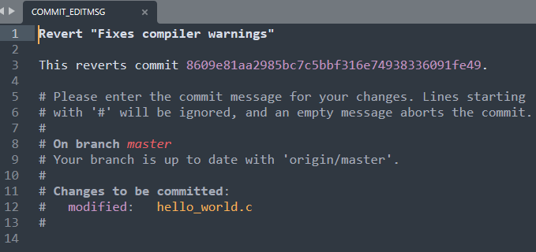
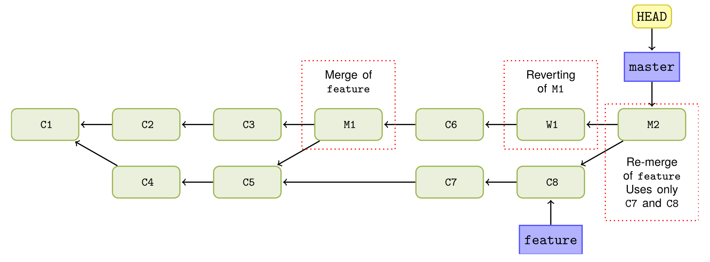
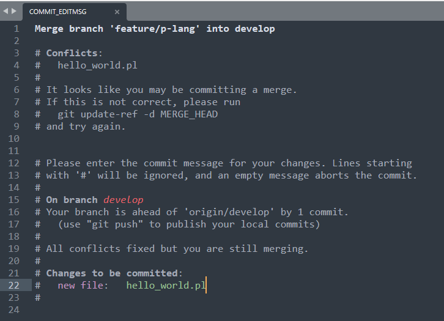
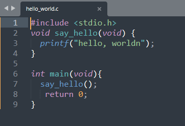

# 第八章 从错误版本中恢复

相关主题：

- 撤销 – 完全移除一次 `commit`
- 撤销 – 删除提交版本但保留文件变更
- 撤销 – 删除提交版本但保留暂存区内的文件变更
- 撤销 – 与脏工作区打交道
- 重做 – 将新变更重新创建到最后一个 commit 版本
- 恢复 – 撤销由于提交引入的变更
- 恢复一个合并提交
- 用 `git reflog` 查看 Git 的历史动作
- 用 `git fsck` 找出遗失的变更

---

## 引言

如果直到推送或发布一次更新的时候才发现一个错误，`git` 可以在推送环境进行更正；如果已经推送到远程库，`git` 也可以撤回到错误引入时的那个版本。

本章将考察 `git reflog` 命令的使用，以及运用 `git fsck` 还原丢失的信息。

其实 `Git` 的核心库并未提供现成的撤回（`undo`）命令，因为“撤回”是一个很模糊的概念：究竟是撤回到上一个版本，还是到新增的文件？如果是撤回上一个版本，对应的具体操作是什么？是把当次提交的变更删掉吗？是退回到上一次提交后的状态，还是说仅仅撤回上一个版本，略作修改以便再次提交？还或者，只是更新一下提交注释的内容？……有太多不确定的因素需要明确。

本章将根据演示需要，探讨撤回操作可能涉及的几种情况：

- 完全撤回：删除所有变更，还原回上一次提交后的状态；
- 撤销提交，并从暂存区退出：即撤回到加入暂存区前的状态；
- 仅撤回提交：暂存区（或索引区）不动，允许细小变更以便重新提交；
- 从脏工作区撤回提交。


注意：实际工作中，由于会变更历史版本，类似撤回已推送的版本，通常是严格禁止的，本章只做演示。

## 8.1 完全移除一次 `commit`

本节演示第一种最简单的情况——完全撤回：

```bash
$ git clone https://github.com/PacktPublishing/Git-Version-Control-Cookbook-Second-Edition_hello_world_cookbook.git 
$ cd Git-Version-Control-Cookbook-Second-Edition_hello_world_cookbook.git
$ git status 
$ ls 
$ git log --oneline 
$ git reset --hard HEAD^
$ git log --oneline 
$ git status
$ ls
```

`git reset --hard HEAD^` 原理示意图：


## 8.2 撤销 – 删除提交版本但保留文件变更

本节演示如何在撤回时保留工作区的变更：

```bash
$ git clone https://github.com/PacktPublishing/Git-Version-Control-Cookbook-Second-Edition_hello_world_cookbook.git 
$ cd Git-Version-Control-Cookbook-Second-Edition_hello_world_cookbook.git
$ git status 
$ git log --oneline 
$ git reset --mixed HEAD^
$ git log --oneline
$ git status
```

`git reset --mixed HEAD^` 原理图：


注意：`--mixed` 也是 `git reset` 命令的默认参数。


## 8.3 撤销 – 删除提交版本但保留暂存区内的文件变更

本节演示如何在撤回版本时，保留暂存区及工作区变更：

```bash
$ git clone https://github.com/PacktPublishing/Git-Version-Control-Cookbook-Second-Edition_hello_world_cookbook.git 
$ cd Git-Version-Control-Cookbook-Second-Edition_hello_world_cookbook.git
$ git status 
$ git log --oneline 
$ git reset --soft HEAD^
$ git log --oneline
$ git status
```

这样撤回的好处在于，允许用户对当前工作区进行少量改动，再重新提交。

`git reset --soft HEAD^` 原理图如下：


## 8.4 撤销 – 与脏工作区打交道

前三节的示例，前提都是工作区是 **干净** 的，即工作区内没有处于 “被修改” 状态的、参与版本控制的内容。实际工作中往往并没有这么理想。如果工作区存在这样的文件或文件夹（脏工作区），执行 `git reset --hard` 时会同时撤回工作区内的这些变更。好在 Git 提供了 git stash 命令来解决这样的问题：

```bash
$ git clone https://github.com/PacktPublishing/Git-Version-Control-Cookbook-Second-Edition_hello_world_cookbook.git
$ cd Git-Version-Control-Cookbook-Second-Edition_hello_world_cookbook
```

变更文件 `hello_world.c` 的文件内容：

```c
#include <stdio.h> 

void say_hello(void) { 
  printf("hello, worldn"); 
} 

int main(void){ 
  say_hello(); 
  return 0; 
}
```

本节演示的场景：修改某文件时，临时需要撤回到上一版，但又不希望当前的文件变更受到撤回的影响：

```bash
# before stash
$ git log --oneline 
$ git status 
# run stash
$ git stash
$ git status
# reset to last commit
$ git reset --hard HEAD^ 
$ git log --oneline 
# resume modification from stash
$ git stash pop 
# Check again
$ cat hello_world.c 
```

在第 5 行执行 `git stash` 后，可以使用 `gitk --all` 查看状态：


由于 **Packt** 对示例仓库做了一些促销活动的版本提交，这里的状态和原书略有差别。关键是 `git stash` 相当于在版本树上创建了一个标注为 `stash` 类似的 `commit`，这就是 `git stash` 命令的实质。

`git stash` 命令在 **第 11 章 Git 技巧与小贴士** 中还会详细展开介绍，这里知识从撤回版本的角度作简单演示。

注意：`git stash` 是将工作区及暂存区的变更同时“抽离”出当前工作区，在其他命令执行结束后（如 `git reset`）可以复盘之前的工作状态。


## 8.5 重做 – 将新变更重新提交到最后一个 `commit` 版本

与撤回（`undo`）一样，重做（`redo`）也分很多种情况。本节讨论的重做，是重新创建一个和上一次提交几乎一样的 `commit`；这个新的 `commit` 与上一版具有相同的父级 `commit`。这对于工作中先提交了一个版本，结果发现少提交了某个文件，需要补充进最新的 `commit` 版本、或者仅仅需要修改提交注释内容时，将十分管用。

本节示例将演示如何修改最新版本的提交注释：

```bash
# Init repo
$ git https://github.com/PacktPublishing/Git-Version-Control-Cookbook-Second-Edition_hello_world_cookbook.git 
$ cd Git-Version-Control-Cookbook-Second-Edition_hello_world_cookbook
$ git log -1 
commit dc26ea1e039f672f6a29eeb7f1265d885c18d6da (HEAD -> master, origin/master, origin/HEAD)
Author: Packt-ITService <62882280+Packt-ITService@users.noreply.github.com>
Date:   Fri Jan 15 07:04:31 2021 +0000

    remove $5 campaign
$ git status
$ git commit --amend 
```

弹出的编辑器窗口如下：


在提交注释中补填上 `issue` 的相关引用信息：`Fixes: RD-31415`。然后保存、退出编辑器。接下来查看提交日志，验证最新版是否和上一版都是指向同一个父级 `commit`：

```bash
$ git commit --amend
[master 6bba5f9] remove $5 campaign
 Author: Packt-ITService <62882280+Packt-ITService@users.noreply.github.com>
 Date: Fri Jan 15 07:04:31 2021 +0000
 1 file changed, 5 deletions(-)
# check git log
$ git log -1
commit 6bba5f97ad4ee3addd97bc2a6fdebccc556169f2 (HEAD -> master)
Author: Packt-ITService <62882280+Packt-ITService@users.noreply.github.com>
Date:   Fri Jan 15 07:04:31 2021 +0000

    remove $5 campaign

    Fixes: RD-31415
# Check original SHA-1
$ git cat-file -p dc26ea1e039f672f6a29eeb7f1265d885c18d6da
tree abb9c0873564ef5147fb694d16a96ee0ab5ef28f
parent 55c7ae42fbc6d79ef9ef89a8aafb664a9d33c128
author Packt-ITService <62882280+Packt-ITService@users.noreply.github.com> 1610694271 +0000
committer Packt-ITService <62882280+Packt-ITService@users.noreply.github.com> 1610694271 +0000

remove $5 campaign
# Check new SHA-1
$ git cat-file -p 6bba5f97ad4ee3addd97bc2a6fdebccc556169f2
tree abb9c0873564ef5147fb694d16a96ee0ab5ef28f
parent 55c7ae42fbc6d79ef9ef89a8aafb664a9d33c128
author Packt-ITService <62882280+Packt-ITService@users.noreply.github.com> 1610694271 +0000
committer SafeWinter <zandong_19@aliyun.com> 1640168227 +0800

remove $5 campaign

Fixes: RD-31415
```

可以看到前后两个版本的 `tree` 和 `parent` 都是一样的，说明前后两个版本的根节点树（`abb9c0873564ef5147fb694d16a96ee0ab5ef28f`）是同一个，且同时指向相同的父级（`55c7ae42fbc6d79ef9ef89a8aafb664a9d33c128`）。根节点不变，是因为本例只修改了提交注释，对工作区的内容变更没有贡献。

一旦暂存区也有变动，在提交时使用 `git commit --amend`，则 `tree` 的引用就和上一版不同了，而父级 `commit` 依然相同。

究其原因，`--amend` 标记相当于：

1. 执行了一次 `git reset --soft HEAD^`；
2. 接着将有变动的内容重新加到暂存区；
3. 最后，重用上一次提交的提交注释，发起一次新的提交（`git commit -c ORIG_HEAD`）。


> **拓展**

上例演示了只变动提交注释的情况，本节演示如何将一个漏掉的文件重新提到最后一次 `commit` 中。

```bash
$ echo "Updated README file content" > Readme.md
$ git add Readme.md
$ git status
On branch master
Your branch and 'origin/master' have diverged,
and have 1 and 1 different commits each, respectively.
  (use "git pull" to merge the remote branch into yours)

Changes not staged for commit:
  (use "git add <file>..." to update what will be committed)
  (use "git restore <file>..." to discard changes in working directory)
        modified:   Readme.md
$ git commit --amend --no-edit 
[master 0beba0c] remove $5 campaign
 Author: Packt-ITService <62882280+Packt-ITService@users.noreply.github.com>
 Date: Fri Jan 15 07:04:31 2021 +0000
 1 file changed, 5 deletions(-)
# Check git log (SHA-1: 0beba0c8b4f7c3502d2e2b43ee8745bc497e6129)
$ git log -1
commit 0beba0c8b4f7c3502d2e2b43ee8745bc497e6129 (HEAD -> master)
Author: Packt-ITService <62882280+Packt-ITService@users.noreply.github.com>
Date:   Fri Jan 15 07:04:31 2021 +0000

    remove $5 campaign

    Fixes: RD-31415
$ git cat-file -p 0beba0c8b4f7c3502d2e2b43ee8745bc497e6129
tree abb9c0873564ef5147fb694d16a96ee0ab5ef28f
parent 55c7ae42fbc6d79ef9ef89a8aafb664a9d33c128
author Packt-ITService <62882280+Packt-ITService@users.noreply.github.com> 1610694271 +0000
committer SafeWinter <zandong_19@aliyun.com> 1640169487 +0800

remove $5 campaign

Fixes: RD-31415
```

可以看到，`tree` 的引用已经不同了（`0beba0c8b4f7c3502d2e2b43ee8745bc497e6129`，上一例为 `abb9c0873564ef5147fb694d16a96ee0ab5ef28f`）；而 `parent` 仍保持不变（`abb9c0873564ef5147fb694d16a96ee0ab5ef28f`）。

这里用了一个新标记，`--no-edit`，用于直接沿用上一版提交注释。

此外，`--amend` 还可以更新版本的提交人信息，只需要加上 `--reset-author` 标记即可。此时 `git` 会更新提交的时间戳，并重新读取提交者相关信息（用户名、电子邮箱）。


## 8.6 恢复 – 撤销由于提交引入的变更

`Git` 中的恢复（`Revert`）主要用途，是在不重写历史记录的情况下，撤消历史记录中已发布（或已推送）的 `commit` 版本；而在不修改历史记录的前提下，前面提到的修改（`amend`）或重置（`reset`）都无法满足要求。

先来看一个最简单的演示：

```bash
$ git clone https://github.com/PacktPublishing/Git-Version-Control-Cookbook-Second-Edition_hello_world_cookbook.git hello
$ cd hello
$ git log --oneline 
dc26ea1 (HEAD -> master, origin/master, origin/HEAD) remove $5 campaign
55c7ae4 add $5 campaign
680ab8a Adds Java version of 'hello world'
8609e81 Fixes compiler warnings
21e3c2b Initial commit, K&R hello world
$ git revert 8609e81 
# this brings up the default editor...
```

执行 `git revert` 后弹出的编辑器窗口如下：



直接保存后退出，对比 `git log` 的结果：

```bash
$ git revert 8609e81 
[master 832eda7] Revert "Fixes compiler warnings"
 1 file changed, 1 insertion(+), 5 deletions(-)
$ git log --oneline
832eda7 (HEAD -> master) Revert "Fixes compiler warnings"
dc26ea1 (origin/master, origin/HEAD) remove $5 campaign
55c7ae4 add $5 campaign
680ab8a Adds Java version of 'hello world'
8609e81 Fixes compiler warnings
21e3c2b Initial commit, K&R hello world
```

可以看到，`git revert` 命令将手动指定的 `commit` （`8609e81`）的补丁，逆向应用到了当前的 `HEAD` 上，产生了一个新的 `commit` 节点。

此外，`revert` 还可以恢复多个连续版本：

```bash
$ git revert master~6..master~2
```

这表示将 `master~6` 到 `master~2` 的版本反补丁到当前 `HEAD` 节点。这里的 `master~6..master~2` 表示将从 `master` 底部的第 6 次提交恢复到 `master` 底部的第 3 次提交（都包括在内）：

```bash
# prepare commits in advance
$ echo "+1" >> Readme.md; git commit -aqm '+1 test';
$ echo "+2" >> Readme.md; git commit -aqm '+2 test';
$ echo "+3" >> Readme.md; git commit -aqm '+3 test';
$ echo "+4" >> Readme.md; git commit -aqm '+4 test';
$ echo "+5" >> Readme.md; git commit -aqm '+5 test';
$ echo "+6" >> Readme.md; git commit -aqm '+6 test';
$ echo "+7" >> Readme.md; git commit -aqm '+7 test';
$ echo "+8" >> Readme.md; git commit -aqm '+8 test';
# check git log
$ git log --oneline
e890b92 (HEAD -> master) +8 test
ed28ca0 +7 test
3df0adc +6 test
f3b01a3 +5 test
8919876 +4 test
217fcfa +3 test
90b0f48 +2 test
e58efb7 +1 test
dc26ea1 (origin/master, origin/HEAD) remove $5 campaign
55c7ae4 add $5 campaign
680ab8a Adds Java version of 'hello world'
8609e81 Fixes compiler warnings
21e3c2b Initial commit, K&R hello world
$ git log --oneline master~6..master~2
3df0adc +6 test
f3b01a3 +5 test
8919876 +4 test
217fcfa +3 test
```

注意 `master~6..master~2` 的输出结果。

如果恢复时不希望创建新版本，可以加 `-n` 标记，这样相关补丁就会只应用在工作区和暂存区。


## 8.7 恢复一个合并提交

执行 `revert` 恢复时，合并提交（`merge commits`）是一个特例。恢复一个合并提交时，必须指定一个需要保留的父级。记住，Git 虽然能通过 `revert` 实现文件内容的撤回，但 Git 历史是无法撤回的——这就意味着，由于之前的合并所产生的任何变更，后续将不再对指定的目标分支产生任何影响。如果再次合并执行过 `revert` 的、被舍弃的分支，则新加入的变更将不包含上一次合并引入的变更，如下图所示：



如上所述，图中进行了两次合并，中间包含一次 `revert` 恢复，且恢复的版本是第一次合并；第二次合并（`M2` 节点）将只会引入 `C7` 和 `C8` 产生的新变更，`C4` 和 `C5` 的历史变更 **不会** 并入主分支。

本节将演示如何恢复一个合并提交，以及如何再次合并——通过恢复 “执行过 `git revert`” 的那次提交（`W1`），来引入原分支上的所有变更（`C4` + `C5` + `C7` + `C8`）。

```bash
$ git clone https://github.com/PacktPublishing/Git-Version-Control-Cookbook-Second-Edition_hello_world_cookbook.git 
$ cd Git-Version-Control-Cookbook-Second-Edition_hello_world_cookbook
$ git branch -f feature/p-lang origin/feature/p-lang 
$ git checkout develop 
$ git reset --hard origin/develop 
# Imagine a bug is detected in hello_world.pl
# perl hello_world.pl failed
# Check git log before reverting
$ git log --oneline --graph -5 
* aaf61e9 (HEAD -> develop, origin/develop) Adds Groovy hello world
*   211421b Merge branch 'feature/p-lang' into develop
|\
| * 66016b5 php version added
| * ff22d4e Adds perl hello_world script
* | a3af57c Hello world shell script
|/
# check HEAD structure
$ git ls-tree --abbrev HEAD
100644 blob 28f40d8     helloWorld.groovy
100644 blob 881ef55     hello_world.c
100644 blob 5dd01c1     hello_world.php
100755 blob ae06973     hello_world.pl
100755 blob f3d7a14     hello_world.py
100755 blob 9f3f770     hello_world.sh
# Revert the merge, keeping the history of the first parent
$ git revert -m 1 211421b 
hint: Waiting for your editor to close the file...
# Save commit messge without modification
[develop 84a7744] Revert "Merge branch 'feature/p-lang' into develop"
 2 files changed, 4 deletions(-)
 delete mode 100644 hello_world.php
 delete mode 100755 hello_world.pl
$ git ls-tree --abbrev HEAD 
100644 blob 28f40d8     helloWorld.groovy
100644 blob 881ef55     hello_world.c
100755 blob f3d7a14     hello_world.py
100755 blob 9f3f770     hello_world.sh
```

正如所料，执行 `revert` 后，之前合并引入的两个文件（`Perl` 和 `PHP` 文件）已经被移除了。


> **执行原理**

`revert` 命令会读取拟撤回版本的补丁（`patches`），然后将其反向作用于（即逆向补丁）当前工作区。如若进展顺利（即没有造成版本冲突），`git` 将自动产生一个新的 `commit` 版本。在恢复一个合并提交时，指定主线（`mainline`，由 `-m` 标记指定）引入的变更会被保留；而另一条支线上引入的变更则会从工作区撤回。


> **拓展**

刚才的示例演示了如何恢复一个合并提交，看起来还比较容易，如果后续要重新并入那条支线呢？比如被撇开的那个支线，如果上面的问题已经修复了，可以并入之前的主线了，应该如何操作？显然，直接合并将丢失一部分支线版本，因为在恢复上一次合并版本时，属于支线的那部分变更已经被还原了，除非手动干预，否则后续的合并，**都不会** 包含上次恢复时被排开的那部分变更。

本节就将对此进行演示，看看怎样才能按预期的那样，在第二次合并时恢复 **所有的** 支线变更。先看看不作任何调整，直接重新合并：

```bash
$ git merge --no-edit feature/p-lang 
CONFLICT (modify/delete): hello_world.pl deleted in HEAD and modified in feature/p-lang.  Version feature/p-lang of hello_world.pl left in tree.
Automatic merge failed; fix conflicts and then commit the result.
$ git add hello_world.pl 
$ git commit 
```

从第 2 行可知，文件 `hello_world.php` 引发了冲突。这也说得通：受此前恢复合并提交的影响，引入该文件的 `commit` 版本被撤回了；而新并入的变更又需要该文件，因此出现了冲突。此时只需要执行 `git add` 加入该文件即可。提交后弹出的编辑器窗口如下：



不作任何修改，直接保存退出：

```bash
$ git commit
[develop 28f93de] Merge branch 'feature/p-lang' into develop
$ git ls-tree --abbrev HEAD 
100644 blob 28f40d8     helloWorld.groovy
100644 blob 881ef55     hello_world.c
100755 blob 6611b8e     hello_world.pl
100755 blob f3d7a14     hello_world.py
100755 blob 9f3f770     hello_world.sh
```

可以看到，合并后的文件中并没有 `hello_world.php`。要想得到再次合并的正确结果，必须先撤回那次 `git revert` 操作，即对恢复合并那次版本再执行一次恢复；然后重新合并。这样就能重新引入支线上的所有变更。

先撤回刚才的直接合并：

```bash
# reset to the initial status
$ git reset --hard HEAD^ 
HEAD is now at 84a7744 Revert "Merge branch 'feature/p-lang' into develop"
# revert the reverting commit
$ git revert HEAD 
[develop 7c1cacd] Revert "Revert "Merge branch 'feature/p-lang' into develop""
 2 files changed, 4 insertions(+)
 create mode 100644 hello_world.php
 create mode 100755 hello_world.pl
# merge again
$ git merge feature/p-lang 
Merge made by the 'ort' strategy.
 hello_world.pl | 2 +-
 1 file changed, 1 insertion(+), 1 deletion(-)
# check the files
$ git ls-tree --abbrev HEAD 
100644 blob 28f40d8     helloWorld.groovy
100644 blob 881ef55     hello_world.c
100644 blob 5dd01c1     hello_world.php
100755 blob 6611b8e     hello_world.pl
100755 blob f3d7a14     hello_world.py
100755 blob 9f3f770     hello_world.sh
```

这样才是完整的重新合并。

更多参考资料详见：

- The *How To Revert a Faulty Merge* article：https://www.kernel.org/pub/software/scm/git/docs/howto/revert-a-faulty-merge.html
- The *Undoing Merges* article：http://git-scm.com/blog/2010/03/02/undoing-merges.html


## 8.8 用 `git reflog` 查看 `Git` 的历史动作

`reflog` 命令保存了 HEAD 在各个分支变动的情况，与之相对应的是 git log，记录的是各个分支的各个父级节点的情况。`reflog` 提供的是本地你自己的提交历史：怎样在分支间切换的，怎么新增或重置一次提交等等。通常，任何触发 `HEAD` 指针发生变动的情况都会记录在 `reflog` 中，通过该命令可以找到 `git` 库中不被任何分支引用的丢失的版本节点。这不失为寻找遗失版本节点的一个好的切入点。

沿用上一节的 `hello` 库：

```bash
# Use the repo from the last section
$ cd hello
$ git checkout master 
# Check the latest 7 ref logs
$ git reflog -7
dc26ea1 (HEAD -> master, origin/master, origin/HEAD) HEAD@{0}: checkout: moving from develop to master
13749c4 (develop) HEAD@{1}: merge feature/p-lang: Merge made by the 'ort' strategy.
7c1cacd HEAD@{2}: revert: Revert "Revert "Merge branch 'feature/p-lang' into develop""
84a7744 HEAD@{3}: reset: moving to HEAD^
28f93de HEAD@{4}: commit (merge): Merge branch 'feature/p-lang' into develop
84a7744 HEAD@{5}: revert: Revert "Merge branch 'feature/p-lang' into develop"
aaf61e9 (origin/develop) HEAD@{6}: reset: moving to origin/develop
```

由于实测时的用户名和电子邮箱不同，得到的输出结果也和原书略有不同，但提交内容的大致顺序应该是一致的。

注意第 10 行的输出，`HEAD@{4}` 对应的合并节点并未被分支引用：

```bash
$ git show 28f93de 
commit 28f93de7da30e0924b423a7e42237ea31debd460
Merge: 84a7744 06e4ae2
Author: SafeWinter <zandong_19@aliyun.com>
Date:   Fri Dec 24 10:11:24 2021 +0800

    Merge branch 'feature/p-lang' into develop
# Check by git ls-tree
$ git ls-tree --abbrev 28f93de
100644 blob 28f40d8     helloWorld.groovy
100644 blob 881ef55     hello_world.c
100755 blob 6611b8e     hello_world.pl
100755 blob f3d7a14     hello_world.py
100755 blob 9f3f770     hello_world.sh
```

可以看到，这正是上一节中我们临时测试后废弃的版本。

`Git` 提供了多种方法找回一个丢失的版本：既可以用 `git-show` 或 `git cat-file` 查看详情，也可以签出一个 `commit`，用 `git checkout` 新建一个分支，还可以基于 commit 中的某个文件进行签出，语法格式为：`checkout – path/to/file SHA-1`。


> **小结**

`HEAD` 指针的每次变更，`Git` 都会存储其指向的 `commit` 以及切换到该状态所执行的操作。 这些操作可以是一次提交（`commit`）、签出（`checkout`）、重置（`reset`）、还原（`revert`）、合并（`merge`）、变基（`rebase`）等。 这些信息是 `git` 本地的信息，因此不会在推送（`push`）、获取（`fetch`）和克隆（`clone`）时共享出去。如果记得要检索的内容，或者创建目标版本的大致时间，则使用 `reflog` 命令查找丢失的版本会非常轻松。 如果有很多 `reflog` 历史记录、许多提交、切换分支等，由于对 `HEAD` 的多次更新产生的杂音，则较难通过 `reflog` 命令进行定位。


## 8.9 用 `git fsck` 找出遗失的变更

除了 `git reflog`，另一个可以帮你定位丢失的版本、甚至是丢失 `blob` 的命令，是 `git fsck`。该命令检测 `git` 的对象数据库，并验证目标对象的 `SHA-1` 以及它们创建的连接，可用于查找不被其他具名引用使用的对象。这些对象都存放于 `.git/objects` 文件夹。

本节沿用 hello_world 库，但需执行本书主页上的脚本（`04_undo_dirty.sh`，无法获取）。按照示例内容来看，应该是借用了 git stash 和 stash pop 的操作示例，模拟一次工作区的变更，然后临时放到 stash 缓存，同时执行一次 reset，再把缓存内容还原到工作区。示例将考察此时的被丢失对象：

```bash
$ git clone https://github.com/PacktPublishing/Git-Version-Control-Cookbook-Second-Edition_hello_world_cookbook.git ch8-9
$ cd ch8-9
# Edit a file
$ subl hello_world.c
```

在 `SublimeText` 编辑 `hello_world.c`。文件内容如下：



接着将当前变更存入 `stash`，并临时重置到上一个 `commit` 版本：

```bash
# Stash changes
$ git stash
Saved working directory and index state WIP on master: dc26ea1 remove $5 campaign
# Run a reset
$ git reset --hard HEAD^
HEAD is now at 55c7ae4 add $5 campaign
# Retrieve data from stash pop
$ git stash pop
On branch master
Your branch is behind 'origin/master' by 1 commit, and can be fast-forwarded.
  (use "git pull" to update your local branch)

Changes not staged for commit:
  (use "git add <file>..." to update what will be committed)
  (use "git restore <file>..." to discard changes in working directory)
        modified:   hello_world.c

no changes added to commit (use "git add" and/or "git commit -a")
Dropped refs/stash@{0} (5390ad6a3c4b04249b182a4a074f90feea7e064f)
$ git fsck --unreachable
Checking object directories: 100% (256/256), done.
Checking objects: 100% (36/36), done.
unreachable commit 8778a93894e984fae9654b93c68fe4e9b40c9311
unreachable tree 14cf51045199a00925c446df753a649dce5022de
unreachable blob c41a2cb3b76d775a0bfbb87a2f0c85540c983c74
unreachable commit 5390ad6a3c4b04249b182a4a074f90feea7e064f
# Check the missing file SHA-1 (c41a2cb3b76d775a0bfbb87a2f0c85540c983c74)
$ git show c41a2cb3b76d775a0bfbb87a2f0c85540c983c74
#include <stdio.h>
void say_hello(void) {
  printf("hello, worldn");
}

int main(void){
  say_hello();
   return 0;
}
# Check the missing commit SHA-1 (5390ad6a3c4b04249b182a4a074f90feea7e064f)
$ git show 5390ad6a3c4b04249b182a4a074f90feea7e064f
commit 5390ad6a3c4b04249b182a4a074f90feea7e064f
Merge: dc26ea1 8778a93
Author: SafeWinter <zandong_19@aliyun.com>
Date:   Fri Dec 24 12:09:13 2021 +0800

    WIP on master: dc26ea1 remove $5 campaign

diff --cc hello_world.c
index 881ef55,881ef55..c41a2cb
--- a/hello_world.c
+++ b/hello_world.c
@@@ -1,7 -1,7 +1,9 @@@
--#include <stdio.h>
--
--int main(void){
--      printf("hello, world\n");
--
--      return 0;
--}
++#include <stdio.h>
++void say_hello(void) {
++  printf("hello, worldn");
++}
++
++int main(void){
++  say_hello();
++   return 0;
++}
```

可以看到，经过 `stash` 缓存、执行 `reset`、释放缓存后，工作区内并未发起过一次提交；但缓存到 `git` 库的命令确实将文件写入了 `git` 数据库，因此只要在 `git` 的垃圾回收介入前，`git` 的对象库内始终能找到这个 `blob` 对象。如果被其他对象引用，那么它将永久有效。

由于示例库后期加入了一个促销活动（5 美元促销），后来又下架了活动，这些变更使得实操结果和原书大不相同，但原理是共通的：通过 stash 操作涉及的变动都会作为不可及的丢失对象，出现在 `git fsck --unreachable` 的查询结果中。

`git fsck` 命令会查看 `.git/objects` 文件夹内的所有对象，加上 `--unreachable` 标记后，返回的是任何其他引用对象都无法访问到的 `git` 对象。这些引用可以是分支（`branch`）、标签（`tag`）、提交（`commit`）、目录树（`tree`）、`reflog`，抑或是 `stash` 操作涉及的变动。


