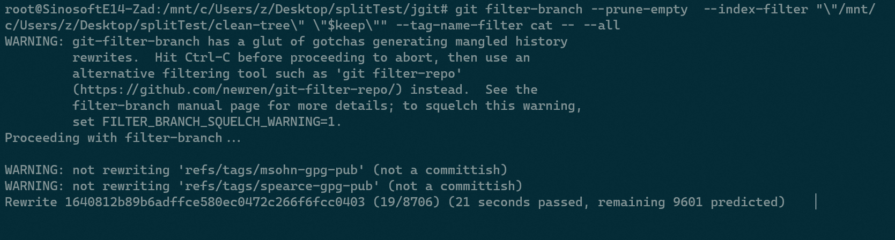

# 第九章 Git 仓库的运维

本章将介绍用于 `Git` 仓库运维工作的各类工具。例如在本地轻松删除远程库中已经删除的分支；垃圾回收的触发及关闭；利用 `filter-branch` 拆分 `Git` 仓库或修改仓库历史；最后简要介绍一下怎样以子项目的方式（应用子模块或子树策略），将 `Git` 库集成到另一个 `Git` 库。

本章相关主题：

- 整理远程仓库
- 手动执行垃圾回收
- 关闭自动垃圾回收
- 分隔仓库
- 重写提交历史 – 变更单个文件
- 以镜像的方式创建仓库备份
- 一个快捷子模块操作演示
- 子树合并
- 子模块与子树对比

---


## 9.1 整理远程仓库

项目的开发往往是在 `features` 特性分支上进行的。开发完成后并入主分支，并将原特性分支删除。对于不是推送该分支的本地库，`Git` 不会自动将分支变更信息自动更新到之前克隆的其他本地仓库，对这些本地仓库而言，必须手动同步远程分支信息。

使用命令：`git fetch --prune`

功能演示：

```bash
# Prepare repos: a bare and a clone
$ git clone --bare https://github.com/PacktPublishing/Git-Version-Control-Cookbook-Second-Edition_hello_world_flow_model.git hello_world_flow_model_remote
$ git clone hello_world_flow_model_remote hello_world_flow_model
# delete branches from the remote repo
$ cd hello_world_flow_model_remote 
$ git branch -D feature/continents  
Deleted branch feature/continents (was 5bd5222).
$ git branch -D feature/printing  
Deleted branch feature/printing (was a5da07d).
$ git branch -D release/1.0  
Deleted branch release/1.0 (was 134fe4b).
# enter cloned repo
$ cd ../hello_world_flow_model 
$ git checkout develop 
$ git reset --hard origin/develop
# Check branches from remote
$ git branch -a 
* develop
  master
  remotes/origin/HEAD -> origin/master
  remotes/origin/develop
  remotes/origin/feature/cities
  remotes/origin/feature/continents
  remotes/origin/feature/printing
  remotes/origin/master
  remotes/origin/release/1.0
# fetch with default options
$ git fetch 
$ git pull 
Already up to date. 
$ git branch -a 
* develop
  master
  remotes/origin/HEAD -> origin/master
  remotes/origin/develop
  remotes/origin/feature/cities
  remotes/origin/feature/continents
  remotes/origin/feature/printing
  remotes/origin/master
  remotes/origin/release/1.0
# Sync with remote repo by using --prune
$ git fetch --prune
From C:/Users/ad/Desktop/hello_world_flow_model_remote
 - [deleted]         (none)     -> origin/feature/continents
 - [deleted]         (none)     -> origin/feature/printing
 - [deleted]         (none)     -> origin/release/1.0
# Check again
$ git branch -a
* develop
  master
  remotes/origin/HEAD -> origin/master
  remotes/origin/develop
  remotes/origin/feature/cities
  remotes/origin/master
```

此外，也可以用 `git pull --prune` 达到相同效果，或者运行命令 `git remote prune origin`。不过，后者虽然能够删除远程库中已经不存在的分支，但不会自动更新本地的远程跟踪分支信息。


## 9.2 手动执行垃圾回收

周期性运作 `git` 仓库时，有时可能会看到某些命令触发了 git 的垃圾回收，同时将松散对象变为致密文件（git 的对象式存储）。这也可以通过手动运行命令 `git gc` 实现。手动触发垃圾回收，可用于存在大量松散对象的场合。一个松散对象（`loose object`）可以是一个 `blob`、一个 `tree`、或者一个 `commit`。正如第一章中提到过的，这些对象是在添加到 `Git` 或创建版本时进入 `Git` 数据库的。这些对象最早以单个文件形式存放在 `.git/objects` 中（不可直接访问），然后通过事件或手动触发的方式打包为压缩文件以减少磁盘占用。当开启一个新项目并添加大量文件到 `git` 库时，会产生大量的松散对象。这时执行垃圾回收可以确保松散对象被压缩打包，同时未引用对象会被清除。后者尤其适用于本地删除了某些分支或版本、并希望引用它们的对象也一并清理的场景。

功能演示：

```bash
# Prepare repo
$ git clone https://github.com/PacktPublishing/Git-Version-Control-Cookbook-Second-Edition_hello_world_flow_model.git  
$ cd hello_world_flow_model 
$ git checkout develop 
$ git reset --hard origin/develop 
$ git count-objects
0 objects, 0 kilobytes
$ git fsck --unreachable 
Checking object directories: 100% (256/256), done.
Checking objects: 100% (58/58), done.
$  du -sh .git
56K     .git
$ git remote rm origin 
$  git fsck --unreachable
Checking object directories: 100% (256/256), done.
Checking objects: 100% (58/58), done.
unreachable commit 85d110c5bbe00733ad0f5404d7b88ef320217808
unreachable blob e26174ff5c0a3436454d0833f921943f0fc78070
unreachable tree f03964e50809d5a0a9d35c208001b141ac36d997
$ git gc
Enumerating objects: 55, done.
Counting objects: 100% (55/55), done.
Delta compression using up to 16 threads
Compressing objects: 100% (38/38), done.
Writing objects: 100% (55/55), done.
Total 55 (delta 20), reused 48 (delta 15), pack-reused 0
$ git count-objects
3 objects, 1 kilobytes
$ git fsck --unreachable
Checking object directories: 100% (256/256), done.
Checking objects: 100% (55/55), done.
unreachable commit 85d110c5bbe00733ad0f5404d7b88ef320217808
unreachable blob e26174ff5c0a3436454d0833f921943f0fc78070
unreachable tree f03964e50809d5a0a9d35c208001b141ac36d997
Verifying commits in commit graph: 100% (19/19), done.
$ du -sh .git
60K     .git
# before
$ git count-objects
3 objects, 4 kilobytes
$ git gc --prune=now
Enumerating objects: 55, done.
Counting objects: 100% (55/55), done.
Delta compression using up to 16 threads
Compressing objects: 100% (33/33), done.
Writing objects: 100% (55/55), done.
Total 55 (delta 20), reused 55 (delta 20)
# after
$ git count-objects
0 objects, 0 kilobytes
$ git fsck --unreachable
Checking object directories: 100% (256/256), done.
Checking objects: 100% (55/55), done.
$ du -sh .git
56K     .git
```

可以看到，不可及对象已被删除，且不存在松散对象，仓库大小重新还原。

> **原理剖析**

`git gc` 命令通过压缩修订文件、删除未被引用对象等实现了对 `git` 库的优化。在被废弃（已删除）的分支上，通过 `git add` 调用的 `blob`、通过 `git commit --amend` 或其他命令丢弃、撤回的提交或其他命令可能会留下对象。

默认情况下，对象在创建时已经用 `zlib` 进行了压缩，并且当移动到包文件中时，`Git` 确保只存储必要的更改。例如，如果在一个大文件中只更改一行，那么将整个文件再次存到包文件中会浪费一些空间。实际情况是，`Git` 将最新文件作为一个 `整体` 存储在包文件中，并且仅存储旧版本的变更增量。这样的设计非常巧妙，因为最新的文件更有可能被用到，而 `Git` 不必为此进行增量计算。这似乎与第一章中的相关论述相矛盾。当时提到，`Git` 存储快照而不是增量。但回忆一下快照是怎么来的就清楚了。 `Git` 对 `blob` 中的所有文件内容进行哈希散列，生成 `tree` 和 `commit` 对象；`commit` 对象使用根节点树的 `sha-1` 散列值描述完整的树状态。将对象存储在包文件中对树状态的计算 **没有影响**。签出较早版本时，`Git` 会确保 `sha-1` 哈希值与请求的分支、提交或标签相匹配。


## 9.3 关闭自动垃圾回收

垃圾回收的自动触发可以设置为关闭，需要是再手动执行。这样在查询丢失版本时，就不会受到自动回收的影响。

要禁用自动垃圾回收，需要设置 `gc.auto` 为 `0`：

```bash
# (on Linux) Query the default value
$ git config gc.auto
$ echo $?
1
# disable auto gc
$ git config gc.auto 0 
$ git config gc.auto 
0
# test gc automatically (disabled)
$ git gc --auto
# manually invoke gc
$ git ac
```


## 9.4 分隔仓库

有时，`Git` 托管的一个逻辑上的完整项目，实际上是有多个子系统构成的。这可能是刻意为之；也有可能同一个项目被其他 `Git` 托管的项目所依赖；亦或是，随着开发到了某个时间节点，其中一个子项目需要单列出来等等。这时可以通过剥离相关的子文件夹、关联文件，并携带相关的提交历史记录来实现。

```bash
$ git clone https://git.eclipse.org/r/jgit/jgit
$ cd jgit
$ git checkout master
# Save current branch
$ current=$(git rev-parse --symbolic-full-name --abbrev-ref HEAD)
# create local branches from all the remote branches
$ for br in $(git branch -a | grep -v $current | grep remotes | grep -v HEAD); do git branch ${br##*/} $br; done
Branch 'next' set up to track remote branch 'next' from 'origin'.
Branch 'stable-0.10' set up to track remote branch 'stable-0.10' from 'origin'.
Branch 'stable-0.11' set up to track remote branch 'stable-0.11' from 'origin'.
Branch 'stable-0.12' set up to track remote branch 'stable-0.12' from 'origin'.
...
```

注意：

- 这里的 `grep -v $current` 以及 `grep -v HEAD` 是滤除含有 `$current` 和 `HEAD` 头的分支，为的是仅保留远程跟踪分支；
- `git branch ${br##*/} $br` 是从最后一个 `/` 开始截取字符串，作为本地分支名（如： `remotes/origin/stable-0.10` 的本地分支名称变为 `stable-0.10`）；

接下来，在与 `jgit` 库平级的位置新建一个 `shell` 脚本 `clean-tree`。该脚本接收一个路径参数，作用是从 `jgit` 库删除除指定路径外，所有 `git` 索引库中的内容：

`clean-tree`：

```bash
#!/bin/bash 
# Clean the tree for unwanted dirs and files 
# $1 Files and dirs to keep 

clean-tree () { 
  # Remove everything but $1 from the git index/staging area 
  for f in $(git ls-files | grep -v -E "$1" | grep -o -E "^[^/\"]+" | sort -u); do 
    git rm -rq --cached --ignore-unmatch $f 
  done 
} 

clean-tree $1 
```

其中：

- `grep -v -E "$1"`：剔除包含 `$1` 的查询结果；
- `grep -o -E "^[^/\"]+"`：仅提取首个 `/` 之前的路径部分；
- `sort -u`：排序并剔除重复项；
- `git rm -rq --cached --ignore-unmatch $f`：从暂存区删除（`--cache`）、文件不存在时不中断执行（`--ignore-unmatch`）、静默执行（`-q`）、包含子文件夹（`-r`）

事实上，`git` 的暂存区内包含了自上一次提交为止被 `git` 托管的 **所有文件内容**，以及通过 `git add` 命令引入的文件。但执行 `git status` 时，**只会列出暂存区与上一次提交、以及暂存区与当前工作区内** 的变更情况。

本节示例演示如何将 `org.eclipse.jgit.http` 下的内容，连同项目许可、忽略文件、`README` 文件以及 `.gitattributes` 文件单列出来，重写原 `git` 提交历史的具体步骤：

先将 `jgit` 库与 `clean-tree` 脚本放到桌面 `splitTest` 文件夹内，执行以下命令：

```bash
# (on Linux)
$ chmod +x clean-tree
$ keep="org.eclipse.jgit.http|LICENSE|.gitignore|README.md|.gitattributes"
$ git stash
$ git filter-branch --prune-empty  --index-filter "\"/mnt/c/Users/z/Desktop/splitTest/clean-tree.sh\" \"$keep\"" --tag-name-filter cat -- --all
```

注意，第 4 行的 `git stash` 是实操时临时加入的，因为时隔 3 年克隆该仓库后，当前工作区还有大量被修改内容，不满足仓库剥离条件。因此执行第 5 行命令时，必须确保工作区是“干净的”。正常情况下该命令执行过程如下：



由于需要处理所有的 `commit` 节点，命令执行会持续一段时间。待执行结束，可以通过如下命令检验是否仅有指定内容被保留：

```bash
$ git ls-tree --abbrev HEAD 
```

此时 `git filter-branch` 命令在命令空间 `/refs/original` 下保留了所有之前的引用、分支、标签等。经过确认，新的提交历史无需保留之前的 `refs` 引用，它们不仅不被新版引用，还占用了大量磁盘空间。清理这些内容要用到 `git` 的垃圾回收相关命令：

```bash
# before cleanup
$ du -sh .git
# do the cleanup with git gc
$ git for-each-ref --format="%(refname)" refs/original/ | xargs -n 1 git update-ref -d
$ git reflog expire --expire=now --all
$ git gc --prune=now
# after cleanup
$ du -sh .git
```

`git filter-branch` 可以配置不通的筛选条件。本例仅演示了如何从原仓库清除文件及文件夹，其中 `index-filter` 参数的作用十分关键，可以在不实际签出一个 `tree` 对象到本地、并在将提交信息写入 `git` 数据库之前变更 `git` 索引的具体内容，因此节约了大量的磁盘读写开销。这使得手动创建的 `clean-tree` 脚本可以从索引直接删除不需要的文件和文件夹。

`git filter-branch` 还可以设置如下筛选参数：

- `env-filter`
- `tree-filter`
- `msg-filter`
- `subdirectory-filter`


> **关键提示**

从实操截图可以看到，`git` 命令行提示 `git filter-branch` 存在大量问题（执行极慢（平均一个节点重写需要 1 ~ 2 秒，实操时的 8700+ 提交节点需要连续执行数小时之久）、重写历史时存在其他连带问题等，详见 https://github.com/newren/git-filter-repo/），目前已不推荐使用；`git` 官方推荐换用 `git filter-repo` 命令。


## 9.5 重写提交历史 – 变更单个文件
## 9.6 以镜像的方式创建仓库备份
## 9.7 一个快捷子模块操作演示
## 9.8 子树合并
## 9.9 子模块与子树对比


