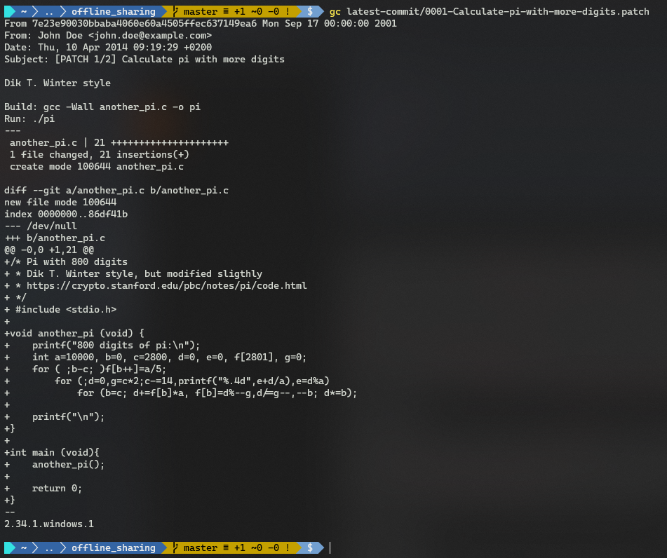
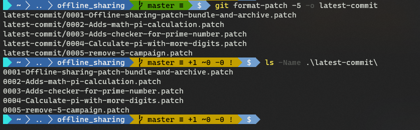
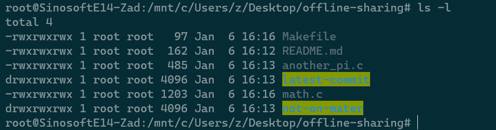

# 第十章 Git 补丁与离线共享

本章相关主题：

- 补丁的创建
- 从分支创建补丁
- 补丁的应用
- 补丁的发送
- 创建 Git 打包文件（`bundles`）
- 使用 Git 打包文件（`bundle`）
- 创建基于 `tree` 的存档文件

---


在联网环境下，`Git` 的分布式特性和现有的多种代码托管平台可以很方便地共享历史记录。如果设备没有联网，`Git` 也提供了其他方式来共享历史，补丁就是其中之一。

- `Git` 提供了一种简单的方法来格式化现有历史记录中的补丁。这些补丁通过电子邮件发送到目标设备并应用到目标 `Git` 库；
- `Git` 也有一个包（`bundle`）的概念，在包内可以仅包含部分提交历史，并可用作另一个库的远程仓库；
- 最后，`Git` 提供了一种简单易用的方法来创建存档（`archive`），已存储给定引用下的文件或文件夹结构快照信息。

借助 `Git` 提供的不同方法，可以轻松实现历史记录的共享，尤其是在常规方法不可用的情况下。


## 10.1 补丁的创建

本节演示如何从 commit 创建补丁。补丁既可以通过发送电子邮件来快速共享，也可以通过移动存储设备（U 盘、存储卡、移动硬盘等）复制到未联网的主机上。补丁是审查代码的有用方法，因为审查人员可以将补丁应用到他们的 `Git` 库，发现差异并检查程序。如果认为补丁没问题，则可以将其发布（推送）到公共库中，假设审查人员是仓库维护者。如果审查人员拒绝该补丁，也可以快速还原到原始状态，并通知补丁提交者作进一步修改。

补丁创建演示如下：

```bash
# init repo
$ git clone https://github.com/PacktPublishing/Git-Version-Control-Cookbook-Second-Edition_offline-sharing.git offline_sharing
$ cd offline_sharing
$ git checkout master
Already on 'master'
Your branch is up to date with 'origin/master'.
# Check log info
$ git log --graph --all --online
* 937f960 (HEAD -> master, origin/master, origin/HEAD) remove $5 campaign
* 7e23e90 Calculate pi with more digits
| * b7a59e5 (origin/doc) Adds Documentation folder
| * b1e7600 Add build information
| * 9e6fc30 Update readme
| | * 0276427 (origin/develop) Adds functionality to prime-test a range of numbers
| | * cf3249e Adds Makefile for easy building
| | * df0eb7a Move print functionality of is_prime
| |/
|/|
* | 2a6f0eb Adds checker for prime number
|/
* b968400 Adds math, pi calculation
* ad92f75 Offline sharing, patch, bundle and archive
```

可以看到，示例仓库共有三个分支：`master`、`develop` 及 `doc` 分支。所有分支都与其他分支相差了一两个 `commit` 版本。我们可以在 master 分支的最新 commit 上创建一个补丁，放入 `latest-commit` 文件夹：

```bash
$ git format-patch -2 -o latest-commit
latest-commit/0001-Calculate-pi-with-more-digits.patch
latest-commit/0002-remove-5-campaign.patch
# Check patch content
$ gc latest-commit/0001-Calculate-pi-with-more-digits.patch
```

实测中，原仓库加入了促销信息，因此和原书演示结果不同，需将最近两个 `commit` 版本一同纳入补丁，因此用了 `-2`，而不是书中的 `-1`。执行结果如下图所示：



可以看到，补丁的抬头部分包含 `From`、`Date`、`Subject` 字样，类似电子邮件。接下来是正文部分，包含提交注释信息；接着依次是三个破折号（`---`）、实际补丁内容、收尾的两个破折号（`--`）；最后是创建补丁的 Git 版本信息（`2.34.1.windows.1`）。用 `git format-patch` 命令创建的补丁遵守 UNIX 邮件格式，且用一个固定时间戳巧妙地区分开补丁和普通邮件。该时间戳可在首行 `SHA-1` 后面找到（`Mon Sep 17 00:00:00 2001`）。

生成补丁时，`Git` 会将 `HEAD` 与其父级 `commit` 进行 `diff` 比较，并将比较结果用作补丁。参数 `-2` 表示只对最后两次提交生成补丁；`-o latest-commit` 表示将补丁存放到 `latest-commit` 文件夹中。若该文件夹不存在，则将自动创建。


> **发散**

也可以基于多个提交创建补丁，例如创建一个最近五次（原书为三次）提交的补丁，存入 `latest-commit` 文件夹：

```bash
$ git format-patch -5 -o latest-commits
$ ls -Name .\latest-commits\
```

结果如下：




## 10.2 从分支创建补丁

指定目标分支，也可以创建补丁：

```bash
# repo init
$ git clone https://github.com/PacktPublishing/Git-Version-Control-Cookbook-Second-Edition_offline-sharing.git offline-sharing
$ cd offline-sharing
# switch to develop branch
$ git checkout develop
$ git log --oneline master..develop
0276427 (HEAD -> develop, origin/develop) Adds functionality to prime-test a range of numbers
cf3249e Adds Makefile for easy building
df0eb7a Move print functionality of is_prime
# create patches for all of the commits that are not on the master branch
$ git format-patch -o not-on-master master
not-on-master/0001-Move-print-functionality-of-is_prime.patch
not-on-master/0002-Adds-Makefile-for-easy-building.patch
not-on-master/0003-Adds-functionality-to-prime-test-a-range-of-numbers.patch
# check patch files
$ ls -name .\not-on-master
0001-Move-print-functionality-of-is_prime.patch
0002-Adds-Makefile-for-easy-building.patch
0003-Adds-functionality-to-prime-test-a-range-of-numbers.patch
```

可见，指定分支时，是立足当前分支，对没在目标分支上的 `commit` 创建补丁文件。

`git format-patch` 命令常见的配置参数如下：

- `-s`、`--signoff`：在补丁文件新增一行 `Signed-off-by`，后跟提交人姓名。用于将补丁电邮给仓库维护人员时的必填项要求，比如提交给 `Linux` 内核的邮件列表。
- `-n`、`--numbered`：对应 `Subject` 行中的编号：`[PATCH n/m]`，从 1 开始；
- `--suffix=.<sfx>`：设置补丁文件的后缀。可以为空，也不必以句点 `.` 开头；
- `-q`，`--quiet`：生成补丁文件时不打印补丁文件名；
- `--stdout`：将补丁打印到标准输出，而不是创建补丁文件。


## 10.3 补丁的应用

演示命令：`git am <patch-file>`，`am` 是 `apply from mailbox` 的缩写：

接着上一节仓库进行演示：

```bash
$ cd offline-sharing 
$ git checkout master
$ ls -name
latest-commit
not-on-master
another_pi.c
math.c
README.md
# switch to develop
$ git checkout develop
# apply patch file
$ git am latest-commit/0001-Offline-sharing-patch-bundle-and-archive.patch
git am latest-commit/0001-Offline-sharing-patch-bundle-and-archive.patch
.git/rebase-apply/patch:18: trailing whitespace.
##
error: README.md: already exists in index
hint: Use 'git am --show-current-patch=diff' to see the failed patch
Applying: Offline sharing, patch, bundle and archive
Patch failed at 0001 Offline sharing, patch, bundle and archive
When you have resolved this problem, run "git am --continue".
If you prefer to skip this patch, run "git am --skip" instead.
To restore the original branch and stop patching, run "git am --abort".
```

上一节提到，由于示例仓库产生了新提交记录，故实操结果与书中不同。根据提示，切换到 develop 分支并应用第一个补丁文件时，README 文件不应存在，但却在工作目录中。因此需要删除，以解决冲突：

```bash
$ rm .\README.md
$ git am --continue
Applying: Offline sharing, patch, bundle and archive
No changes - did you forget to use 'git add'?
If there is nothing left to stage, chances are that something else
already introduced the same changes; you might want to skip this patch.
When you have resolved this problem, run "git am --continue".
If you prefer to skip this patch, run "git am --skip" instead.
To restore the original branch and stop patching, run "git am --abort".
```

这里提示需要先运行 `git add`，以继续打补丁：

```bash
$ git add README.md
$ git am --continue
Applying: Offline sharing, patch, bundle and archive
```

补丁应用成功！

此外，也可以批量打补丁，例如在 `master` 分支应用从 `develop` 创建的补丁：

要应用的补丁文件在 not-on-master 文件夹内：



```bash
# (on Linux)
$ git checkout master
$ git am not-on-master/*
Applying: Move print functionality of is_prime
Applying: Adds Makefile for easy building
Applying: Adds functionality to prime-test a range of numbers
```

与原书结果一致。

`git am` 命令根据指定路径下的补丁文件，分别应用到相应的项目文件。然后用补丁中的提交信息（提交注释和提交人）生成一个 `commit` 版本。commit 中的提交者身份（`commiter identity`）将是执行 `git am` 命令的人的身份。可以通过 `git log` 验证，其中提交者信息通过 `--pretty=fuller` 显示：

```bash
# Check the log
$ git log -1 --pretty=fuller
commit 418553f21f13054cf6fa8e426854186bfcc66c95 (HEAD -> master)
Author:     John Doe <john.doe@example.com>
AuthorDate: Wed Apr 9 21:50:18 2014 +0200
Commit:     root <root@SinosoftE14-Zad.localdomain>
CommitDate: Thu Jan 6 16:16:02 2022 +0800

    Adds functionality to prime-test a range of numbers
```


> **发散**

如果不希望产生一次提交记录，可以使用 `git apply` 命令：

```bash
$ git checkout develop
$ git reset --hard origin/develop
HEAD is now at c131c8b Adds functionality to prime-test a range of numbers
# use git apply
$ git apply latest-commit/0001-Offline-sharing-patch-bundle-and-archive.patch
latest-commit/0001-Offline-sharing-patch-bundle-and-archive.patch:24: trailing whitespace.
##
error: README.md: already exists in working directory
# resolve conflict
$ rm README.md
$ git add README.md
# apply again
$ git apply latest-commit/0001-Offline-sharing-patch-bundle-and-archive.patch
latest-commit/0001-Offline-sharing-patch-bundle-and-archive.patch:24: trailing whitespace.
##
warning: 1 line adds whitespace errors.
```

可以添加 `--index` 参数将补丁应用到暂存区与工作区；或使用 `--cached` 仅应用于暂存区。


## 10.4 补丁的发送

## 10.5 创建 Git 打包文件（`bundles`）

## 10.6 使用 Git 打包文件（`bundle`）

## 10.7 创建基于 `tree` 的存档文件
