# 第十一章 Git 操作技巧与诀窍

本章相关主题：

- 活用 `git stash`
- 保存并应用 `stash`
- 用 `git bisect` 进行调试
- 使用 `git blame` 命令
- 设置彩色命令行界面
- 自动补全
- 让 Bash 自带状态信息
- 更多别名
- 交互式新增提交
- 用 Git 的图形界面交互式新增
- 忽略文件
- 展示与清理忽略文件

---


## 简介

本章将重点梳理 Git 的使用技巧，以便用于日常工作。例如在执行重要任务时被临时打断需要寄存工作区变更内容，或者使用 `bisect` 与 `blame` 命令高效定位 `bug`，抑或是设置命令行的颜色与状态信息等。此外还将进一步梳理实用别名、根据指定的行级变更创建更清爽的 `commit` 提交、以及忽略文件的相关操作。


## 11.1 活用 `git stash`

本节演示如何使用 `git stash` 命令来快速寄存未提交的更改并再次读取这些内容。该操作在某项重要任务被临时打断（如紧急修复线上 `bug`）时非常实用，可以快速保存本地更改，恢复当前工作区；待临时任务结束后再还原之前的工作状态。利用 `git stash` 命令，还可以在寄存本地更改时设置是否保存暂存区（`staging area`）中的内容。

相关命令：

- `git stash`：添加到寄存区（入栈）
- `git stash list`：查看寄存区的存放列表
- `git stash pop`：取回寄存区的内容（出栈）

实操示例如下：

```bash
# repo init
$ git clone https://github.com/PacktPublishing/Git-Version-Control-Cookbook-Second-Edition_tips_and_tricks.git tiptrick
$ cd tiptrick
$ git checkout master
# do some changes
$ echo "Just another unfinished line" >> foo
$ git add foo
$ echo "Another line" >> bar
$ echo "Some content" > new_file
$ git status -s
```


可见，`git stash` 只对暂存区及加入版本管理的文件生效（`new_file` 未被寄存）。

```bash
# using git stash
$ git stash
Saved working directory and index state WIP on master: b6dabd7 Update foo and bar
$ git status -s
?? new_file
```

查看 `gitk`：

```bash
$ gitk master stash
```

结果如下：

 
**图 11-1 放入寄存区后的分支状态** <a id="fig11_1"></a> [返回](#ref11_1) 

对 `foo` 文件作如下修改：

```bash
# on Linux (BSD sed)
$ sed -i 's/First line/This is the very first line of the foo file/' foo
$ git add foo
$ git commit -m "Update foo"
[master 3646ef9] Update foo
 1 file changed, 1 insertion(+), 1 deletion(-)
# check stashed contents
$ git stash list
stash@{0}: WIP on master: b6dabd7 Update foo and bar
```

实测发现，`Ubuntu` 环境下 `sed` 命令为 `sed -i 's/.../.../' foo`。

此时再查看分支状态：

```bash
$ gitk --reflog
```

结果如下：


**图 11-2 完成临时任务并提交后的分支状态** <a id="fig11_2"></a> [返回](#ref11_2)

完成临时任务后，取回 `stash` 命令寄存的内容如下：

```bash
$ git status -s
?? new_file
$ git stash pop
Auto-merging foo
On branch master
Your branch is ahead of 'origin/master' by 1 commit.
  (use "git push" to publish your local commits)

Changes not staged for commit:
  (use "git add <file>..." to update what will be committed)
  (use "git restore <file>..." to discard changes in working directory)
        modified:   bar
        modified:   foo

Untracked files:
  (use "git add <file>..." to include in what will be committed)
        new_file

no changes added to commit (use "git add" and/or "git commit -a")
Dropped refs/stash@{0} (c008d2f149d0827cbc06879b3097bd690128e260)
```

值得注意的是，虽然原来暂存区的变更也一并存入了寄存区，但还原时 `git` 默认只把工作区内的变更还原了。


> **原理分析**

上述演示中，`foo` 文件的一处修改先放到了寄存区；然后在处理临时任务时，对该文件的另一处内容作了修改并提交；之后再将寄存的变更重新还原到 `foo` 上，由于没有版本冲突，`Git` 作了自动合并。

根据 [图 11-1](#fig11_1)<a id="ref11_1"></a> 可知，加入寄存区后，`Git` 分别为索引区（`index`）及工作区（`work area`）创建了 `commit` 节点；这在临时任务提交后也可以佐证，如 [图 11-2](#fig11_2)<a id="ref11_2"></a> 所示。

`stash` 创建的 `commit` 对象存放在 `refs/stash` 命名空间下。其中，包含原暂存区信息的 `commit` 节点，称为 `index on master`（主分支上的索引信息）；另一个包含工作区信息的节点，叫 `WIP on master`（主分支上正在进行中的工作信息，`WIP` 是 `W`ork `I`n `P`rogress 的缩写）。这些临时创建的节点信息，可以通过 `git` 的常规操作将更改重新还原到工作目录下。也就是说，一旦还原过程中发生版本冲突，也可以通过 `git` 处理冲突的常规流程进行处理。


> **知识拓展**

通过刚才的演示得知，默认情况下，`git` 寄存或还原当前工作状态时，存在两个问题：

- 未加入版本控制的文件不会自动 `stash` 到寄存区；
- 还原只对工作区生效，尽管寄存了原暂存区的变更；

这两个问题都可以通过手动指定参数来解决。前者使用 `git stash --include-untracked` 解决；后者通过 `git stash pop --index` 解决：

```bash
$ git clone https://github.com/PacktPublishing/Git-Version-Control-Cookbook-Second-Edition_tips_and_tricks.git tiptrick
$ cd .\tiptrick\
$ echo "Just another unfinished line" >> foo; git add foo; echo "Another line" >> bar;echo "Some content" > new_file;
$ git stash --include-untracked
Saved working directory and index state WIP on master: b6dabd7 Update foo and bar
# Check untracked file (not existed):
$ git status -s
# Check gitk with 'stash' branch
$ gitk stash
```

查看结果如下：（`Git` 在 `stash` 上又新增一个节点来单独存放 **不在版本控制内的** 内容变更）


继续后面的操作，处理并提交临时任务，只是在还原寄存区的变更时，将原暂存区的变更也还原：

```bash
$ sed -i 's/First line/This is the very first line of the foo file/' foo
$ git add foo; git commit -m 'Update foo';
$ gitk --reflog
```

再次查看还原前的分支状态：


这时，需要将原暂存区的变更内容一并还原到之前的状态：

```bash
$ git stash pop --index
$ git status -s
 M bar
M  foo
?? new_file
$ 
```


注意对比之前没加 `--index` 的输出内容。再次查看 `gitk --reflog` 予以验证，可以看到还原后的状态中，暂存区不同了：


此外，还可以在放入寄存区时，手动指定是否需要保留暂存区的变更：在执行 `git stash` 时通过标记 `--keep-index` 实现（也可以加 `--include-untracked` 包含不受版本控制的变更）：

```bash
$ git clone https://github.com/PacktPublishing/Git-Version-Control-Cookbook-Second-Edition_tips_and_tricks.git tiptrick
$ cd .\tiptrick\
$ echo "Just another unfinished line" >> foo; git add foo; echo "Another line" >> bar;echo "Some content" > new_file
# keep changes in staging area 
# while stashing away untracked changes, too:
$ git stash --keep-index --include-untracked
Saved working directory and index state WIP on master: b6dabd7 Update foo and bar
# Check result (as expected)
$ git status
On branch master
Your branch is up to date with 'origin/master'.

Changes to be committed:
  (use "git restore --staged <file>..." to unstage)
        modified:   foo

```


## 11.2 保存并应用 `stash`

寄存当前工作状态时，寄存区可能会有出现寄存状态，而默认的名称并不能区分要恢复的版本具体是哪个。本节将对这种情况进行处理，演示怎样给寄存区的存放记录命名，并恢复指定的版本：

```bash
# init repo
$ git clone https://github.com/PacktPublishing/Git-Version-Control-Cookbook-Second-Edition_tips_and_tricks.git tiptrick
$ cd .\tiptrick\
$ echo "Just another unfinished line" >> foo; git add foo; echo "Another line" >> bar;echo "Some content" > new_file
$ git stash --keep-index --include-untracked
Saved working directory and index state WIP on master: b6dabd7 Update foo and bar
$ git status
On branch master
Your branch is up to date with 'origin/master'.

Changes to be committed:
  (use "git restore --staged <file>..." to unstage)
        modified:   foo
$ git stash list
stash@{0}: WIP on master: b6dabd7 Update foo and bar
# create stash and name the stash item
$ git stash save 'Updates to foo'
Saved working directory and index state On master: Updates to foo
$ git stash list
stash@{0}: On master: Updates to foo
stash@{1}: WIP on master: b6dabd7 Update foo and bar
# Create a new stash by changing bar:
$ echo "Another change" >> bar
$ git stash save 'Made another change to bar'
Saved working directory and index state On master: Made another change to bar
# check stash list
$ git stash list
stash@{0}: On master: Made another change to bar
stash@{1}: On master: Updates to foo
stash@{2}: WIP on master: b6dabd7 Update foo and bar
```

解决了寄存记录的命名问题，就可以在应用寄存信息的同时保留该记录：

```bash
# apply stash info
$ git stash apply 'stash@{1}'
# use --quiet to suppresses the status output
$ git stash apply --quiet 'stash@{0}'
$ git stash list
stash@{0}: On master: Made another change to bar
stash@{1}: On master: Updates to foo
stash@{2}: WIP on master: b6dabd7 Update foo and bar
```

可以看到，寄存列表在成功还原后仍在存在。应用某个寄存区的记录，语法为：`git stash apply stash@{stash-no}`。


> **发散**

寄存列表如何删除呢？执行命令 `git stash drop stash@{stash-no}` 即可：

```bash
$ git stash list
stash@{0}: On master: Made another change to bar
stash@{1}: On master: Updates to foo
stash@{2}: WIP on master: b6dabd7 Update foo and bar
$ git stash drop 'stash@{1}'
Dropped stash@{1} (ef0c0e7de00803e61f7a2a02df581bedb143778b)
$ git stash list
stash@{0}: On master: Made another change to bar
stash@{1}: WIP on master: b6dabd7 Update foo and bar
```

对比之前的默认版本，手动应用或删除寄存区版本提供了更多的灵活性，可以避免一个操作失误。默认情况下，成功 `stash pop` 一个版本后，该版本会从寄存区自动删除；但若还原过程受阻（如发生冲突）则会被保留下来，即便用户处理了这个冲突，寄存区的版本仍不会自动删除。这就为后续的版本还原埋下了隐患。而手动控制应用或删除，就可以很好地解决这个问题。


> **小试牛刀**

`git stash` 命令也能把调式信息应用到项目中。比如在调式代码过程中，为了定位 `bug` 而在项目中加入了不少调式用的语句，调试结束后不必手动删除所有的调试语句。相反，可以将这些语句通过 `git stash save "Debug info stash"` 寄存到 `git` 中并命名。这样在今后再次调试时，可以应用该寄存版快速初始化上一次的调试环境。


## 11.3 用 `git bisect` 进行调试

实际工作中经常遇到类似“究竟是哪次提交引入的某个 `Bug`”的问题，而底层应用二分算法的 `git bisect` 命令是该类问题的绝佳工具，尤其适用于在较长的提交历史记录中快速锁定引入 `bug` 具体 `commit`。二分查找法（`binary search method`）或二分法（`bisection method`），是一种在有序数组中查找目标位置的搜索方法。算法会在每一步与数组的中间值进行比较，如果匹配成功则返回该位置；否则，根据比较结果，选择中间值的右侧或左侧的子数组继续搜索，直至找到目标位置。在 `Git` 中，历史提交记录对应一组可供测试的值数组，若程序能在某个 `commit` 编译成功则为目标位置。二分查找的算法复杂度为 ***O(log n)***。

本节演示如何从一个提交了 23 次的带 `bug` 分支利用 `git bisect` 命令定位该 `bug` 的全过程（假设带 `bug` 提交的 `SHA-1` 为 `83c22a39955ec10ac1a2a5e7e69fe7ca354129af`）：

```bash
# init repo
$ git clone https://github.com/PacktPublishing/Git-Version-Control-Cookbook-Second-Edition_tips_and_tricks.git bugHunting
$ cd bugHunting
$ git checkout bug_hunting
```

该 `bug` 位于 `map.txt` 文件第 38 行：


接下来是找到检测该 `bug` 的方法来测试不同版本。比如编译代码，执行测试等等。这里简化为定位代码中是否存在 `oo` 字样的行，编写测试脚本 `test.sh` 如下：（注：该测试脚本只适用于 `Linux` 环境下）

```bash
$ echo "! grep -q oo map.txt " > ../test.sh
$ chmod +x ../test.sh
```

为了避免测试脚本不受项目签出、编译等影响，最好将测试脚本放到 `git` 库外面。

> **小提示**
>
> 经实测，测试脚本 `test.sh` 第一行末尾须加一个空格，否则脚本只能在 `Linux` 环境运行成功，而 `Windows` 下，`Windows` 的换行符号会与文件名 `test.sh` 连在一起，从而导致目标文件定位失败。

接下来开始测试：

```bash
$ git bisect start
# mark current commit as bad
$ git bisect bad
# mark the last known good commit (master HEAD) as good
$ git bisect good master
Bisecting: 12 revisions left to test after this (roughly 4 steps)
[7fb98059857aa0361cf14329d027573afd5a17b2] Build map part 10
# 1st round
$ ../test.sh; test $? -eq 0 && git bisect good || git bisect bad
Bisecting: 6 revisions left to test after this (roughly 3 steps)
[de6b768ceebd451591ee41ff4708ca889bafd3f2] Build map part 15
# 2nd round
$ ../test.sh; test $? -eq 0 && git bisect good || git bisect bad
Bisecting: 2 revisions left to test after this (roughly 2 steps)
[865ff6f8a62d61e4a59f7bc1b2478aa6c71c345a] Build map part 13
# 3rd round
$ ../test.sh; test $? -eq 0 && git bisect good || git bisect bad
Bisecting: 0 revisions left to test after this (roughly 1 step)
[27952d82d1f9067948b37e39b9bc4d0e6d846567] Build map part 14
# 4th round
$ ../test.sh; test $? -eq 0 && git bisect good || git bisect bad
Bisecting: 0 revisions left to test after this (roughly 0 steps)
[83076f97e8312f8d59976c6373c897aef284c26d] Bugs...
# 5th round
$ ../test.sh; test $? -eq 0 && git bisect good || git bisect bad
83076f97e8312f8d59976c6373c897aef284c26d is the first bad commit
commit 83076f97e8312f8d59976c6373c897aef284c26d
Author: HAL 9000 <aske.olsson@switch-gears.dk>
Date:   Tue May 13 09:53:45 2014 +0200

    Bugs...

 map.txt | 6 +++---
 1 file changed, 3 insertions(+), 3 deletions(-)
# reset bisect, get SHA-1 (83076f9): 
$ git bisect reset
Previous HEAD position was 83076f9 Bugs...
Switched to branch 'bug_hunting'
Your branch is up to date with 'origin/bug_hunting'.
$ git show 83076f9
commit 83076f97e8312f8d59976c6373c897aef284c26d
Author: HAL 9000 <aske.olsson@switch-gears.dk>
Date:   Tue May 13 09:53:45 2014 +0200

    Bugs...

diff --git a/map.txt b/map.txt
index 8a13f6b..1afeaaa 100644
--- a/map.txt
+++ b/map.txt
@@ -34,6 +34,6 @@ Australia:
                .-./     |.     :  :,
               /           '-._/     \_
              /                '       \
-           .'                         *: Brisbane
-        .-'                             ;
-        |                               |
+           .'        \__/             *: Brisbane
+        .-'          (oo)               ;
+        |           //||\\              |
```

演示过程的示意图如下：


其实倒数第二轮时已经找到引入 bug 的版本了，但需要进一步确认 bug 是该版本自己产生的，还是其他版本传播到这里的，因此多运行了一轮。


> **发散**

上述示例的一个弊端就是手动执行每一轮测试脚本，直到找出目标位置为止。若想让该过程自动进行，可以给 git 指定一个脚本（`script`），或 `makefile`，或一个测试脚本，使得二分查找自动进行。传入的脚本，会在命中目标时用返回一个为零状态（`exit with a zero-status`），或者在未命中时返回一个非零状态（`a non-zero status`）：

```bash
# Automatic bisect
$ git bisect start HEAD master
Bisecting: 12 revisions left to test after this (roughly 4 steps)
[7fb98059857aa0361cf14329d027573afd5a17b2] Build map part 10
# pass the test script
$ git bisect run ../test.sh
running  '../test.sh'
Bisecting: 6 revisions left to test after this (roughly 3 steps)
[de6b768ceebd451591ee41ff4708ca889bafd3f2] Build map part 15
running  '../test.sh'
Bisecting: 2 revisions left to test after this (roughly 2 steps)
[865ff6f8a62d61e4a59f7bc1b2478aa6c71c345a] Build map part 13
running  '../test.sh'
Bisecting: 0 revisions left to test after this (roughly 1 step)
[27952d82d1f9067948b37e39b9bc4d0e6d846567] Build map part 14
running  '../test.sh'
Bisecting: 0 revisions left to test after this (roughly 0 steps)
[83076f97e8312f8d59976c6373c897aef284c26d] Bugs...
running  '../test.sh'
83076f97e8312f8d59976c6373c897aef284c26d is the first bad commit
commit 83076f97e8312f8d59976c6373c897aef284c26d
Author: HAL 9000 <aske.olsson@switch-gears.dk>
Date:   Tue May 13 09:53:45 2014 +0200

    Bugs...

 map.txt | 6 +++---
 1 file changed, 3 insertions(+), 3 deletions(-)
bisect found first bad commit
$ git bisect reset
Previous HEAD position was 83076f9 Bugs...
Switched to branch 'bug_hunting'
Your branch is up to date with 'origin/bug_hunting'.
$ git show 83076f9
# ... (omitted)
```


## 11.4 使用 `git blame` 命令

上一节的 `git bisect` 适用于只知道项目有 `bug`，但不知道 `bug` 在哪儿、是具体哪次提交引入的场景。如果知道了 `bug` 在代码中的位置，需要明确谁提交或改动的这行代码，就需要使用 `git blame` 命令。

继续以 `Git-Version-Control-Cookbook-Second-Edition_tips_and_tricks` 库为例：

```bash
$ git blame --date short -L 30,47 .\map.txt
7fb98059 (Dave Bowman      2014-05-13 30) Australia:
33016136 (Frank Poole      2014-05-13 31)
33016136 (Frank Poole      2014-05-13 32)                     _,__        .:
33016136 (Frank Poole      2014-05-13 33)             Darwin <*  /        | \
5a5f6ef7 (Frank Poole      2014-05-13 34)                .-./     |.     :  :,
5a5f6ef7 (Frank Poole      2014-05-13 35)               /           '-._/     \_
5a5f6ef7 (Frank Poole      2014-05-13 36)              /                '       \
83076f97 (HAL 9000         2014-05-13 37)            .'        \__/             *: Brisbane
83076f97 (HAL 9000         2014-05-13 38)         .-'          (oo)               ;
83076f97 (HAL 9000         2014-05-13 39)         |           //||\\              |
27952d82 (Dave Bowman      2014-05-13 40)         \                              /
27952d82 (Dave Bowman      2014-05-13 41)          |                            /
27952d82 (Dave Bowman      2014-05-13 42)    Perth  \*        __.--._          /
de6b768c (Heywood R. Floyd 2014-05-13 43)            \     _.'       \:.       |
de6b768c (Heywood R. Floyd 2014-05-13 44)            >__,-'             \_/*_.-'
de6b768c (Heywood R. Floyd 2014-05-13 45)                                  Melbourne
9b49c0f0 (Heywood R. Floyd 2014-05-13 46)         snd                     :--,
9b49c0f0 (Heywood R. Floyd 2014-05-13 47)                                  '/
```

其中的 `-L` 表示限定考察代码的行数范围，格式为 `-L <from>,<to>` 。从反馈的结果可知，`bug` 出现在 `map.txt` 文件的第 37 至 39 行，由 `HAL` 首次引入该 `bug`，对应 `SHA-1` 为 `83076f97`，与 `git bisect` 结果一致。

此外，还可以指定 `-M` 参数，查看文件被重构或移动到某处的情况；指定 `-C` 参数，则可以展示目标文件从当前 `commit` 包含的文件中复制或移入相关代码的情况；指定 `-CCC` 则范围不仅限于当前 `commit`，可包含所有 `commit`。


## 11.5 设置彩色命令行界面

默认的 git 命令行内容是黑白模式的，切换彩色模式只需一步简单配置：

```bash
$ git config --global color.ui true
```

设置生效前后效果对比演示：

```bash
$ git clone https://github.com/PacktPublishing/Git-Version-Control-Cookbook-Second-Edition_tips_and_tricks.git colorUI
$ cd colorUI
$ echo "And another line" >> foo
$ git add foo
$ echo "Last line ...so far" >> foo
$ touch test
# before configuration
$ git status
# set color UI
$ git config --global color.ui true
# check status by comparison
$ git status
```

配置前：


配置后：


彩色输出结果对多种 `git` 命令生效，如 `diff`、`log`、`branch` 等：

```bash
$ git log --oneline --decorate --graph
```


## 11.6 自动补全

`git` 自动补全，是指键入 <kbd>Tab</kbd> 键自动补全相关命令或参数项。通常在安装 `git` 时自带该功能。关键是将自动补全配置文件 `git-completion.bash` 放入指定路径：

|     操作系统      |                  `git-completion.bash` 路径                  |
| :---------------: | :----------------------------------------------------------: |
|       Linux       |                 `/etc/bash_completion.d/` 下                 |
|       MacOS       | `/Library/Developer/CommandLineTools/usr/share/git-core/` 下 |
| Mac from Homebrew | `/usr/local/Cellar/git/2.15.0/etc/bash_completion.d/git-completion.bash` |
|      Windows      |          `%GIT_HOME%\mingw64\share\git\completion`           |

如果文件缺失，可从 `GitHub` 下载：https://github.com/git/git/blob/master/contrib/completion/git-completion.bash

激活配置脚本：

```bash
# take Linux for instance
if [ -f /etc/bash_completion.d/git-completion.bash ]; then
    source /etc/bash_completion.d/git-completion.bash
fi
```

自动补全不仅对命令生效（如 `git che<tab><tab>`），还可以用于提示命令参数：（如 `git branch --<tab><tab>`）：


## 11.7 让 Bash 自带状态信息

本节示例需在 `Linux` 环境运行：

```bash
root@SinosoftE14-Zad:/mnt/c/Users/z/Desktop/colorUI# echo $PS1
\[\e]0;\u@\h: \w\a\]${debian_chroot:+($debian_chroot)}\u@\h:\w\$
# \u: user
# \h:hostname
# \w:the current working directory relative to the user's home directory

# add a branch name after the working directory
root@SinosoftE14-Zad:/mnt/c/Users/z/Desktop/colorUI# PS1='\u@\h:\w$(__git_ps1 " (%s)") \$ '
root@SinosoftE14-Zad:/mnt/c/Users/z/Desktop/colorUI (master) # pwd
/mnt/c/Users/z/Desktop/colorUI
root@SinosoftE14-Zad:/mnt/c/Users/z/Desktop/colorUI (master) #
```

由于当前目录在上一节的 `git` 库 `master` 分支，因此命令行的提示符多了 `(master)` 字样。

其他可供配置的环境变量：

|         **Variable**         |            **Value**             | **Effect**                                                   |
| :--------------------------: | :------------------------------: | ------------------------------------------------------------ |
|   `GIT_PS1_SHOWDIRTYSTATE`   |             Nonempty             | Shows `*` for unstaged changes and `+` for staged changes.   |
|   `GIT_PS1_SHOWSTASHSTATE`   |             Nonempty             | Shows the `$` character if something is stashed.             |
| `GIT_PS1_SHOWUNTRACKEDFILES` |             Nonempty             | Shows the `%` character if there are untracked files in the repository. |
|    `GIT_PS1_SHOWUPSTREAM`    | auto verbose name legacy Git svn | Auto shows whether you are behind (`<`) or ahead (`>`) of the upstream branch. A `<>` value is displayed if the branch is diverged and `=` if it is up to date. Verbose shows the number of commits behind/ahead. Name shows the upstream name. Legacy is verbose for old versions of Git. Git compares `HEAD` to `@{upstream}`. SVN compares `HEAD` to `svn upstream`. |
|   `GIT_PS1_DESCRIBE_STYLE`   | contains branch describe default | Displays extra information when on a detached `HEAD`. Contains is relative to a newer annotated tag (`v1.6.3.2~35`). Branch is relative to a newer tag or branch (`master~4`). Describe is relative to an older annotated tag (`v1.6.3.1-13-gdd42c2f`). Default is the tag that matches exactly. |

由于 `Windows` 版 `Git` 已配置了 `oh-my-posh` 主题样式，故 `Windows` 不考虑按本书定制命令行。

在 `~/.bashrc` 设置如下内容：

```bash
export GIT_PS1_SHOWUPSTREAM=auto
export GIT_PS1_SHOWDIRTYSTATE=enabled
PS1='u@h:w$(__git_ps1 " (%s)") $ '
```

测试效果：

```bash
$ cd bugHunting
$ touch test
$ git add test
$ echo "Testing" > test
$ git commit -m 'test'
```


有了定制化的配置项 `__git_ps1`，合并、变基、二分查找相关命令都会在命令行中通过符号予以实时展示，`git status` 命令瞬间黯然失色。


> **发散：设置彩色命令行**

现如今不支持彩色显示的命令行还叫命令行吗？在 `~/.bashrc` 加入如下配置项：

```bash
export GIT_PS1_SHOWUPSTREAM=auto
export GIT_PS1_SHOWDIRTYSTATE=enabled
export GIT_PS1_SHOWCOLORHINTS=enabled
PROMPT_COMMAND='__git_ps1 "\u@\h:\w" "\$ "'
```

看看效果：


## 11.8 更多别名

早在第二章就介绍过一些常见别名，本节将作进一步扩展，介绍更多实用的别名（共 13 个），以提高日常工作效率。还是以本章示例 `git` 库为例：

```bash
# repo init
$ git clone https://github.com/PacktPublishing/Git-Version-Control-Cookbook-Second-Edition_tips_and_tricks.git moreAlias
$ cd .\moreAlias
$ git checkout aliases
```

分别尝试如下别名：

```bash
# Demo1: show the current branch only as 'git b'
$ git config alias.b "rev-parse --abbrev-ref HEAD"
aliases

# Demo2: prettier git log as 'git graph'
$ git config alias.graph "log --graph --pretty=format:'%Cred%h%Creset -%C(yellow)%d%Creset %s %Cgreen(%cr) %C(bold blue)<%an>%Creset' --abbrev-commit --date=relative"
$ git graph origin/conflict aliases
# ... (omitted)
```

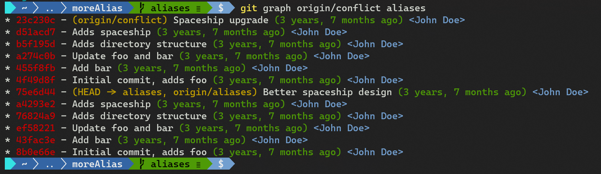


解决由于合并分支导致的冲突后，查看有冲突的、待合并的文件列表 `git unmerged`：

```bash
# Demo3: git unmerged
$ git config alias.unmerged '!git ls-files --unmerged | cut -f2 | sort -u'
# test by merging the origin/conflict branch
$ git merge origin/conflict
fatal: refusing to merge unrelated histories
$ git merge origin/conflict --allow-unrelated-histories
CONFLICT (add/add): Merge conflict in spaceship.txt
Auto-merging spaceship.txt
Automatic merge failed; fix conflicts and then commit the result.
$ git unmerged
spaceship.txt
# about merge
$ git merge --abort
```

实测效果：

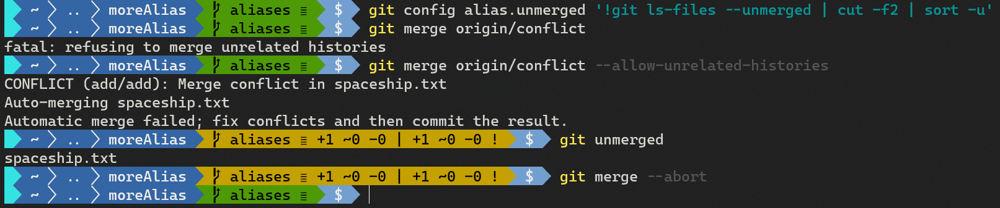


```bash
# Demo4: shorten git status as 'git st'
$ git config alias.st "status"
$ git st
On branch aliases
Your branch is up to date with 'origin/aliases'.

nothing to commit, working tree clean
```


```bash
# Demo5: shorter status with branch and file information as 'git s'
$ git config alias.s 'status -sb'
# test
$ touch test
$ echo testing >> foo
$ git s
## aliases...origin/aliases
 M foo
?? test
```

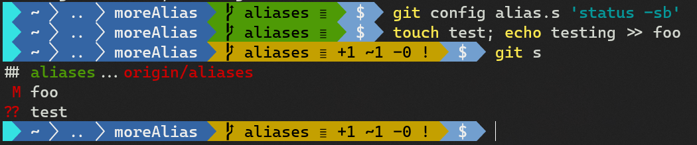


```bash
# Demo6: show the latest commit with some stats as 'git l1'
$ config alias.l1 "log -1 --shortstat"
$ git l1
commit 75e6d446289ac917aeb18f0f611bd0c91f4b7033 (HEAD -> aliases, origin/aliases)
Author: John Doe <john.doe@example.com>
Date:   Tue Jun 12 22:07:08 2018 +0200

    Better spaceship design

 1 file changed, 9 insertions(+), 9 deletions(-)
```

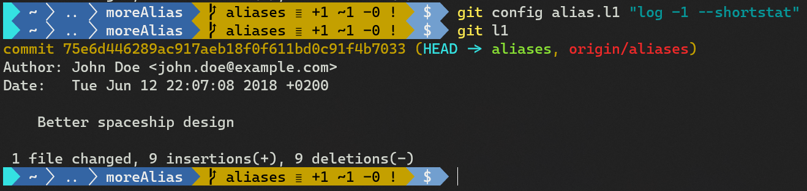


```bash
# Demo7: list latest 5 commits with more info as 'git l5'
$ git config alias.l5 "log -5 --decorate --shortstat"
$ git l5
```

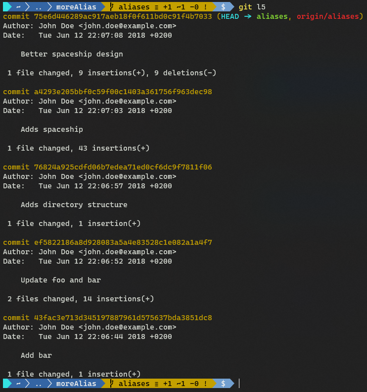


```bash
# Demo8: Show commit listing with statistics on the changed files in color, as 'git ll'
$ git config alias.ll "log --pretty=format:'%C(yellow)%h%Creset %s %Cgreen(%cr) %C(bold blue)<%an>%Creset %Cred%d%Creset' --numstat"
$ git ll -5
```

实测发现，定义别名时外层必须使用双引号，否则定义不成功（书中为单引号）。效果如下：

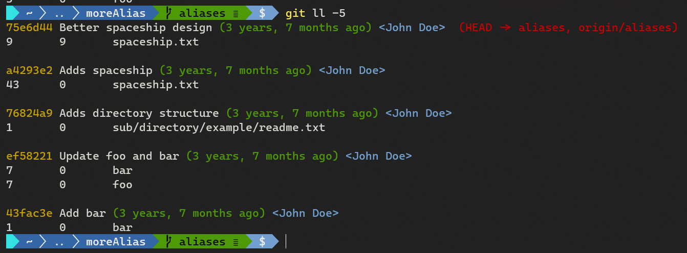


```bash
# Demo9: show the upstream/tracking branch by 'git upstream'
$ git config alias.upstream "rev-parse --symbolic-full-name --abbrev-ref=strict HEAD@{u}"
$ git upstream
origin/aliases 
```


```bash
# Demo10: show the details of ID/SHA-1 (commit, tag, tree, blob) as 'git details'
$ git config alias.details "cat-file -p"
$ git details HEAD
```

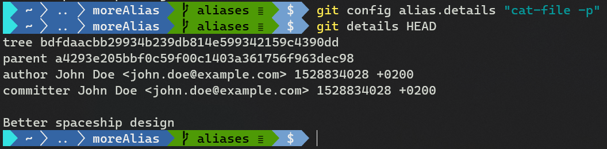


接下来这个别名在命令行脚本中非常实用 `git root`：

```bash
# Demo11: show the number of cd-ups or '../'s, needed to go to the repository root
# as 'git root'
$ git config alias.root "rev-parse --show-cdup"
$ cd sub/directory/example
$ pwd
$ git root
$ cd $(git root)
$ pwd
```

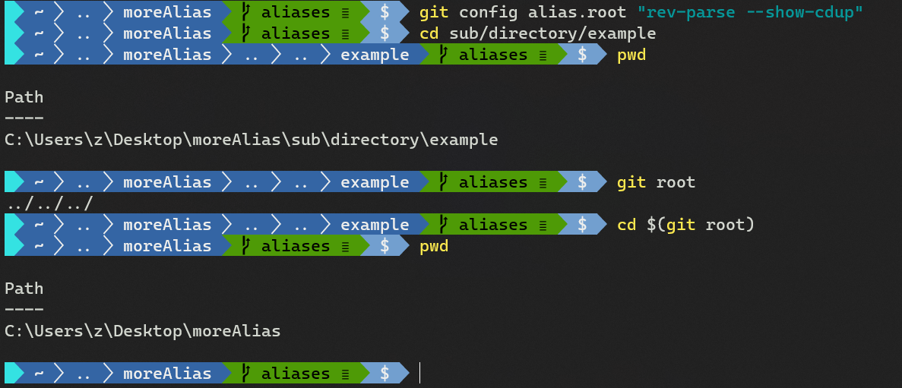


```bash
# Demo12: View the path of the repository on the filesystem as 'git path'
$ git config alias.path "rev-parse --show-toplevel"
$ git path
C:/Users/z/Desktop/moreAlias
```


最后，若想舍弃暂存区（索引区）、工作区、抑或是某 `commit` 的改动；再或者，在保留版本管理以外的变更的情况下，将工作区重置（`reset`）到某个状态（或 `commit ID`），只需要跟一个 `ref` 引用即可，比如 `HEAD`：（线上版）

```bash
# Demo13: abandon changes as 'git abandon'
$ git config alias.abandon "reset --hard"
$ echo "new stuff" >> foo
$ git add foo
$ echo "other stuff" >> bar
$ git s
## aliases...origin/aliases
 M bar
M  foo
?? test
$ git abandon HEAD
$ git s
## aliases...origin/aliases
?? test
```

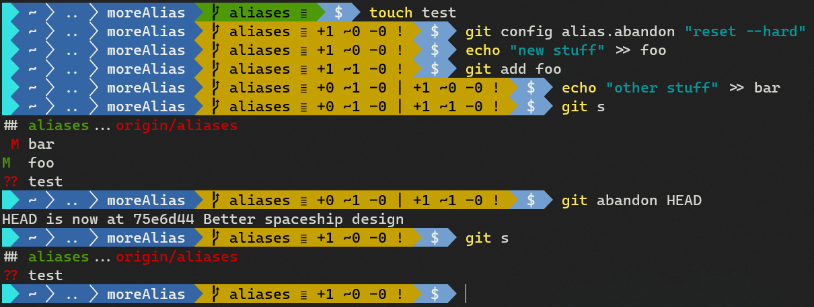


## 11.9 交互式新增提交

如果需要从一个文件中分出多次修改分别提交，如拆分为 `bug` 修复、代码重构、特性开发等 `commit`，就可以用到本节演示的交互式提交功能：

```bash
# repo init
$ git clone https://github.com/PacktPublishing/Git-Version-Control-Cookbook-Second-Edition_tips_and_tricks.git interAdd
$ cd interAdd
$ git checkout interactive
$ git reset 'HEAD^'
# add interactively
$ git add -p liberty.txt
```

最后一行的 `-p` 和 `--patch` 表示可以成片地、选择性地添加代码变更。此外还可以使用 `-i` 表示交互模式。

结果如下：

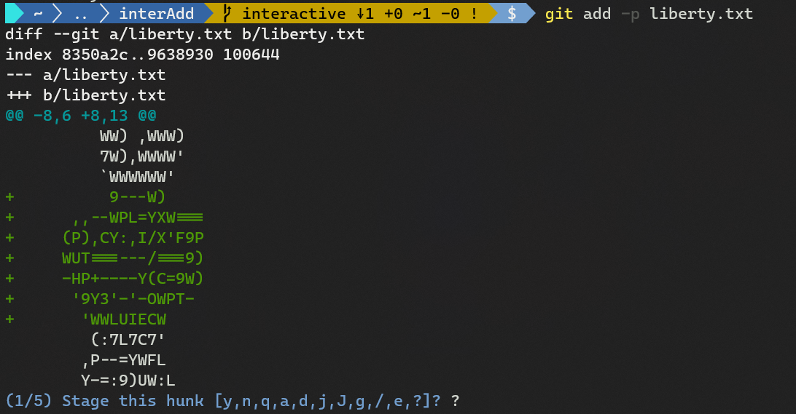

输入 `?` 可查看各操作符含义：

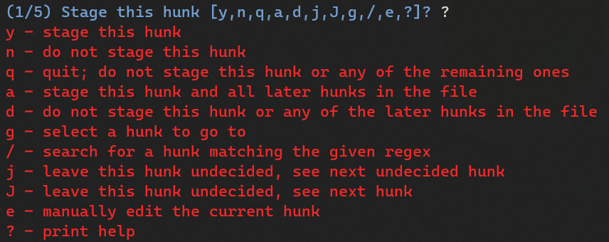

根据提示，Git 切分出的一块代码变更叫做一个 `hunk`，键入 `y` 表示整个加入暂存区，也可以用 `s` 进行细分；最后可以键入 `a` 将后面的所有 `hunk` 都加到暂存区。

该功能类似 `SourceTree` 的按需提交或撤回某行，只是 `SourceTree` 的操作界面更友好。如果没有 `SourceTree`，纯命令行也可以实现该功能。


## 11.10 用 Git 的图形界面交互式新增

（类似 `SourceTree`，略）


## 11.11 忽略文件

所谓忽略文件，通常是指诸如源码产生的编译文件、项目构建产生的内容、文件备份、本地配置等无需纳入版本管理的内容。为了避免这些文件也出现在 `git status` 的结果里干扰其他源码文件，可将它们添加到 `.gitignore` 文件。这样，工作区内凡是写入该文件的文件或路径，就都不会出现在 `git status` 的结果里了。

本节演示忽略文件 `.gitignore` 的相关操作：

```bash
# repo init
$ git clone https://github.com/PacktPublishing/Git-Version-Control-Cookbook-Second-Edition_tips_and_tricks.git ignoredemo
$ cd ignoredemo
$ git checkout ignore
# prepare changes
$ echo "Testing" > test.txt
$ echo "Testing" > test.txt.bak
$ mkdir bin
$ touch bin/foobar
$ touch bin/frotz
```

接下来实测：

```bash
# check status
$ git status -s
?? test.txt
# Why only test.txt displayed? Check ignore file
$ cat .\.gitignore
*.config
*.bak

# Java files
*.class

bin/
# try adding a file ignored
$ git add .\bin\frotz
The following paths are ignored by one of your .gitignore files:
bin
hint: Use -f if you really want to add them.
hint: Turn this message off by running
hint: "git config advice.addIgnoredFile false"
# force to add the file ignored
$ git add -f .\bin\frotz
$ git status -s
A  bin/frotz
?? test.txt
```

对于已经纳入版本管理的文件，是否可以放到 `.gitignore` 中呢？

```bash
$ echo "foo" >> .gitignore
$ echo "more testing" >> foo
$ git st -s
 M .gitignore
A  bin/frotz
 M foo
?? test.txt
```

可以看到，文件 `foo` 即使添加到忽略文件 `.gitignore` 中，仍旧会出现在 `git status` 的结果中。莫非是没有提交 `.gitignore` 的变更导致的吗？来验证一下：

```bash
$ git add foo .gitignore
$ git commit -m 'Add bin/frotz with force, foo & .gitignore'
[ignore ed9ff4c] Add bin/frotz with force, foo & .gitignore
 3 files changed, 2 insertions(+)
 create mode 100644 bin/frotz
$ git st -s
?? test.txt
# change foo to test again
$ echo "abc" >> foo
$ git st -s
 M foo
?? test.txt
```

显然，`foo` 还是没被忽略。由此得出结论：已参与版本管理的文件，不可以被忽略，即便加到 `.gitignore` 文件也是徒劳的。

除了常规的 `.gitignore` 文件外，`git` 还提供了两种方式忽略无关内容：

- 通过全局忽略文件（如 `~/.gitignore_global`）忽略；
- 通过 `git` 钩子 `.git/info/exclude` 忽略；

若全局忽略文件不在默认位置，则需要在配置项指定具体路径：

```bash
$ git config --global core.exludesfile ~/.gitignore_global
```

以 `git` 钩子为例进行演示：

```bash
$ echo "*.test" > .git/info/exclude
$ touch test.test
$ git st -s
 M foo
?? test.txt
$ ls
bin
.gitignore
bar
foo
test.test
test.txt
test.txt.bak
```

可见，`test.test` 虽然存在工作区，但并未显示到 `git status`，即忽略操作成功。

值得注意的是，后两种方法存在明显不足：因为没在 `git` 版本控制范围内，项目需要忽略的所有文件信息都不方便利用 `git` 共享。因此若想一劳永逸地忽略一个文件并让后面来的人保持一致，还是首选 `.gitignore` 文件。


> **小知识**
>
> `GitHub` 提供了不同语言开发项目时常见的忽略文件的内容，在创建 `Git` 仓库时可以方便地进行初始化设置，详见 https://github.com/github/gitignore。


## 11.12 展示与清理忽略文件

`Git` 提供的 `.gitignore` 文件确实方便，但如果想查看具体有哪些文件或文件夹被忽略了，应该如何操作呢？

可以使用 `git clean` 命令：

```bash
# repo init
$ git clone https://github.com/PacktPublishing/Git-Version-Control-Cookbook-Second-Edition_tips_and_tricks.git ignoredemo
$ cd ignoredemo
$ git checkout ignore
# prepare changes
$ echo "Testing" > test.txt
$ echo "Testing" > test.txt.bak
$ mkdir bin
$ touch bin/foobar
$ touch bin/frotz
# list files ignored
$ git clean -Xnd
Would remove bin/
Would remove test.test
Would remove test.txt.bak
```

正常情况下，`git clean` 会从工作区删除未被管理的文件或文件夹。但加上参数 `-n` 后则只会显示相关文件，不会实际删除。上例中的：

-  `-X` 表示仅删除被 `Git` 设置忽略的文件；
- `-d` 表示除了删除未被管理的文件外，还要删除未被管理的文件夹。


此外，`git ls-files` 也能查看被忽略文件列表：

```bash
$ git ls-files -o -i --exclude-standard
bin/foobar
bin/frotz
test.test
test.txt.bak
```

其中：

- `-o` 或 `--others` 表示列出未被管理的内容；
- `-i` 或 `--ignored` 表示列出被设置为忽略的内容；
- `--exclude-standard` 表示包括 `.git/info/exclude`、`.gitignore`、以及全局忽略文件中设置的忽略规则。


> **发散**

如果确实想删除被忽略的文件，则使用如下命令：

```bash
$ git clean -Xfd
Removing bin/
Removing test.test
Removing test.txt.bak
```

其中的 `-f` 表示强制执行（`forced`）；

如果想同时删除被忽略文件（`ignored files`）及未追踪文件（`untracked files`），则使用：

```bash
git clean -xfd
Removing bin/
Removing test.txt
Removing test.txt.bak
```

这里的 `-x` 是小写，表示 `Git` 的忽略规则不生效，即删除所有未被 `git` 托管的项目内容（被忽略文件及未追踪文件）。

