# 第十二章 Git 服务供应方、集成及客户端

本章相关主题：

- 在 `GitHub` 创建机构
- 创建 `GitHub` 仓库
- 为议题（`issues`）与拉取请求（`pull requests`）创建模板
- 创建 `GitHub` API 密钥
- 使用 `GitHub` 通过 `Jenkins` 认证
- 发起 `Jenkins` 构建任务
- 使用 `Jenkinsfiles` 文件

---

## 简介

自行安装 `Git` 并为自己的公司维护一个基于 `Git` 的中央服务器，这对小公司或开源项目来说，日常维护可能是一种负担。现如今有不少 `Git` 服务供应商可以为您减负，比如本章将重点介绍的 `GitHub`。作为最有名的 `Git` 服务供应商，目前拥有 7300 万注册用户<sup>[[1]](https://baijiahao.baidu.com/s?id=1721224421874432077&wfr=spider&for=pc)</sup>，许多备受瞩目的开源项目都是由 `GitHub` 托管。现在的软件开发领域，持续集成（`CI`）热度不减，其本质是将开发者提交的更新尽快合并到源码库，`GitHub` 的拉取请求服务（`PR`）就是达到该目的的一种途径。`GitHub` 设计一个用户界面来创建 `PR`，让用户可以在线与合作者一起进行代码评审。`CI` 策略也包含自行运行所有测试，比如将 `Jenkins` 配置到项目中，实现对每次提交都自动进行构建并运行测试。


## 12.1 在 `GitHub` 创建机构

商业软件也好、开源项目也罢，背后往往有一家公司或一群研发人员在支撑。`GitHub` 提供了机构创建功能来适应这样的实际需求。一个机构可以关联多个 `git` 库，也可以包含多个机构成员。设立机构的好处在于机构成员的流动性往往较大，但机构下的仓库只与该机构关联，因此不必担心由于人员变动造成的仓库所有权变更问题；对用户而言，一个用户也可以是多家机构的成员，既可以是所在公司的成员，也可以是开源项目背后的机构成员。

本节演示如何在 `GitHub` 创建机构。注意，创建 `GitHub` 机构需要一个 `GitHub` 帐号，任何帐号都能新建机构：

1. 单击右上角用户头像，点击 `Settings`；

   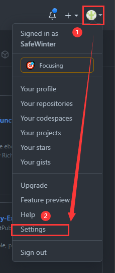

2. 从跳转页找到 `Organizations` 侧边栏项，单击 <kbd>New organization</kbd> 按钮。可以看到有两种方式创建机构：一种是直接创建；另一种是将当前帐号转为机构号。本节演示直接创建的方式：

   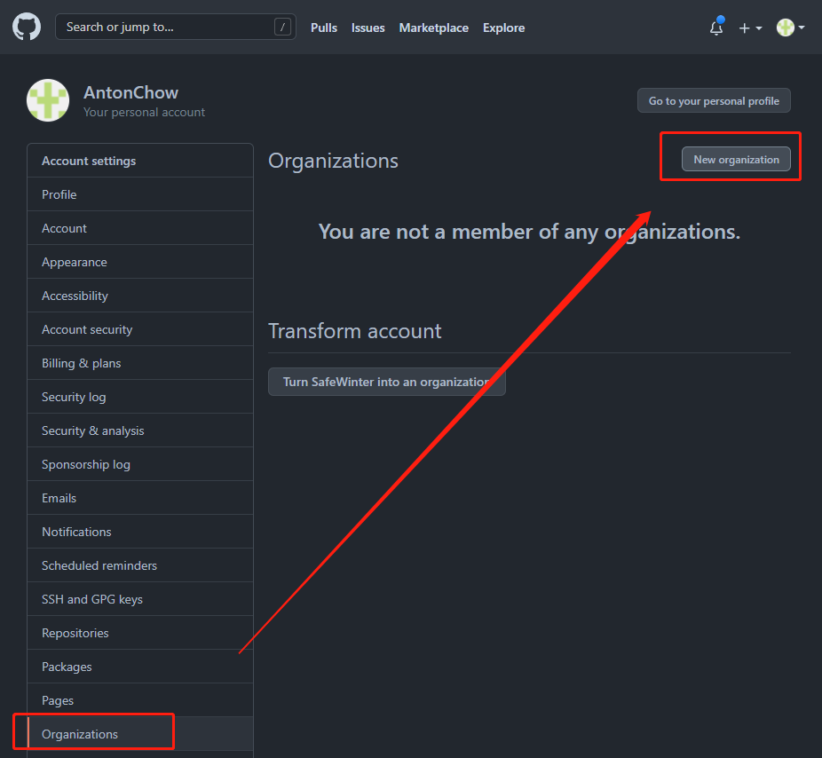

3. 单击 <kbd>Create a free organization</kbd> 按钮：

   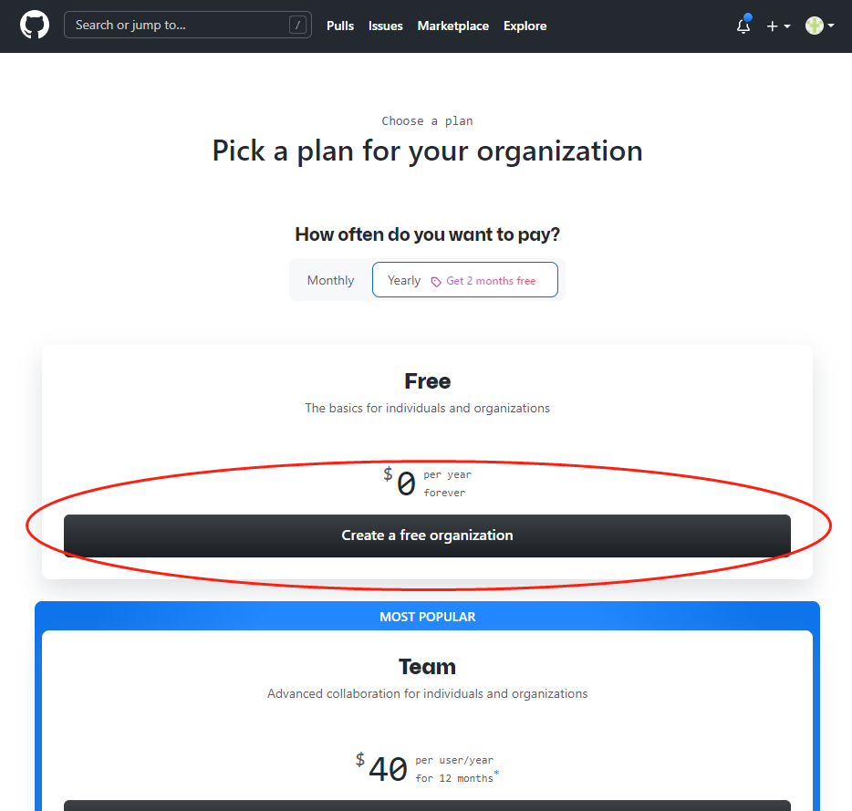

4. 进入创建页面，填写机构名、联系人电子邮箱、归属类别等信息后，单击下方的 <kbd>Next</kbd> 按钮继续：

   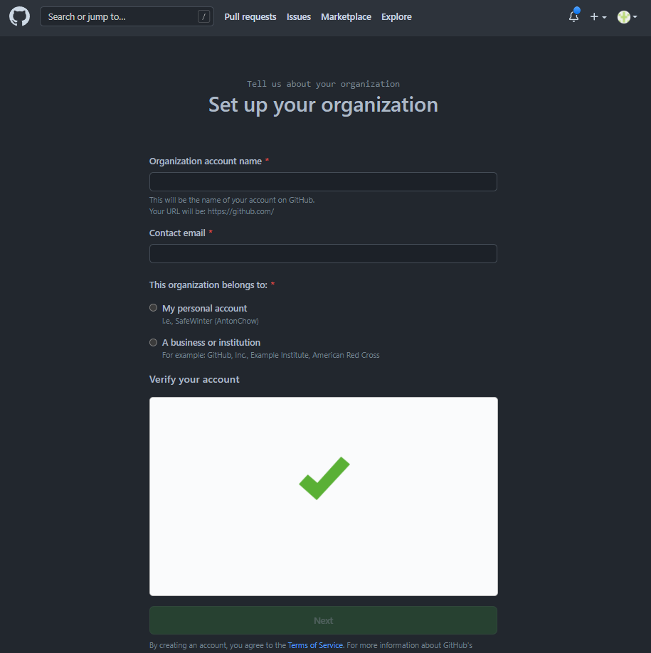

5. 随后可以添加机构成员，也可以直接单击 <kbd>Complete setup</kbd> 按钮跳过，后面再设置：

   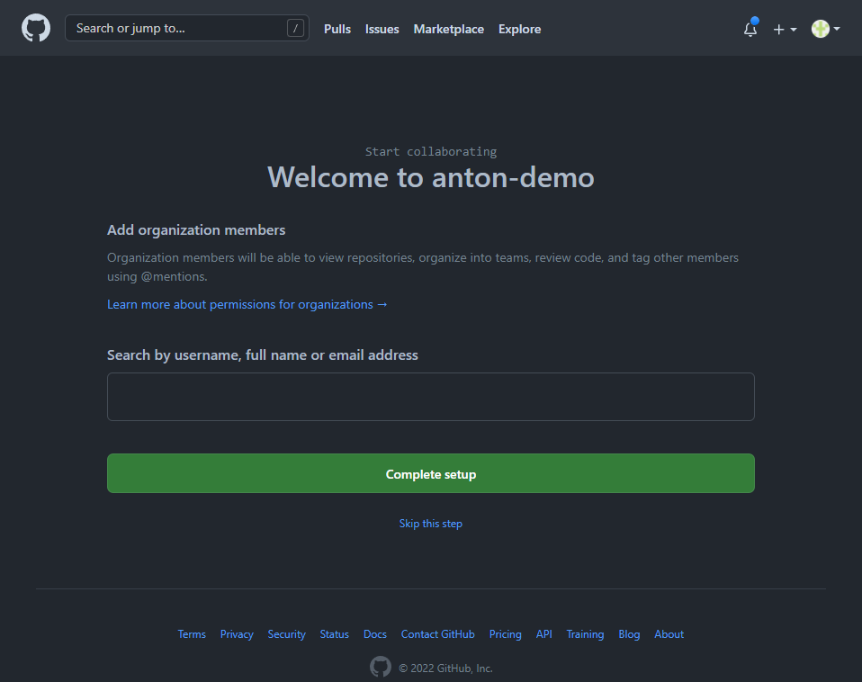

6. 最后验证身份，输入当前登录密码，完成机构创建：

   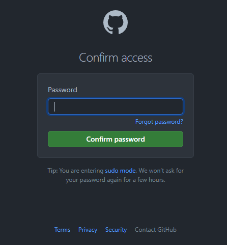

7. 实测时，`GitHub` 网站会自动进入一个问卷调查页面，初始化该机构下的基础信息（主要活动、成员规模、机构用途等），也可以直接略过：

   

8. 以 `anton-demo` 为例，创建好的新机构首页如下（https://github.com/anton-demo）：

   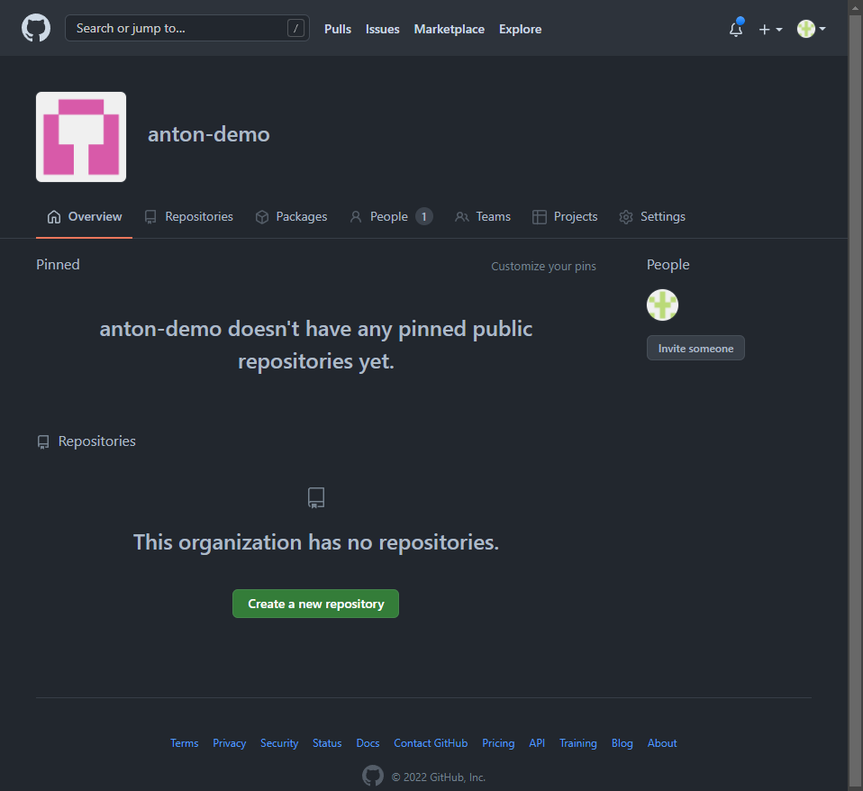

可以看到，新创建的机构 `URL` 与个人帐号一样，前缀都是 https://github.com，因此关联到该机构下的 `git` 库可以视为具有一定访问权限（具体由机构权限控制）的 `git` 代码库。

若为付费用户，创建的机构就可以包含私有库，只能对机构成员可见。一家公司可以在 `GitHub` 上将一些开源项目或演示项目设为公开库（`public`），而将涉密项目设为私有库。

为了提高机构管理的安全性，还可以要求机构成员必须使用双重身份验证（`two-factor authentication`）。

还可以访问机构的审核日志（`audit log`），确认是谁做了什么操作。审核日志还可以查看是否有人获取了机构访问权限并试图对其进行篡改。

更多详情，参考：https://docs.github.com/en/organizations


## 12.2 创建 `GitHub` 仓库

`GitHub`  为用户创建 `git` 库提供了用户界面，以简化操作。本节将在上一节创建的机构（`anton-demo`）中演示如何创建一个 `git` 库（个人用户也可以）。

有两点需要提前考虑：

- `Git` 仓库的命名
- 公开库还是私有库（需付费）

然后切换到机构首页（单击左上角章鱼猫图标），从下方的下拉菜单中选中对应机构：

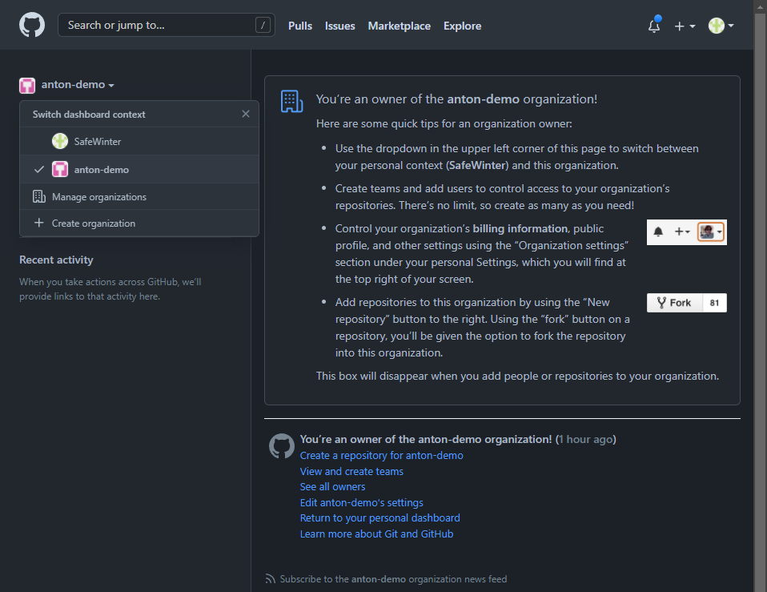

根据页面超链接或右上角的加号，即可创建一个 `Git` 库：

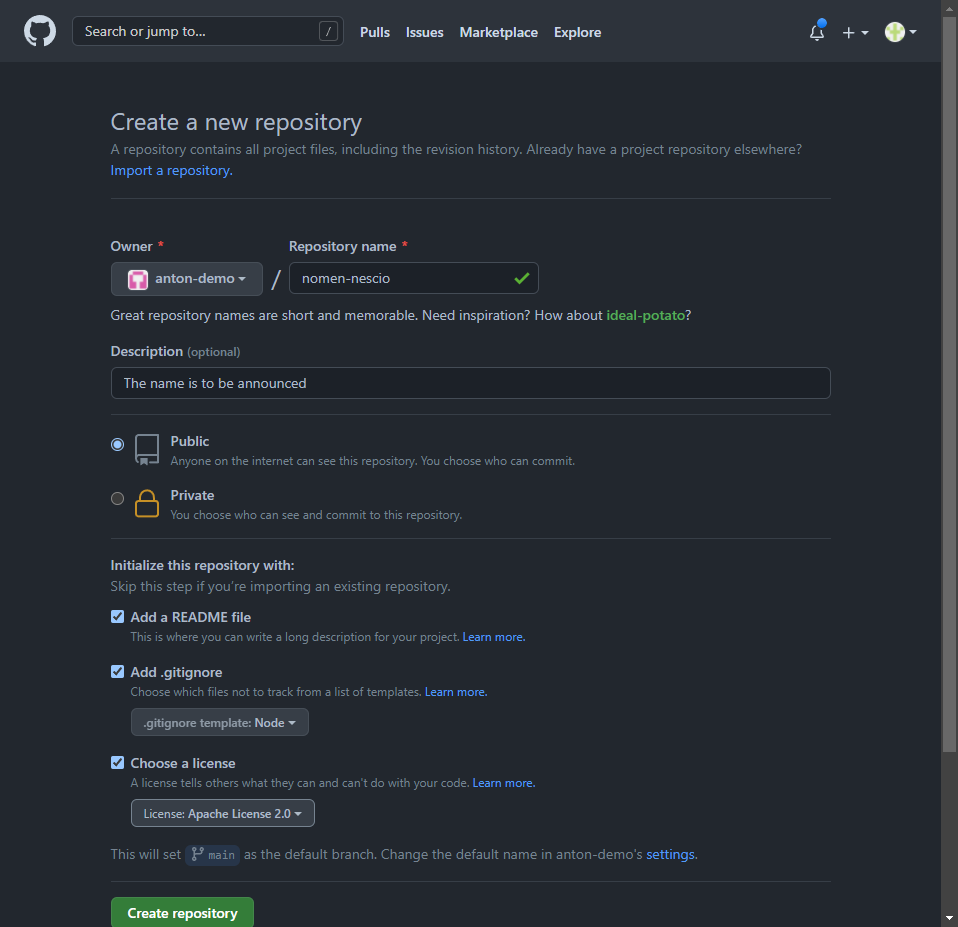

然后在命令行执行如下操作：

```bash
$ git clone https://github.com/JohnDoePacktOrg/nomen-nescio.git
$ cd nomen-nescio
$ ls -a
.  ..  .git  .gitignore  LICENSE  README.md
```

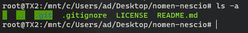

可以看到，线上的创建过程，无非是新建一个文件夹，然后运行 `git init`。预设的 `.gitignore` 文件可以省去很多繁琐低效的初始化工作。

仓库的权限控制相关设置，在仓库首页的 `Settings` 标签 -- `Collaborators & teams` 菜单项下（需校验身份）：

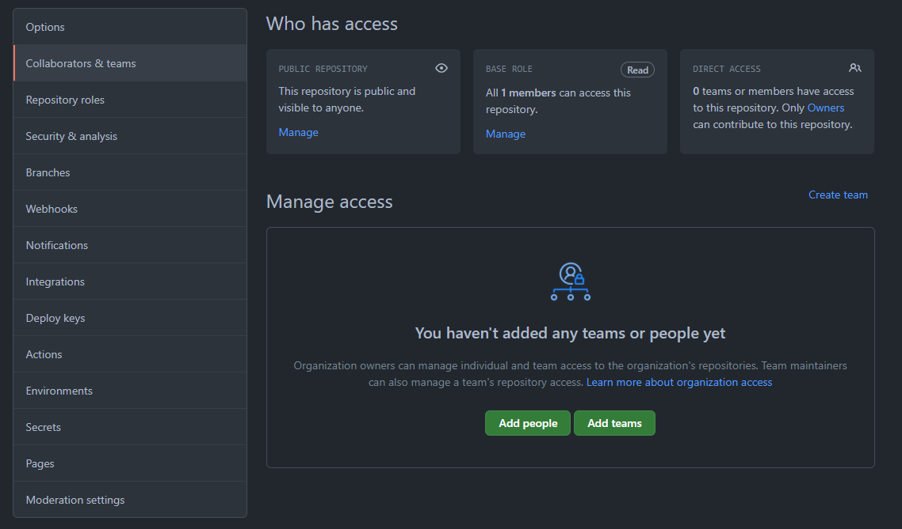

这里的一个 `team` 团队，指的是在一起工作的 `GitHub` 多个用户。比如 `iOS` 团队、`Android` 团队、`DevOps` 团队等。


> **拓展：在 GitHub 进行代码评审**

代码审查是在 `GitHub` 上拉取请求不可或缺的一环。以更新 `README` 文件为例，相关操作如下：

```bash
$ git checkout -b update-readme
$ echo "\nSoon a better name will be decided." >> README.md
$ git add README.md
$ git commit -m 'Updating README.md'
[update-readme 57a1e41] Updating README.md
 1 file changed, 1 insertion(+)
$ git push origin update-readme
```

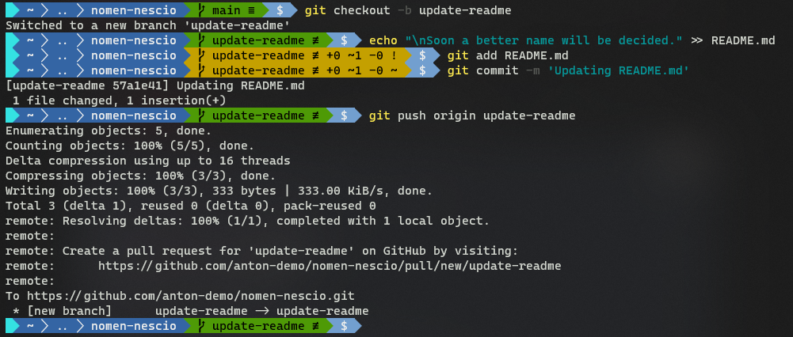

此时访问 `GitHub` 线上仓库，可以看到 `Pull Request` 的对应提示：

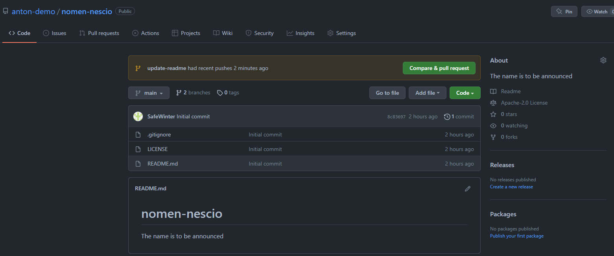

单击 <kbd>Compare & pull request</kbd> 按钮可以跳转到代码审核页面，此时 `GitHub` 自动作了对比并显示修改详情：

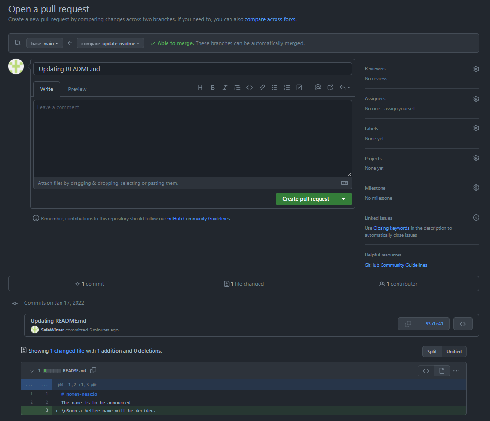

对比发现新增内容多了一个 `\n` 换行符，实际不需要，则在创建 PR 时写到评论区：

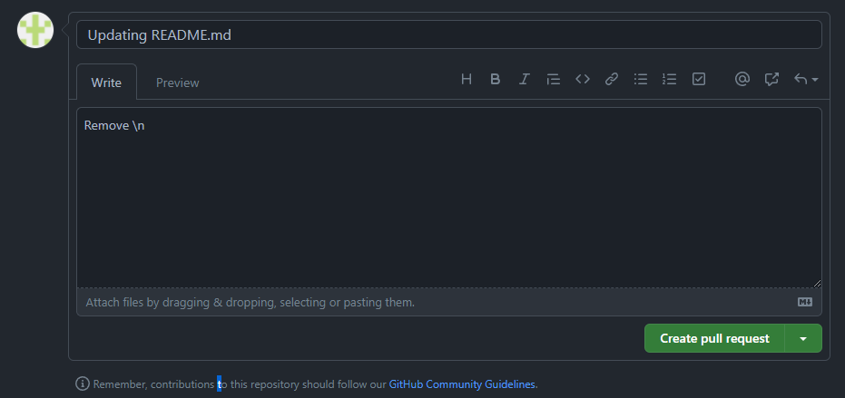

由于是本人帐号提交的 `PR`，因此可以直接在线上对 `update-readme` 分支的问题进行更正并提交；管理者再次核对，确认无误后可将该 `PR` 并入主分支 `main`；合并完成后，提交的 `update-readme` 分支就可以安全删除了。这时，可以对本次 `PR` 填写注释信息（备忘信息等），结束整个 `PR` 流程。这些操作都会记录到代码评审的审核日志中（其中添加标签是 `GitHub` 推出的最新功能）：

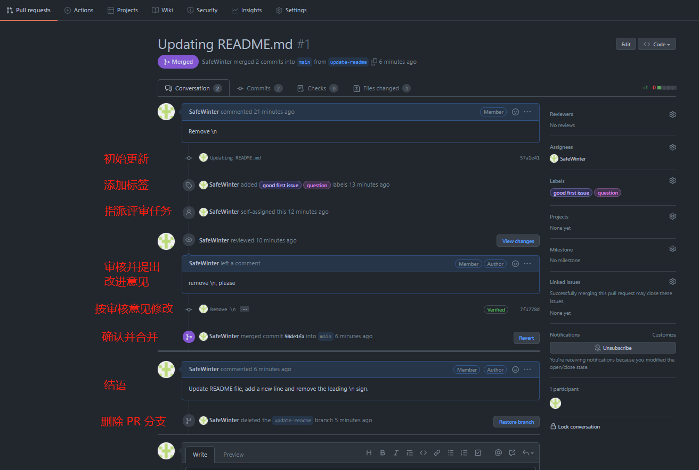

> **小结**
>
> 原书拓展训练中对如何处理 `PR` 介绍得过于简略，只有一张截图。实测时对提交 `PR` 过程中模拟的退回、修改、再审核进行了重新模拟演示，以加深印象，学以致用。


## 12.3 为议题（`issues`）与拉取请求（`pull requests`）创建模板

第七章介绍 `Git` 钩子、别名与运行脚本的时候，演示了怎样为提交注释信息添加模板。注释信息模板中可以包含当次提交的相关说明。`GitHub` 用户还可以创建议题（`issues`）或拉取请求（`pull requests`），同样也可以设置模板。

本节演示为 `issue` 及 `PR` 新增模板的方法，旨在提醒创建者提供足够的关联信息，以便快速理解提交者的意图。示例仓库为上一节创建的 `nomen-rescio`，利用 `Markdown` 语法创建模板。

> **操作步骤**

首先在 `nomen-rescio` 库的 `Settings` 设置页找到 `Features` 特性设置栏，单击 <kbd>Set up templates</kbd> 按钮：

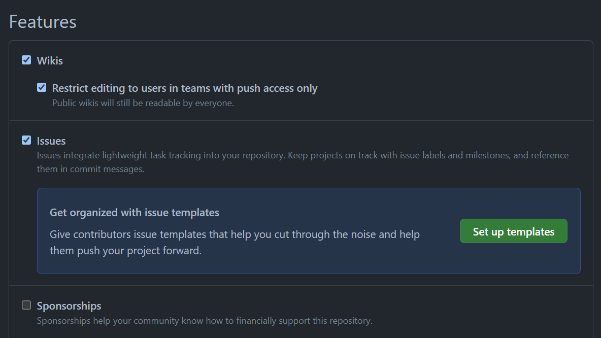

随后，在弹出的下拉框选中自定义模板：

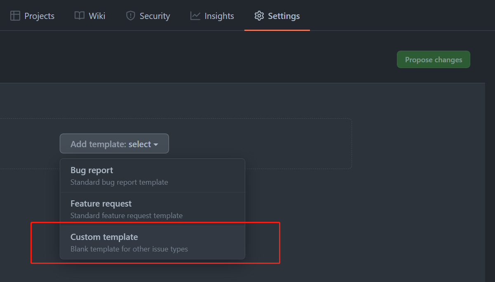

然后单击新建模板记录的预览按钮，预览模板详情：

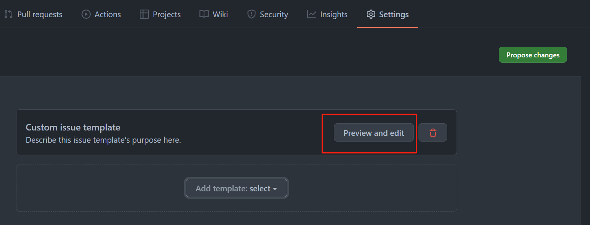

预览详情如下：

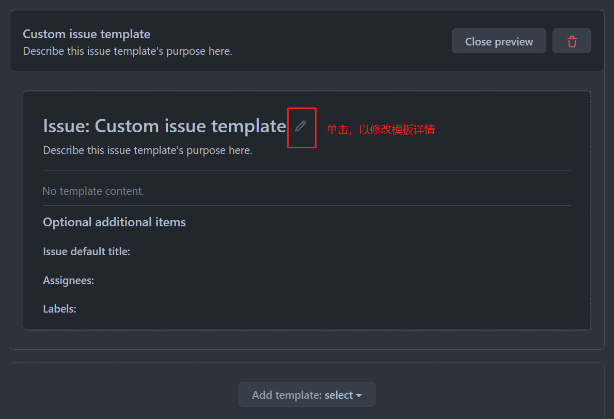

编辑模板详情如下，再点击右上角的 <kbd>Propose changes</kbd> 关闭模板编辑；在随即并弹出的提交信息栏补充相关提交注释内容后，单击 <kbd>Commit changes</kbd> 按钮提交模板修改：

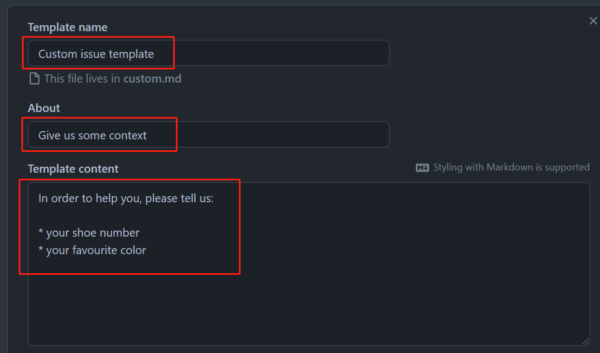

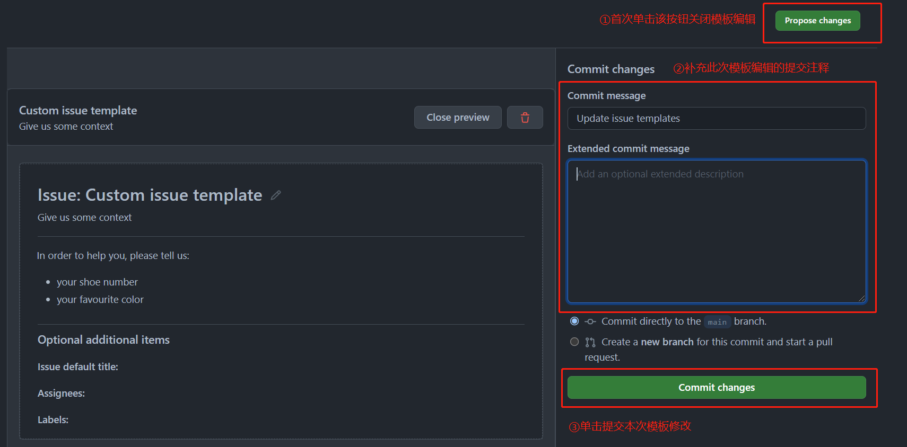

这样，当用户创建一个新议题时，会根据模板得到如下提示：

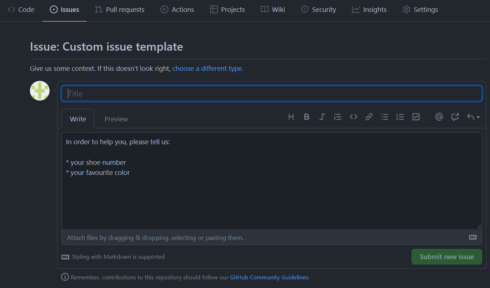

该自定义模板文件，在本地库的 `.github` 文件夹可以找到，且文件名与线上 `issue` 的标题对应：

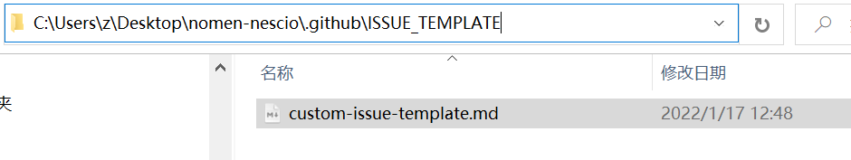

该文件可以在经常使用的文本编辑器中，按实际需要进行扩展定制。`ISSUE_TEMPLATE` 文件夹中存放了所有创建的模板文件。对于 PR 的定制模板，则存入 `PULL_REQUEST_TEMPLATE` 文件夹。多个模板情况下，GitHub 会让用户先选中一个模板，再读取该模板的内容。


## 12.4 创建 `GitHub` API 密钥


## 12.5 使用 `GitHub` 通过 `Jenkins` 认证


## 12.6 发起 `Jenkins` 构建任务


## 12.7 使用 `Jenkinsfiles` 文件


