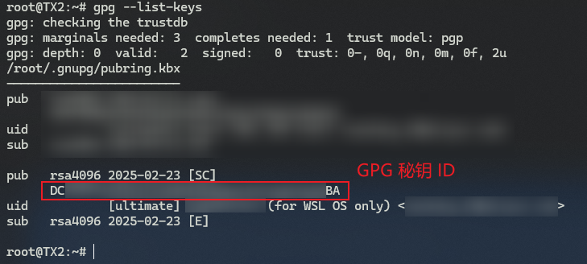

# 利用 DeepSeek 实现 GitHub 的 GPG 密钥创建与配置


## 1 前言

昨天在更新我的第二个 `Vim` 专栏《[Mastering Vim (2nd Ed.)](https://blog.csdn.net/frgod/category_12891223.html)》时遇到一个经典的 `Git` 操作问题：如何在 `WSL` 环境下，将本地已有的 `Git` 仓库和 `GitHub` 远程仓库进行关联、并实现同步推送？在尝试传统的 `HTTPS` 协议推送失败后 [^1]，当时为了节约时间，我改用 `SSH` + `RSA` 密钥对解决了这个问题。配置结束后，我又看到了曾被多次忽略的 `GPG` 密钥设置：


##### 图 1：GitHub 密钥配置页上的 GPG 管理界面

今天刚好有空就试了下用 `DeepSeek` 来指导我完成 `GPG` 密钥的配置，发现实战过程中还是有些坑值得注意。特此梳理并分享出来，让更多后来者少走些弯路。


## 2 准备工作

操作系统：`Windows` 自带的 `WSL` 环境、`Ubuntu v20.04`；

`Git`：`v2.25.1`；


## 3 具体配置过程

### 3.1. 本地生成 `GPG` 密钥

执行以下命令：

```bash
$ gpg --full-generate-key
```

然后根据提示选择密钥类型，这里选择默认的 `RSA and RSA` 类型：


##### 图 2：密钥类型选择默认的 “RSA 与 RSA” 型

接着需要设置密钥长度（keysize），保险起见我填最大的 `4096`：


##### 图 3：密钥长度填最大长度 4096

然后是设置有效期（默认永久有效，保持默认即可）：


##### 图 4：设置有效期（默认永久有效）

按回车键后，系统会再次让你确认（毕竟是永久有效，存在潜在安全风险）。输入 `y` 确认即可：


##### 图 5：二次确认有效期设置，输入 y 确认即可

然后根据提示输入登录 `GitHub` 用到的用户名与绑定邮箱（注意邮箱一定不能写错，否则后期匹配不上）：


##### 图 6：根据提示输入帐号、邮箱、描述信息（非必填），然后确认

然后系统会提示你输入一个 `passphrase`，也就是安全密码，输入完毕按回车键确认，就会看到如下界面，`GPG` 密钥就生成好了：


##### 图 7：成功生成本地 GPG 密钥对后的提示界面


### 3.2. 导出 GPG 密钥

先获取刚生成的 GPG 密钥 ID：

```bash
$ gpg --list-keys
```

从给出的密钥信息列表中复制密钥 ID：



##### 图 8：获取 GPG 密钥 ID 信息（红框选中部分）

接着输入下列命令，将密钥 ID 代入：

```bash
$ gpg --armor --export <YOUR_GPG_KEYS_ID>
-----BEGIN PGP PUBLIC KEY BLOCK-----

mQINBGe6+CABEADVglzi0o4M1MdL+qH/l8S5hCt1OZJkH5QJwdgh1UjTrcD7exy7
...
1WFAIhz8gD/aM7BpipjxAPja7tp5HkKoRHi7OHEg1iVL+Kkgg5a6p2+psluI1MqG
5fMAIYTk0g4OFjYpMooTzA==
=Vqrv
-----END PGP PUBLIC KEY BLOCK-----
$ 
```

再将 `-----BEGIN PGP PUBLIC KEY BLOCK-----` 和 `-----END PGP PUBLIC KEY BLOCK-----` 之间（包含边界）的文本内容复制到 `GitHub` 配置页面：


##### 图 9：将导出的公钥信息存入 GitHub 配置页面


### 3.3. 将密钥配置到 Git 中

执行以下命令完成 `Git` 的配置：

```bash
$ git config --global user.signingkey <YOUR_KEY_ID>
$ git config --global commit.gpgsign true
```


### 3.4. 测试提交

配置成功后，就可以实际测一下代码的提交和推送了：


##### 图 10：实测 GPG 密钥配置成功后的 commit 提交，需输入正确的安全密码

然后再试试推送到 `GitHub`：


##### 图 11：本地提交成功后，将 commit 节点推送至 GitHub

再到 `GitHub` 检查推送的 `commit` 节点，可以看到经过签名的本地提交都自带 `Verified` 校验标记：


##### 图 12：在 GitHub 官网看到的已通过 GPG 签名校验的本地推送版本


## 4 问题排查记录

首次配置其实并没有这么顺利，完成 `Git` 的配置后提交一个本地 `commit` 就失败了：

```bash
$ git commit -m 'Test'
error: gpg failed to sign the data
fatal: failed to write commit object
```

将报错信息直接提给 `DeepSeek`，根据提供的报错原因逐一排查，最后发现是 `GPG` 默认的用于输入密码的 `pinentry` 程序没有配置。配置方法：打开或新建 `GPG` 配置文件 `~/.gnupg/gpg.conf`，并输入以下内容：

```bash
pinentry-mode loopback
```

然后打开或新建另一个配置文件 `~/.gnupg/gpg-agent.conf`，输入以下内容：

```bash
allow-loopback-pinentry
```

然后重启 `GPG` 代理：

```bash
$ gpg-connect-agent reloadagent /bye
OK
$ 
```

再次提交就能自动弹出提示，让你输入安全密码了。

以下为 `DeepSeek` 提供的问题原因排查流程（摘要）：


##### 图 13：DeepSeek 给出的问题排查清单，逐一验证到第四条时找到真正原因

此外，如果不将 `loopback` 模式配到 `GPG` 的配置文件中，还可以用以下命令进行测试：

```bash
$ echo "test" | gpg --clearsign
```

运行命令时会提示输密码，通过校验就会看到一串签名内容：


##### 图 14：实测命令 gpg --clearsign 来反馈 GPG 签名是否配置成功

这样虽然简单些，但每次提交都得用上述命令检查一遍，效率其实并不高。


## 5 小结与复盘

本次和 `DeepSeek` 的互动没有开启推理模式，并且只在首次配置报错后才启用联网模式，实测下来效果依旧很好。由于 `GPG` 的本地配置之前并没有做过功课，所以也无法从提示词层面将问题描述得很精确；此时，应该果断放弃一步到位的想法，按照提供的思路进行实践，并将中途发生的异常如实提交给 `DeepSeek`。这比之前用谷歌百度搜索快太多了。

同时还应该注意，解决完问题后应该通读一遍和 `DeepSeek` 的完整对话，对配置过程中遇到的问题进行梳理复盘，主动从尝试中学习新知识。如果时间允许，还可以和 `GitHub` 官方公布的配置文档进行对比，找出两者的差异，在反复对比中加深印象。

正如 `DeepSeek` 无法一次性获知 `GPG` 配置时的具体环境，我们也不可能在 AI 工具的辅助下一步到位学会 GPG 的正确配置；但我们一定要保持清醒，从每次实际训练中主动完善自己的知识结构（本篇梳理也是基于这个目的）。这样才能掌握人的主动权。

为什么要特别强调这一点呢？因为最近很多朋友跟我反馈，他们在面对铺天盖地的科技新闻轰炸时，表现出的更多是深深的焦虑：AI 什么都能做了，人还做什么？我其实挺理解这种心情的，当前大家面临的困境也是前所未有的：明明知道 AI 很强大，但真正想要去了解 AI 的时候却感觉特别无力——门槛太高、众说纷纭、鱼龙混杂、泥沙俱下……过去面对一个未知领域，人们似乎还能认准大方向，也相信自己一定能弄明白；而时至今日，很多过去的美德和品质正在被 AI 的飞速发展慢慢解构：还有必要去钻研知识吗？会不会高不容易搞懂的操作和概念转眼间又被新的 AI 成果所取代？

这些问题目前都是无解的，或者只能说“都有可能”。毕竟我们经历了太长时间的缓慢积累与艰难探索，早已习惯了确定的答案和确定的道路。面对突如其来的 AI 巨变，每个人心中都对这个很可能全面超越人类的新事物心存忌惮。这种感觉，颇有点类似《超体》中女主 **Lucy** 第一次和 **Samuel Norman** 教授通话时，双方几乎同时表现出的迷茫和困顿的那一幕。但我认为，人还是不能沉湎于这样的迷茫的，而是坦然接受未来的不确定性，并且尽一切可能守护好自己的主观能动性。AI 越是强大，越不能在它面前缴械投降，而应该时刻保持主动地、深度地思考的习惯。


---

[^1]: 出于安全考虑，`GitHub` 官方已于 2021 年 8 月起禁止使用基于 `HTTPS` 协议的用户名/密码校验来推送 `Git` 代码库。

