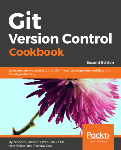

# 《Git Version Control Cookbook - 2nd Edition》Notes

本代码库为[《Git 版本控制手册（第二版）》（原名 Git Version Control Cookbook - Second Edition）](https://www.packtpub.com/product/git-version-control-cookbook-second-edition/9781789137545)（**Packt** 出版社 2018 年 7 月发行，作者 **Kenneth Geisshirt** / **Emanuele Zattin** / **Aske Olsson** / **Rasmus Voss**）的在线实操学习笔记。

笔记对书中提到的演示案例及部分关键知识点做了相应的发散和拓展，并在实测过程中更正了书中的诸多问题（大部分为笔误），并补充了大量有助于理解的截图和文字说明，方便后期快速复习，巩固所学。

笔记将按照原书的章节安排进行梳理：

Status available：:heavy_check_mark: (Completed) | :hourglass_flowing_sand: (Working) | :no_entry: (Not Started) | :orange_book: (Read but not started)

| No.  |                            Title                             |          Status          |
| :--: | :----------------------------------------------------------: | :----------------------: |
| Ch01 |                 [Navigating Git](./Ch01.md)                  |    :heavy_check_mark:    |
| Ch02 |                  [Configuration](./Ch02.md)                  |    :heavy_check_mark:    |
| Ch03 |         [Branching, Merging, and Options](./Ch03.md)         |    :heavy_check_mark:    |
| Ch04 | [Rebasing Regularly and Interactively, and Other Use](./Ch04.md) |    :heavy_check_mark:    |
| Ch05 | [Storing Additional Information in Your Repository](./Ch05.md) |    :heavy_check_mark:    |
| Ch06 |       [Extracting Data from the Repository](./Ch06.md)       |    :heavy_check_mark:    |
| Ch07 | [Enhancing Your Daily Work with Git Hooks, Aliases, and Scripts](./Ch07.md) |    :heavy_check_mark:    |
| Ch08 |            [Recovering from Mistakes](./Ch08.md)             |    :heavy_check_mark:    |
| Ch09 |             [Repository Maintenance](./Ch09.md)              |    :heavy_check_mark:    |
| Ch10 |          [Patching and Offline Sharing](./Ch10.md)           |    :heavy_check_mark:    |
| Ch11 |                 [Tips and Tricks](./Ch11.md)                 |    :heavy_check_mark:    |
| Ch12 |    [Git Providers, Integrations, and Clients](./Ch12.md)     | :hourglass_flowing_sand: |

