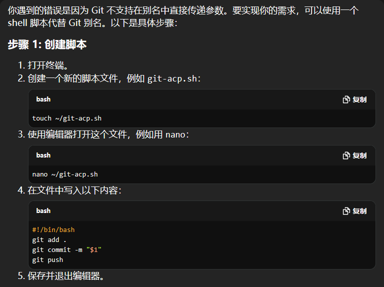
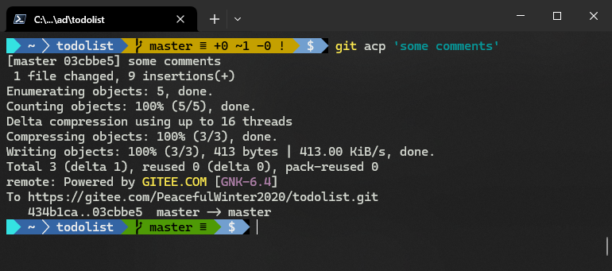

# 关于我和 ChatGPT 合谋摸鱼的日子


## 1 序个言

看到 CSDN 出这个活动有段时间了，奈何俗务缠身，一直没静下心来想想怎么写。今天碰巧赶上了，就顺便聊聊之前有段时间 ChatGPT 是怎么帮我摸鱼的吧。

虽然不是处女座，但我确确实实是一个对工作和生活都有点完美主义的码畜。为了提高编码效率，写出足以名垂公司史册的优美的代码，我是一点都不吝惜自己的业余时间，几乎大部分都用在代码重构上了：小到一个 `if-else`，大到整个项目架构，我都想给它提升提升。重构的时候经常忍不住自言自语：要是并发上去了咋整？要是别人想看懂我写的啥又咋整？这一块是不是可以直接写成一行（one-liner）？那一块调用改成函数式风格好像更加比格满满，整？

类似这样的话还有很多，就不一一列举了。

在我的人生信条里，只要瞄准极致的效率，就算达不到要求，至少也能完成个五五六六吧。这样我就有更多的时间和精力享受生活了。体会一下“原来生活是可以更美的”这句话用发自内心的真诚的语气讲出来，是不是真的会很爽。

于是，我在经年累月的自我麻醉下，效率越来越高（貌似），发际线更是不甘落后（多么痛的领域）。


**成书于 2014 年的神作《人类简史》**

《人类简史》好像说过，整个生物界就只有人类才需要每天工作八小时以上来维持基本的生计。那些我们嗤之以鼻的牛马，细心观察一下它们的动作和神态，在步入断头台之前的时光说不定比在座的各位舒服惬意多了。时间被高效率的现代人急剧压缩，空出来的时间又拿去做所谓“更有意义”的事情。到头来只想着给自己加码了，却忘了加码的另一面，还可以给自己减减负。减负不应只是中小学生的话题，职场码畜如我，同样需要。

突然有那么一天，在上述这般的思绪引领下，我好像找到了一个不错的切入口：2013 年的 3 月，ChatGPT 火了！我也响应与时俱进的号召，投入了学习 ChatGPT 的汪洋大海。刚开始什么都问，蹭着公司的网，问着和公司完全无关的话题：我是谁？从哪里来？到哪里去？

（此处省去 5Tb 文字介绍）

就这样问了 ChatGPT 好几个月，新鲜感渐渐消磨殆尽了，有一天我终于开始反思了：能不能让 ChatGPT 帮我写业务代码，用魔法打败魔法呢？

于是用上了 GitHub 的 Copilot。写着写着就上瘾了：这玩意儿虽然还不是特别智能，但用它来打个草稿提供一下思路，还是很不错的。据说大部分开发者都和我差不多，用了就停不下来了。还有个什么问卷调查，说用了基于 ChatGPT 的编程工具后，效率平均能提高 30% 左右。不管数据是否真实可靠，从我使用的切身体会来讲，AI 确实帮了我不少忙，可以跳过网页广告，跳过论坛登录，直接给我问题的答案，还是经过组织后的语言，不需要我费心去转换，或者知识迁移发散什么的。能做到这样，有没有那 30% 似乎也没那么重要了。

有了这样的“真知灼见”，我便兴致勃勃地在每一个会用到代码的地方搜寻，希望以 ChatGPT 为代表的人工智能最新成果能帮我改造世界！


## 2 说正事

有一天，真就被我找到一个不错切入口。

平时上网学东西的时候，我喜欢用 Git 做做笔记，因为 Git 能忠实记录学习中的每一次版本提交——这就是最好的学习证明，因为任何人都无法篡改。由于是自学，怎么方便怎么来，每次提交都用的 Git 命令行。其中使用频率最高的，长这样：

```bash
$ git add *; git commit -m 'some comments'; git push
```

本来借助翻页，感觉效率挺高的，无非就是改改每次提交的注释内容。但时间一长，屏幕前的你可能已经发现了，就会觉得——

> **每次提交前都要用 键盘 或 鼠标 倒过去修改注释内容，*真的很不高效* ！！！**

有没有什么办法，自己搞个 Git 命令，把要提交的注释就写到最后，实际执行的效果却完全一样呢？

ChatGPT：问我就对了！

它的思路是自定义一个 Git 别名（`acp` 即 `add`、`commit`、`push` 的首字母简写）：

```bash
$ git config --global alias.acp '!git add . && git commit -m "$1" && git push'
```

用的时候也很 one-liner：

```bash
$ git acp 'some comments'
```

结果报错了：

```shell
fatal: 'some comments' does not appear to be a git repository
fatal: Could not read from remote repository.

Please make sure you have the correct access rights
and the repository exists.
```

这时用我苦练多年的 CV 大法，再次求教 ChatGPT。几乎是秒回：



好吧，原来是不支持在别名中传参数。那就退而求其次，改成运行 `shell` 脚本吧。于是有了第 2 版方案：

```bat
@echo off
git add *
git commit -m %1
git push
```

这个脚本文件 `git-acp.sh` 还得找个路径存放，再把路径配到系统的 `PATH` 才能用。

用了一段时间，我的强迫症又犯了：修改脚本太费劲了，每次都要打开这个 `bat` 格式的批处理文件，还得熟悉相关的语法。要是能用熟悉的 PowerShell 来写，好像会轻松很多。

让 ChatGPT 打个样吧。于是有了第 3 版：

```shell
# Auto commit and push to remote Git repo
param(
    [string]$Comment = ""
)
echo 'Running ...'
cd "$(pwd)"
git add *
git commit -m "weekly update (from $start to $end) $Comment"
git push
echo 'Done.'
```

写法其实都差不多，只是改成了 PowerShell 实现：

```shell
$ git-acp.ps1 'some comments'
```

时刻践行极简主义，`.ps1` 也可以干掉：

```bash
$ git-acp 'some comments'
```

就这样，我与这行“极简风” PowerShell 命令渡过了一段令人怀念的美好时光……


## 3 这次是真正的正事

然而美好的时光总是短暂，一天凌晨四点过，我被一声刺耳的来电惊醒。刚上线的系统出 Bug 了，客户催甲方，甲方又催乙方，就这样一直传到我电话里：这个问题务必要解决，甲方在线等修复！务必抓紧时间排查原因！！！

就这样，我又激活了一个新的支线奖励：凌晨四点起床改 Bug。

一顿骚操作过后，系统终于在我 CV 大法的加持下起死回生。这才看了下表：5:20。

常常感慨命运的捉弄，当年那个无欲无求混吃等死的我，想不到有一天也会转行到 IT，为了一个看似光鲜的身份和闪着金光的铜饭碗，忍气吞声老老实实起床去改 Bug。更想不到的是，紧绷的那根弦突然放松的那一刻，我竟然鬼使神差般的去找那行 `git-acp` 命令的茬儿——

为什么这个命令不能写成 `git acp ...` 而只能是 `git-acp ...` 呢？

趁着最后一丝残存的起床气，我打开了当时和 ChatGPT 的对话页，开启了我的【烦人修山】（山：shit mountain，你懂的）模式。

我想要的，只是实现最开始的需求，通过 Git 的相关操作，实现用 `git acp 'some comments'` 做添加、提交、推送一站式操作，遇到报错再手动处理。最终，目光停留在了 ChatGPT 给我的第一次改进意见上：Git 别名怎么就不支持参数传递了？报错前不是已经提交本地成功了么？

命运的齿轮就这样开始转动起来：报错的真正原因并非 ChatGPT 说的那样，而是最后那句 `git push` 把我的注释信息当成了 **要推送的远程分支**！试问远程仓库怎么会有分支名叫 `some` 和 `comments` 的？

找到了原因，似乎就好办多了：只要想办法让参数和 `git push` 分开就行了。

难道要写成 `git push;` ？想多了。:x:

这样呢：`git push --force` ？还是不行。:x:

……

突然，灵光一闪而过：要是把参数变成真正的注释呢？比如：`$ git push<Space>#<Space>`

居然……蒙对了！！！！！！！！！！！！！！！！！！！！！！！！！！！！

于是有了最终的版本：

```bash
# Declare a new alias: acp
$ git config --global alias.acp '!git add * && git commit -m \"$1\" && git push # '
# Testing new alias:
$ git acp 'some comment'
```

于是有了下面这段惊天地泣鬼神的运行结果：



来，跟我一起大声喊三遍——

```markdown
大功告成！！！
大功告成！！！
大功告成！！！
```


## 4 总个结

老话讲：逢人且说三分话，未可全抛一片心。我不是教各位如何使诈，而是想说我的感受：大可不必在 ChatGPT 面前过于卑躬屈膝。否则，明明最多只用敲三个键搞定的问题，丢给 ChatGPT 能让你绕地球跑上三圈。还解决不了根本问题。

（完）